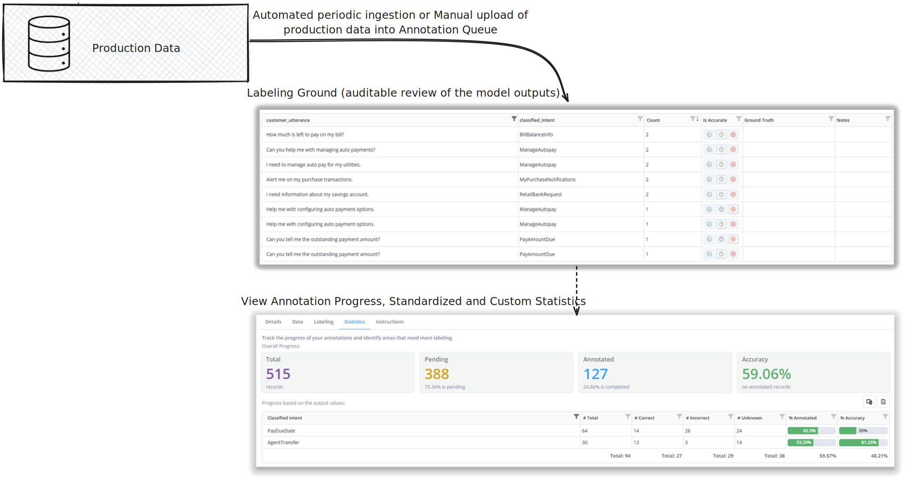

It is important to add a Human element when monitoring activity in Production as not all trends can be caught in an automated way. New trends are not always caught using programmatic approaches, but programmatic approaches are useful for repetitive tasks. Bringing a balance of both evaluation methods is key to maintaining a good healthy production system.

The Annotation Queue capability is designed to bring in the human evaluation and labelling of production data - but also do it in an efficient way to reduce human error. This capability allows the validation of model outputs in real time by having annotators assess and label the production outcome. The capability can help track a variety of metrics, both standard and custom, on raw and annotated production data, organized digitally for the stakeholders.

The capability significantly improves the usual approach to annotating production data using Excel and Google Sheets, creating a more transparent and auditable system to monitor live performance.

## Maintaining Annotation Queues on the Platform:

The Annotation Queues module organizes all the existing queues, which are available in the top right dropdown under **"Select an annotation queue"**, for easier tracking, searching, and creating new ones.

### Annotation Queue Registration:

1. Click on **Select an Annotation Queue** dropdown in the Annotation Queue module and click on **+ Create New Annotation**.
2. Fill in important details like **Name**, **Description**.
3. **Upload data** files to begin annotation or **connect to production tables**.
4. Click on the **Save** button to register the Annotation Queue. Once registered, it will be available in the dropdown to be chosen for annotation work.
5. Select the registered Annotation Queue, and it should open up the details page.

**Note:**

- Multiple files can be added, and the platform will concatenate them automatically as long as the schema matches.
- The object can be edited to map the **Input, Output, and Date Columns**.
- The Date column should be in the format **(mm/dd/yyyy)**.
- Platform maintains **"Is Accurate", "Notes" and "Ground Truth"** columns which can be used for labelling.
- Data will be deduplicated for the labelling process using similar Input and Output values.
- For new data uploads, **"Is Accurate", "Notes" and "Ground Truth"** will be filled using the last labelled matching sample.

**Once the registration is complete, the data is ready for annotation:**

- **View or export** the raw data from the **Data Tab**.
- Start data annotation in the **Labeling Tab**.
- View standardized and custom reports and metrics in the **Statistics Tab**.
- Lastly, add guides and notes for best practices in the **Instruction Tab**.

## Inviting an Annotator:

All users onboarded on the platform with access to the Annotation Queues module can collaborate on labeling. The platform tracks all label changes, allows annotators to leave notes, and provides keyboard shortcuts for faster annotations.

## Benefits of Annotation Queues:

- **Easy onboarding** of data annotated in an external environment.
- Easy to follow and **intuitive user-interface** to annotate data.
- **Auditable annotations**, platform records all modifications to the data and labels.
- **Automatic ingestion** of production data.
- **Enhanced Collaboration** with other reviewers.
- **Automated Performance and Progress** tracking.
- Smart algorithms to **expedite the labeling process**.
