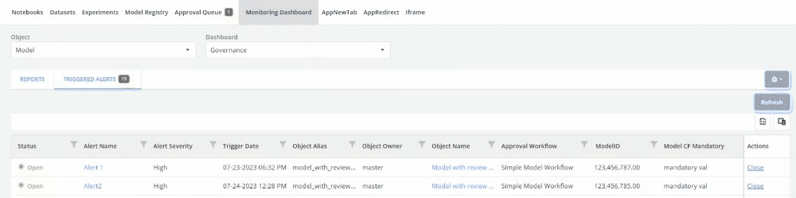
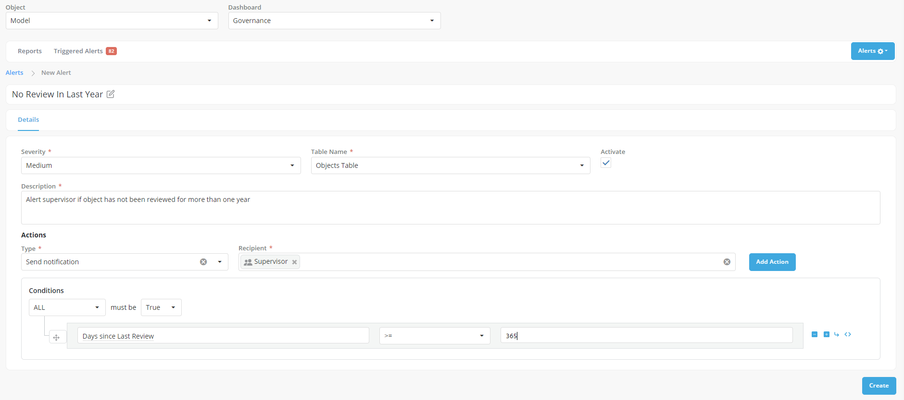

The Monitoring Dashboard provides users with a comprehensive overview of all registered objects on the platform which helps in providing a clear Oversight of all activities happening. It offers an interface that enables users to access snapshots and trend statistics related to various objects, jobs, and users. The dashboard provides various metadata information such as properties, attributes, and statuses of the registered objects.

Monitoring Dashboard is an indispensable tool for review committees and project managers, offering a rich set of features to monitor, analyze, and review all elements registered on the platform efficiently.

The "Monitoring Dashboard" is accessible in the "GenAI Studio" the sub-menu of all modules and is available at various levels (Pipelines, Models, Prompts, RAGs) - and can be used to

### Base Views

This is the default view that the organization decides to show to all users of the platform. Typically the primary cockpit is to quickly find the overall status of governance across all objects on the Platform.

By default, the baseview contains examples of monitoring reports that can help better understand governance activities. They can be adopted or swapped with custom views that better fit the organization's interest.

- **Approval Status View**: It presents an overview of the approval status of different objects grouped under their respective Object Groups.

- **Review History View**: The columns show the distribution of reviews based on their history, with time intervals.

- **Last Review Status View**: It focuses on the most recent review status of objects, organized by Object Groups. The columns display different review statuses, including Accepted with Flag, Accepted without Flag, Pending Acceptance, and Rejected.

- **Schedule Review Status View**: The "Schedule Review Status View" offers insights into the scheduled review periods for objects within Object Groups.

Explore these pre-configured views and customize them further to cater to specific monitoring needs and gain deeper insights into the platform's governance.

### Data View

This view presents the complete data for the selected object type in a tabular format. Users can easily navigate to specific objects by clicking on the rows. Additionally, they can apply filters or sort rows based on any specified column.

The data view is a comprehensive place to access all information across the entire platform - and is the base for nearly all other types of monitoring - be it creating Custom Views or creating automated Alerts.

### Automated Alerts

Alerts are defined as a set of rules that are designed to identify specific items or events that require immediate attention or further action. These rules are created based on predefined criteria, enabling the system to detect critical situations, anomalies, or deviations from expected behaviour. When the conditions specified in the alert rules are met, the system triggers events such as notifications, emails etc. Ensuring that appropriate actions can be taken promptly to address the identified issues.

### Creating Alerts

On the platform, users have the flexibility to create custom alerts tailored to their specific needs. Custom alerts encompass essential properties, including name, description, conditions, severity, and associated actions.

- Click on **Settings** icon and select **Alerts** in the dropdown menu option. Now you can view a list of alerts configured for the dashboard.
  
- Click on **Create**.
- Define the **Alert Name** by editing the New Alert header.
- **Severity**: Each custom alert can be assigned a severity level, such as _High_, _Medium_, or _Low_. This categorization allows users to prioritize alerts based on their importance and urgency. Different severity levels help stakeholders focus on critical issues
- **Table Name**: Select the table name from the dropdown menu.
- **Activate**: Click the activate checkbox to mark the alert as active. Activated alerts are evaluated, and the corresponding data is displayed as columns in the Monitoring Dashboard. Muted alerts are temporarily disabled and not evaluated, meaning they won't appear as columns in the dashboard during that period.
- Fill in the description for the new **Custom Alert**.

- **Actions**
  Choose an action type from the "Type" dropdown menu to determine the action that will be executed when the alert is triggered. The following actions can be associated with custom alerts:

    - **Send Notification**: The system can send notifications to selected users, or user roles informing them about the triggered alert.
    - **Add Alert Flag**: When an alert condition is met, users have the option to add a predefined flag to the object responsible for the alert. Flags serve as visual indicators to highlight objects that require attention.
    - **Create Review**: For Approved objects, users can choose to add an ongoing review to the object's responsibility and assign reviewers. This action facilitates a thorough review process for objects flagged by the custom alert.
    - **Send Email**: Users can configure the system to send email notifications to external users when an alert is triggered. The custom field associated with the objects should contain a string of comma-separated email addresses for users who should receive these emails.

!!! note

    Multiple actions can be triggered based on an alert.

- **Conditions**: Define the conditions that need to be met for an alert to be generated. These conditions are specified using rules based on the columns available in the Monitoring Dashboard Data. By utilizing data from the dashboard, users can set up criteria that trigger the alert when specific thresholds or patterns are detected.

- Click on **Create** to register the alert. A pop-up toast message will be displayed with the text reading Alert Created Successfully.
