# Feedback Portals

The Feedback Portal is a platform feature designed to help teams evaluate, test, and improve AI pipelines by collecting structured feedback from domain experts and testers. It bridges the gap between raw pipeline outputs and real-world quality assessment by letting subject matter experts interact with a pipeline directly and provide detailed evaluations on every session.

It is especially useful for pipelines that involve classification, triage, or decision-making, where correctness needs to be validated by humans with domain knowledge.

---

## How It Works

The Feedback Portal wraps around an existing AI pipeline and adds three layers of structured evaluation:

### 1. Test Definition

Before starting a session, the tester can optionally define what they expect the pipeline to output. This allows the platform to later compare expected vs actual results and surface discrepancies at scale.

### 2. Live Session

The tester interacts with the pipeline through a chat interface, exactly as a real user would. The pipeline processes each message and returns its output. The tester observes the behavior and can rate individual responses using thumbs up or thumbs down during the session.

### 3. Closing Questions

At the end of the session, the tester is shown a structured feedback form that captures their final assessment. This includes whether the pipeline's predictions were correct, what the correct answer should have been, and any additional observations.

---

## Key Concepts

### Pipeline

The AI system being evaluated. It receives a user message and returns an output along with optional context data such as token counts, latency, and cost metrics.

### Processing Logic

A lightweight code layer that sits between the pipeline and the portal. It calls the pipeline, optionally transforms the output for display, and can extract key metrics into `collected_fields` to track them as session-level statistics in the portal's results table.

### Test Definition Schema

A JSON schema that defines the fields shown to testers before they start a session. These fields capture the tester's expectations upfront, such as the expected classification, disposition, or protocol.

### Closing Question Schema

A JSON schema that defines the fields shown to testers at the end of a session. These fields capture the tester's final assessment of the pipeline's predictions, including whether the output was correct and what the correct answer should have been.

### Collected Fields

A dictionary available in the processing logic that can be populated with values extracted from the pipeline's context. These values appear as columns in the portal's results table, making it easy to track metrics like latency, cost, and token usage alongside correctness feedback.

---

## Portal Configuration

When creating a Feedback Portal, you configure the following settings:

| Field | Description |
|---|---|
| Name | The display name of the portal |
| Group | Organizes the portal alongside related portals |
| Description | A summary of what the portal is evaluating |
| Feedback Instructions | Instructions shown to testers before they start, written in plain text |
| Pipeline | The AI pipeline this portal collects feedback for |
| Processing Logic | Custom code to call the pipeline and optionally extract metrics |
| Test Definition Schema | JSON schema for fields shown before the session starts |
| Closing Question Schema | JSON schema for fields shown at the end of the session |

---

## Building a Feedback Portal — Step by Step

### Step 1 — Create the Portal

Navigate to **Human Integrated Testing → Feedback Portals** and click **+ Create**.


Fill in the Name, Group, Description, and Feedback Instructions. These top-level fields are shown in the portal's settings page:

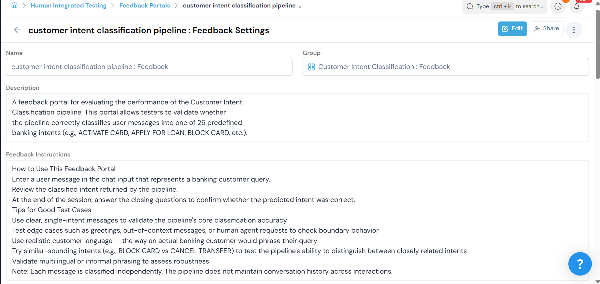

### Step 2 — Select a Pipeline and Write the Processing Logic

Scroll down to the **Pipeline** section and select the pipeline you want to evaluate. Then enable **Processing Logic** to write a Python snippet that calls your pipeline and returns the result.


At minimum, the processing logic looks like this:

```python
return my_pipeline(user_message, history=history)
```

If your pipeline returns useful metrics in the context (such as latency, token counts, or cost), you can surface them as tracked statistics using `collected_fields`:

```python
import json

result = my_pipeline(user_message, history=history)
ctx = json.loads(result["context"])

collected_fields["latency_ms"] = ctx.get("latency_ms", "0")
collected_fields["total_tokens"] = ctx.get("total_tokens", "0")
collected_fields["model_cost"] = ctx.get("model_cost", "0")

return result
```

The variables available in the processing logic are:

- `user_message` — the message typed by the tester, of type `str`
- `history` — the full conversation history, of type `list[TypedDict[{"role": str, "content": str}]]`
- `context` — the current session context, used to maintain state across turns
- `collected_fields` — a `dict[str, str]` that can be mutated to track session-level statistics

The return value must be a dictionary with the following keys:

```python
{
    "output": "The text response shown to the tester",
    "context": ...  # Updated context, can be a dict or JSON string
}
```

### Step 3 — Define the Test Definition Schema

The **Test Definition Schema** controls what fields appear on the Start a Conversation screen. Use it to capture the tester's expectations before the session begins.

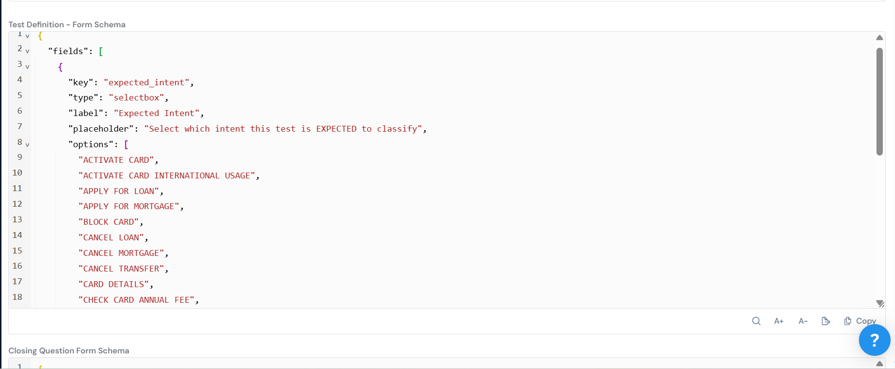

Each field in the schema follows this structure:

```json
{
  "key": "field_key",
  "type": "selectbox",
  "label": "Human readable label",
  "placeholder": "Placeholder text shown in the dropdown",
  "options": ["Option A", "Option B", "Option C"],
  "validators": {
    "required": false
  }
}
```

Supported field types include `selectbox` for dropdown selection and `text` for free text input. Setting `required` to `false` makes the field optional, which is recommended for test definitions so testers are not forced to pre-define expectations.

Example for a classification pipeline:

```json
{
  "fields": [
    {
      "key": "expected_intent",
      "type": "selectbox",
      "label": "Expected Intent",
      "placeholder": "Select which intent this test is EXPECTED to classify",
      "options": [
        "ACTIVATE CARD",
        "BLOCK CARD",
        "MAKE TRANSFER",
        "OUT OF CONTEXT"
      ],
      "validators": {
        "required": false
      }
    }
  ]
}
```

### Step 4 — Define the Closing Question Schema

The **Closing Question Schema** controls what fields appear in the End the Session modal. Use it to capture the tester's final assessment of the pipeline's predictions.

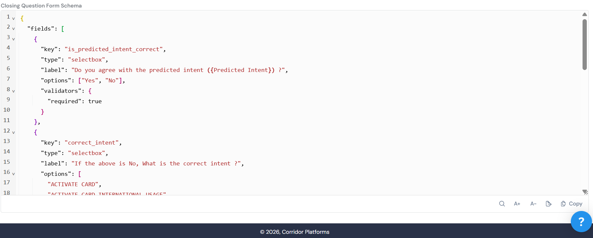

A key feature of closing questions is the `{Predicted X}` placeholder syntax. When used in a label, it is automatically replaced with the actual value predicted by the pipeline, so testers see the real output in context as they evaluate it.

Example for a classification pipeline:

```json
{
  "fields": [
    {
      "key": "is_predicted_intent_correct",
      "type": "selectbox",
      "label": "Do you agree with the predicted intent ({Predicted Intent}) ?",
      "options": ["Yes", "No"],
      "validators": {
        "required": true
      }
    },
    {
      "key": "correct_intent",
      "type": "selectbox",
      "label": "If the above is No, What is the correct intent ?",
      "options": [
        "ACTIVATE CARD",
        "BLOCK CARD",
        "MAKE TRANSFER",
        "OUT OF CONTEXT"
      ],
      "validators": {
        "required": false
      }
    },
    {
      "key": "additional_comments",
      "type": "text",
      "label": "Any additional comments on why the classification was incorrect or could be improved ?",
      "placeholder": "e.g. The message could also be interpreted as BLOCK CARD due to similar phrasing",
      "validators": {
        "required": false
      }
    }
  ]
}
```

Supported field types for closing questions also include `qna`, which renders an interactive question-and-answer widget where testers can add multiple question-answer pairs. This is useful for conversational pipelines where testers want to record follow-up questions they would have asked.

---

## Using the Feedback Portal — Tester Guide

### Starting a Session

Click **+ New Test** from the portal page to open a new session. The **Start a Conversation** screen will appear.

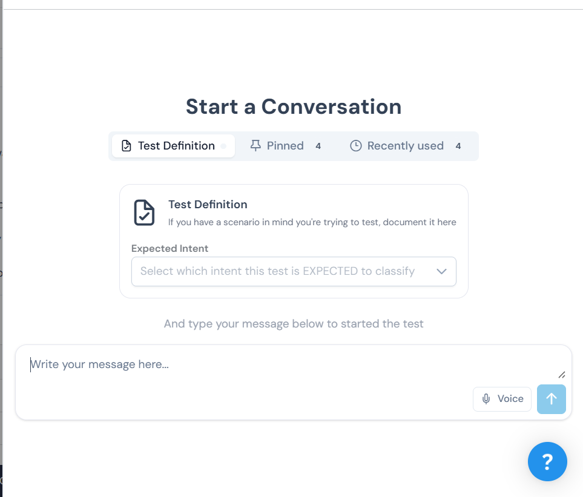

If a Test Definition is configured, you can optionally select your expected values before typing your message. Use the **Pinned** and **Recently used** tabs to quickly reuse common test definitions. Then type your message in the chat input and press send to begin.

### During the Session

The pipeline processes your message and returns its response in the chat view.

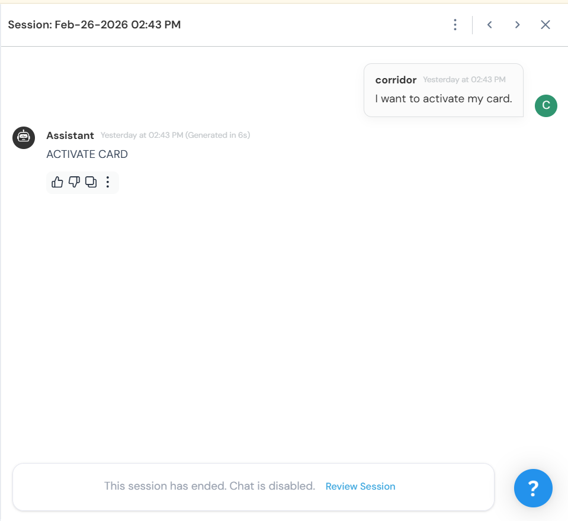

You can rate individual responses using the thumbs up or thumbs down buttons. Continue the conversation if the pipeline is multi-turn, or move to closing if it is single-turn. When you are ready to finish, click **End Session**.

### Ending the Session

Clicking **End Session** opens the **Review Session** modal.

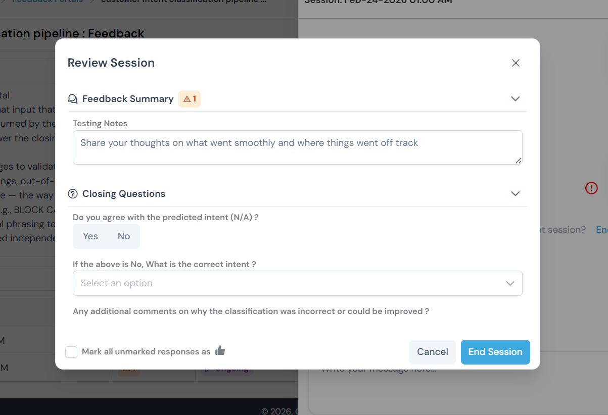

The modal shows:

- **Feedback Summary** — a count of any thumbs down ratings from the session
- **Testing Notes** — a free text field to document your overall observations
- **Closing Questions** — the structured questions defined in the Closing Question Schema, with the pipeline's actual predictions shown inline in the question labels

Fill in your notes and answer the closing questions, then click **End Session** to submit.

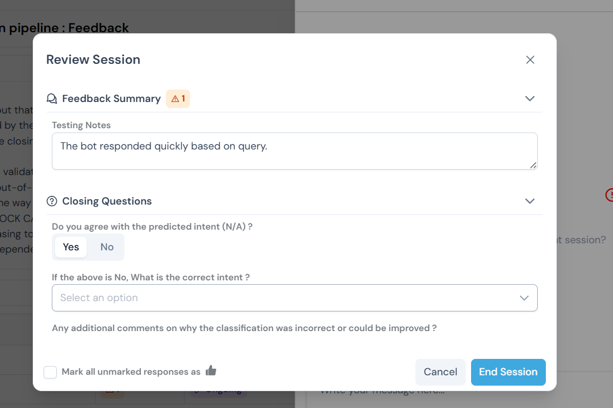

---

## Results and Insights

### Sessions Table

All completed sessions are listed in the portal's results table. Each row represents one session and shows the session name, rating summary, status, testing notes, and the date it was created.

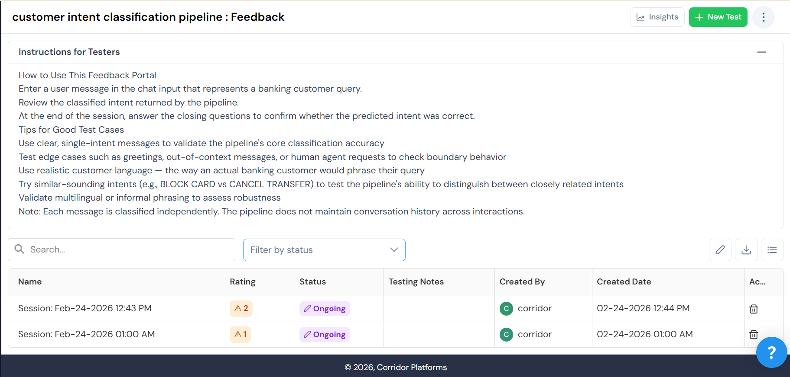

Once a session is submitted, its status changes from **Ongoing** to **Completed** and the testing notes appear inline in the table.

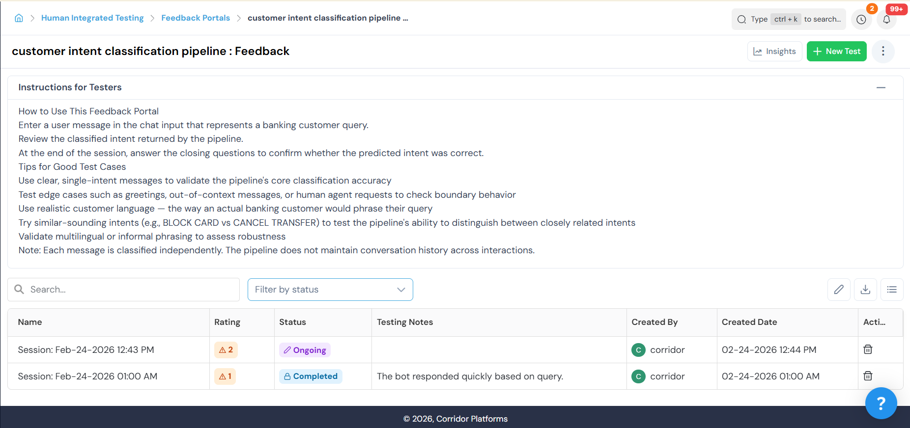

Use the **Filter by status** dropdown to narrow the view to completed or ongoing sessions.

### Insights

Click **Insights** in the top right of the portal to open the Insights view. It provides aggregate analysis across all sessions, organized into four tabs.

#### Summary

Shows high-level counts for the portal: total tests created, tests passed, tests failed, and sessions pending feedback. A Messages Summary section breaks down liked, disliked, and pending-feedback message counts.


#### Contributors

Shows how many tests each team member has run over time, with a bar chart of tests by date and a per-contributor breakdown.

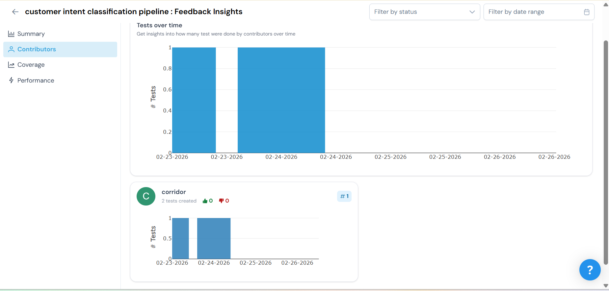

#### Coverage

Shows which Test Definition values have been exercised and which have not. A warning badge highlights options that have not yet been tested, helping you identify gaps in coverage.

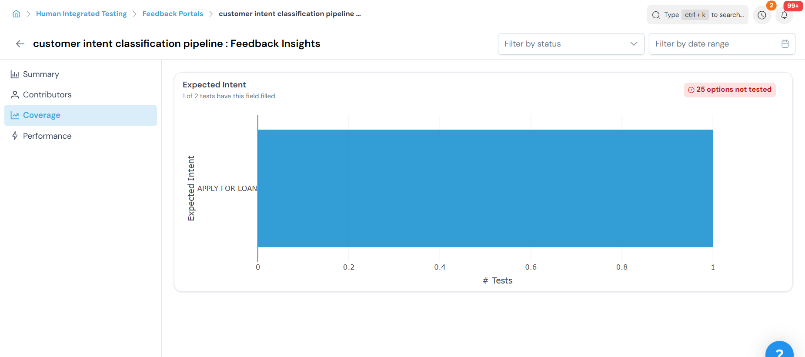

#### Performance

Shows overall test session performance over time, color-coded by outcome: all likes (green), contains dislikes (red), or no feedback (grey). Below the chart, a per-intent breakdown lets you drill into how performance varies across different expected values.

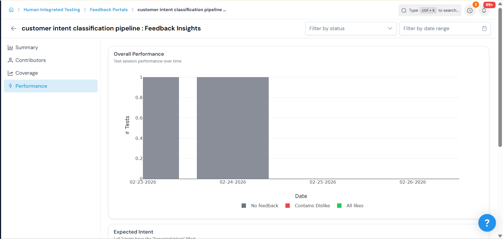

Hovering over a bar in the per-intent chart shows a tooltip with the exact test count and intent label for that segment.

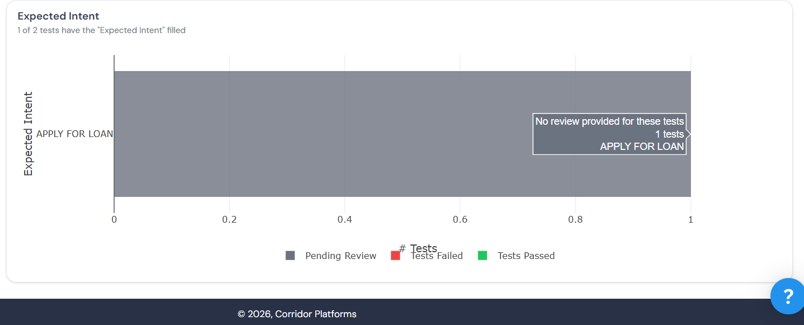

---

## Schema Field Type Reference

| Type | Description | Use Case |
|---|---|---|
| `selectbox` | Dropdown with predefined options | Classification labels, dispositions, protocols |
| `text` | Free text input | Comments, observations, notes |
| `qna` | Interactive question-answer pairs | Follow-up questions a human expert would ask |

---

## Tips for Portal Designers

- Keep the Test Definition optional (`required: false`) so testers are not blocked from starting a session.
- Use the `{Predicted X}` placeholder in closing question labels so testers see the actual pipeline output inline without having to scroll back.
- Use `collected_fields` to surface any performance metrics your pipeline tracks — latency, cost, and token counts are especially valuable for benchmarking.
- Write feedback instructions in plain text without markdown formatting for the best display in the portal UI.
- Design closing questions to mirror your Test Definition fields so expected vs actual comparisons are easy to make in the results table.

---

## Example — Customer Intent Classification Portal

The following is a complete example of a Feedback Portal configured for a banking customer intent classification pipeline that classifies messages into 26 predefined intents.

### Feedback Instructions

```
How to Use This Feedback Portal

1. Enter a user message in the chat input that represents a banking customer query.
2. Review the classified intent returned by the pipeline.
3. At the end of the session, answer the closing questions to confirm whether the predicted intent was correct.

Tips for Good Test Cases
- Use clear, single-intent messages to validate the pipeline's core classification accuracy
- Test edge cases such as greetings, out-of-context messages, or human agent requests to check boundary behavior
- Use realistic customer language — the way an actual banking customer would phrase their query
- Try similar-sounding intents (e.g., BLOCK CARD vs CANCEL TRANSFER) to test the pipeline's ability to distinguish between closely related intents
- Validate multilingual or informal phrasing to assess robustness

Note: Each message is classified independently. The pipeline does not maintain conversation history across interactions.
```

### Processing Logic

```python
import json

result = customer_intent_classification_pipeline(user_message, history=history, context=context)
ctx = json.loads(result["context"])

collected_fields["intent_total_tokens"] = ctx.get("intent_total_tokens", "0")
collected_fields["intent_latency_ms"] = ctx.get("intent_latency_ms", "0")
collected_fields["intent_model_cost"] = ctx.get("intent_model_cost", "0")
collected_fields["intent_input_cost"] = ctx.get("intent_input_cost", "0")
collected_fields["intent_output_cost"] = ctx.get("intent_output_cost", "0")
collected_fields["intent_tokens_per_second"] = ctx.get("intent_tokens_per_second", "0")

return result
```

### Test Definition Schema

```json
{
  "fields": [
    {
      "key": "expected_intent",
      "type": "selectbox",
      "label": "Expected Intent",
      "placeholder": "Select which intent this test is EXPECTED to classify",
      "options": [
        "ACTIVATE CARD",
        "ACTIVATE CARD INTERNATIONAL USAGE",
        "APPLY FOR LOAN",
        "APPLY FOR MORTGAGE",
        "BLOCK CARD",
        "CANCEL LOAN",
        "CANCEL MORTGAGE",
        "CANCEL TRANSFER",
        "CARD DETAILS",
        "CHECK CARD ANNUAL FEE"
      ],
      "validators": { "required": false }
    }
  ]
}
```

### Closing Question Schema

```json
{
  "fields": [
    {
      "key": "is_predicted_intent_correct",
      "type": "selectbox",
      "label": "Do you agree with the predicted intent ({Predicted Intent}) ?",
      "options": ["Yes", "No"],
      "validators": { "required": true }
    },
    {
      "key": "correct_intent",
      "type": "selectbox",
      "label": "If the above is No, What is the correct intent ?",
      "options": [
        "ACTIVATE CARD",
        "ACTIVATE CARD INTERNATIONAL USAGE",
        "APPLY FOR LOAN",
        "APPLY FOR MORTGAGE",
        "BLOCK CARD",
        "CANCEL LOAN",
        "CANCEL MORTGAGE",
        "CANCEL TRANSFER",
        "CARD DETAILS",
        "CHECK CARD ANNUAL FEE"
      ],
      "validators": { "required": false }
    },
    {
      "key": "additional_comments",
      "type": "text",
      "label": "Any additional comments on why the classification was incorrect or could be improved ?",
      "placeholder": "e.g. The message could also be interpreted as BLOCK CARD due to similar phrasing",
      "validators": { "required": false }
    }
  ]
}
```

---

## Example — Clinical Triage Portal (ASK HOAG)

The following is a complete example of a Feedback Portal configured for a clinical triage pipeline that assigns patients to protocols and dispositions.

### Key Differences from a Classification Portal

- The Test Definition captures two expected values — the expected protocol and the expected disposition — since the pipeline produces two outputs.
- The Closing Questions mirror this with two agreement questions, each showing the predicted value inline.
- An additional `qna` field allows nurses to record follow-up questions they would have asked the patient, capturing richer clinical feedback.
- The processing logic is a direct pass-through since the pipeline handles all state and formatting internally.

### Processing Logic

```python
return run_triage_agent(user_message, context)
```

### Test Definition Schema

```json
{
  "fields": [
    {
      "key": "expected_protocol",
      "type": "selectbox",
      "label": "Expected Protocol",
      "placeholder": "Select which protocol this test is EXPECTED to use",
      "options": ["Head Injury", "Blood Pressure - High", "Chest Pain", "..."],
      "validators": { "required": false }
    },
    {
      "key": "expected_disposition",
      "type": "selectbox",
      "label": "Expected Disposition",
      "placeholder": "Select how this case is EXPECTED to be handled",
      "options": ["ASYNC", "VIRTUAL_VISIT", "SPECIALTY_CONSULT", "EMERGENCY", "911 SYMPTOMS"],
      "validators": { "required": false }
    }
  ]
}
```

### Closing Question Schema

```json
{
  "fields": [
    {
      "key": "is_predicted_protocol_correct",
      "type": "selectbox",
      "label": "Do you agree with the predicted protocol ({Predicted Protocol}) ?",
      "options": ["Yes", "No"],
      "validators": { "required": true }
    },
    {
      "key": "correct_protocol",
      "type": "selectbox",
      "label": "If the above is No, What is the correct protocol ?",
      "options": ["Head Injury", "Blood Pressure - High", "Chest Pain", "..."],
      "validators": { "required": false }
    },
    {
      "key": "is_predicted_disposition_correct",
      "type": "selectbox",
      "label": "Do you agree with the predicted disposition ({Predicted Disposition}) ?",
      "options": ["Yes", "No"],
      "validators": { "required": true }
    },
    {
      "key": "correct_disposition",
      "type": "selectbox",
      "label": "If the above is No, What is the correct disposition ?",
      "options": ["ASYNC", "VIRTUAL_VISIT", "SPECIALTY_CONSULT", "EMERGENCY", "911 SYMPTOMS"],
      "validators": { "required": false }
    },
    {
      "key": "additional_questions",
      "type": "qna",
      "label": "Are there any other questions that you as a nurse would have asked the patient ?",
      "qnaConfig": {
        "questionPlaceholder": "Where is the pain located ?",
        "answerPlaceholder": "Near my wrist",
        "addButtonLabel": "Add Question"
      },
      "validators": { "required": false }
    }
  ]
}
```
