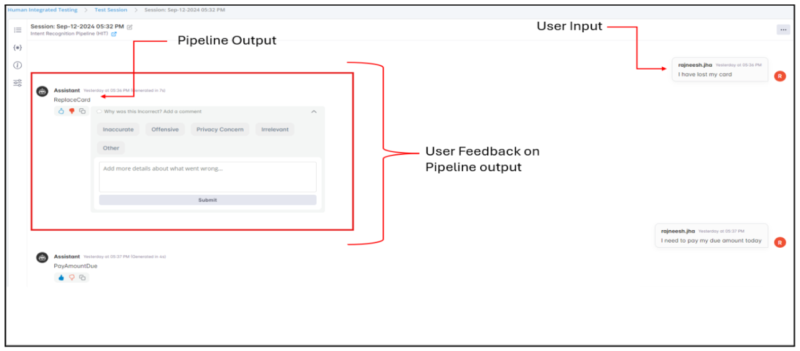
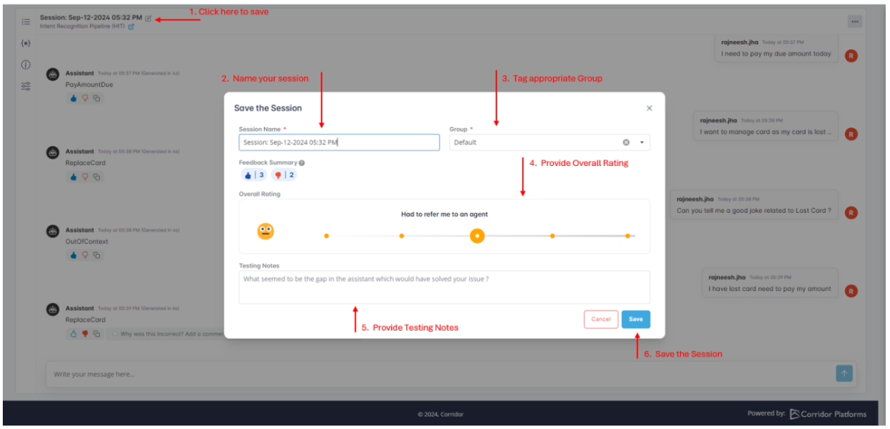
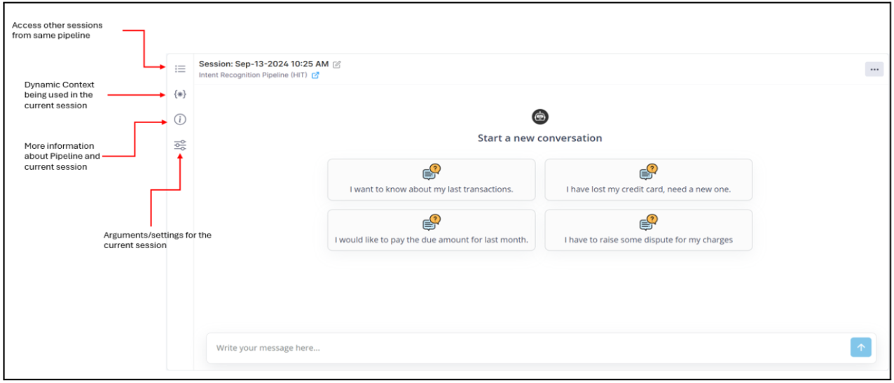

The Human Integrated Testing module enables comprehensive testing of GenAI pipelines both before approval (Pre-Approval) and after deployment (Post-Approval/Post-Depoyment), involving humans in the loop.

## What is a Pre-Approval Testing?

The Pre-Approval Testing allows users to test the full end-to-end pipeline in a production-like environment, providing an opportunity to manually validate the final solution before deployment. It simulates real-world scenarios by replicating end-user experiences. This module abstracts the internal technical details, presenting only the final inputs and outputs for a streamlined evaluation process.

**Note:** Currently, only the chat-based pipelines registered on the platform are available for manual testing.

It enables reviewers to capture their feedback and scores during testing, offering valuable insights for the development team to improve the solution. Additionally, all testing data can be exported from the platform for different purposes, making it easier for developers and reviewers to collaborate.

## Performing Pre-Approval Testing on the Platform:

All the chat-based pipelines are available for Pre-Approval Testing.

1. Click on **Start Session** in the Pre-Approval Testing module.
2. Choose the pipeline to be tested from a list of registered pipelines.
3. Once the pipeline is selected, a new window will open where you can start interacting.
   
4. Once testing is completed, an experience summary can be recorded by providing an overall session rating and testing notes.
   

**Note:**

More information about the Testing Session and GenAI Pipeline can be seen in the information panel on the left. There are 4 buttons in the information panel:

- View other sessions from the same pipeline.
- View the context being used in the pipeline. This is additional information that will be utilized by LLM to answer user questions. For example, it can be customer metadata being pulled from some knowledge base.
- View more details about the pipeline and the Gen AI assets used in this pipeline.
- View any configurations provided to the pipeline by the Modeler, such as temperature, random seed, etc.
  

Every interaction, feedback, and comment in the Test Session is auto-saved immediately and recorded in history and recorded along with report cards in customized groups.

## Benefits of Pre-Approval Testing:

- **Human-in-the-loop testing before approving** the pipeline for production.
- Easy to follow and **intuitive user interface** to test pipelines.
- **Abstraction** of complex pipeline logic from MRM/Fair-Lending/Business teams.
- **Record feedback and generate report cards** for continuous improvement.
- Allows **Multi-Turn testing** for real-world scenarios.
- **Load transcripts from other environments** for human scoring.

Similar to this a pipeline can be tested/monitored post approval also. Visit [Deploy and Monitor](../deploy-and-monitor/index.md) section to know more on this.
