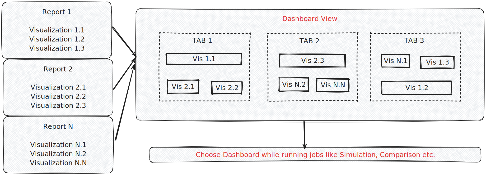

<helper-panel object='Report' location='list'>

## What is a Report?

A report is an analytical entity created to derive insights from a given data source. It is designed to visually communicate findings and statistical analysis through various charts and plots, enabling stakeholders to make informed decisions.

A typical report comprises the following components:

- **Data Source:** The foundational datasets from which insights are derived.
- **Computation Logic:** The processing and transformations applied to the data, such as statistical calculations, grouping, filtering, and model-based analysis.
- **Visualization Logic:** The presentation of raw or computed results using charts, tables, and other visual elements to improve interpretation.

> **Note:** Multiple such reports could be structured in a relevant manner to create a dashboard (details below) in GGX.


## Benefits of Report Registration:

- **Customize reports** as per MRM, Fair Lending, Business, and Development requirements.
- Add multiple reports to create **use-case specific dashboards**.
- **Track all modifications** and enable **enhanced version management**.
- **Enhanced collaboration and approval process** with MRM, FL, and other team members.
- Usage tracking using **Lineage Tracking** capability.
- **Reusability across multiple cases** reduces the need to go through the approval process again.
- Allows for **quick updates** to meet changing needs and business logic.

## Managing Reports on the Platform:

The **Report Registry** organizes all the reports in a customized manner at a centralized location, allowing easier tracking, monitoring, and custom report creation.

### Report Registration:

1. Go to **Resources - Reports** and click on the **Create** button.
2. A new page will appear, requiring the following fields to be filled in:

    - **Name**
    - **Attributes:**
        - **Object Type:** The object for which the report will be used (e.g., Foundation Model, Pipeline, RAG, etc.).
        - **Job Types:** The supported simulation types (Simulation, Comparison, or Validation).
            - **Simulation:** Simulate the object on a given data source.
            - **Comparison:** Compare two object's performance on a data source.
            - **Validation:** Compare the object on multiple datasets.
    - **Properties:**
        - **Description:** Brief description of what the report aims to accomplish.
        - **Group:** The custom group where the report should be displayed for better organization.
        - **Approval Workflow:** Predefined approval chain for transitioning from Draft to Approved.

3. Define the report parameters:

    - **Name:** Intuitive name for the report parameter.
    - **Type:**
        - **String:** A string constant (e.g., a specific group).
        - **Number:** A float constant (e.g., thresholds like 0.5).
        - **String Column:** A dataset column used for evaluation.
        - **Registered Object:** An object already registered (e.g., GPT-4 evaluator model).
    - **Alias:** Python name for the parameter.
    - **Is Mandatory:** Whether the parameter is required for running the simulation.
    - **Description:** Short description of the report parameter.

4. Write the formula for the report:

    - **Source Data:** Defaulted to "Simplified Data" for structured reporting. Other options are deprecated.
    - **Select any additional inputs** (like Global Functions, Models, etc.) to aid in writing report logic.
    - **Report Computation:** Filtering, processing, and statistical calculations based on the job data.

The computation logic can use two default variables:

```plaintext
job: A Corridor Job object containing metadata.
job.current - Access to the current object.
job.challengers - Dictionary of challengers where the key is object name and value is object.
job.benchmarks - Dictionary of benchmarks where the key is object name and value is an object.
job.current.name gives the name of the current object

data: Dictionary containing job result data.
{'current': pyspark_dataframe} for Simulation jobs.
{'current': pyspark_dataframe, 'challenger_1': pyspark_dataframe} for Comparison jobs.
{'current': pyspark_dataframe, 'benchmark_1': pyspark_dataframe} for Validation jobs.
```

5. Define report visualization logic:

    - **Select any additional inputs** (like Global Functions, Models, etc.) to assist in report logic.
    - **Use Plotly, Seaborn, or Matplotlib** to generate figures.
    - **Metric outputs** should return a dictionary, e.g., `{'current': accuracy_value}`.
    - Add more such outputs using the **Add Output** button.

6. Add any additional notes or attachments.
7. Click on the **Create** button to finalize the report registration.

> **Notes:**

> - It is advisable to create a clear sketch of the dashboard in advance and carefully plan the types of charts and visualizations required.
> - Most of the time, the **String Column** type will be used, as the column would already be present in the dataset being used for simulation. Clearly define the report parameter for the string column.
> - If a report parameter is marked as **Non-Mandatory**, ensure the report code handles it correctly.
> - For Comparison and Validation jobs, dynamically rendered names are used for challengers and benchmarks dictionary.
> - It is recommended to have an **ID column** in datasets to merge challenger results with current data.
> - If Figure is selected and a pandas DataFrame is returned from the report output, it is rendered as a Grid Table, enabling sorting and filtering without additional code.

Once the report registration is completed, it can be used for creating **Dashboard Views** which are executed while running jobs (on the output of job data).

</helper-panel>

<helper-panel object='DashboardView' location='list'>

## What are Dashboard Views?

Dashboard Views are created to specify and organize report outputs that should be generated from job output. It enables precise selection of reports for execution and customization of the dashboard layout, including tab structure and names, content arrangement, plot order, and the height and width of each plot..

Dashboards can be specific to some use cases or tasks, e.g., Pipeline Performance Dashboard, Stability Dashboard, MRM-specific Dashboard, Fair Lending Dashboard, Agent Assist Risk Assessment Dashboard, and Classification Models Dashboard.



The Dashboard View registry organizes all the registered views into customized groups at a centralized location and allows easier tracking, monitoring, and creation of new views.

### Dashboard View Registration:

1. Click on **Create** button in Dashboard View Registry.
2. Fill in important details like **Name**, **Usage Option** (Object Type), **Properties** (Description, Group, Approval Workflow).
3. Create custom tabs in the **Tabs Section** by clicking on **Add Report Tab**.

    - Select **Report Name** from the dropdown list of reports filtered for the object type.
    - Select **Report Output** from the dropdown list of outputs associated with the Report.
    - Select **Width** and **Height** for the report outputs.

4. Create additional tabs by clicking on **Add Report Tab** if required.
5. **Add notes**, **attach documentation** if available in the **Additional Information** section.
6. Lastly, click on the **Create** button to finally register the function.

> **Note:** Dashboard Views are currently specific to object types (like Models, RAGs, Pipelines, etc.) and job types (like Simulation, Comparison, etc.).

Once a Dashboard is registered, it will be available for execution and generating reports while running object-specific jobs.

## Benefits of Dashboard View Registration:

- Use-case specific and use-case agnostic **standardized dashboard** creation as per MRM, Development, Fair Lending, and Business requirements.
- **Customized layout** for tabs and reports.
- **Full Auditability** and **approvals** for future usage.
- **Enhanced reusability** for similar use cases.
- Downstream usage tracking with **Lineage Tracking**.

</helper-panel>
