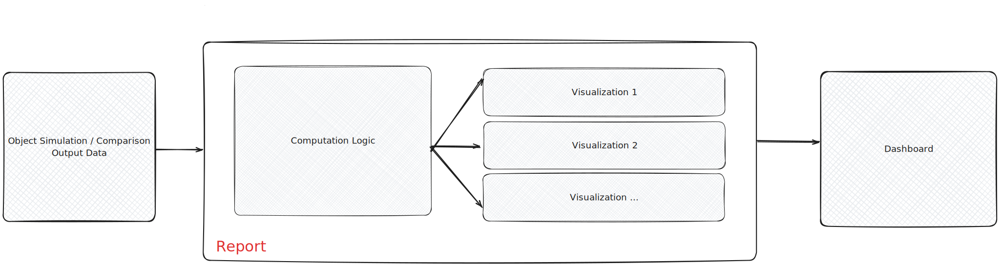

<helper-panel object='Report' location='list'>

## What is a Report?

A report is an analytical entity created to derive insights from a given data source. It presents statistical evaluations and key findings through visual elements such as charts and graphs, supporting stakeholders in making data-driven decisions.

A typical report comprises the following components:

- **Data Source:** The foundational datasets from which insights are derived.
- **Computation Logic:** The processing and transformations applied to the data, such as statistical calculations, grouping, filtering, and model-based analysis.
- **Visualization Logic:** The presentation of raw or computed results using charts, tables, and other visual elements to improve interpretation.

> **Note:** Multiple reports can be structured in a relevant manner to create a dashboard (details below) in GGX.



## Benefits of Report Registration:

- **Customize reports** to meet MRM, Fair Lending, Business, and Development requirements.
- Use multiple reports to create **use-case-specific dashboards** while running jobs.
- **Track all modifications** and enable **enhanced version management**.
- **Enhanced collaboration and approval process** with MRM, FL, and other team members.
- Usage tracking using the **Lineage Tracking** capability.
- **Reusability across multiple cases** reduces the need to go through the approval process again.
- Allows for **quick updates** to meet changing needs and business logic.

## Managing Reports on the Platform:

The **Report Registry** organizes all reports in a customized manner at a centralized location, allowing easier tracking, monitoring, and custom report creation.

### Report Registration:

1. Go to **Resources - Reports** and click on the **Create** button.
2. A new page will appear, requiring the following fields to be filled in:

    - **Name**
    - **Attributes:**
        - **Object Types:** The objects for which the report will be used (e.g., Foundation Model, Pipeline, RAG, etc.).
    - **Properties:**
        - **Description:** Brief description of what the report aims to accomplish.
        - **Group:** The custom group where the report should be displayed for better organization.
        - **Approval Workflow:** Predefined approval chain for transitioning from Draft to Approved.
    - Any other relevant details.

3. Define the report parameters:

    - **Alias:** Python name for the parameter.
    - **Type:**
        - **String:** A string constant (e.g., a specific group).
        - **Number:** A float constant (e.g., thresholds like 0.5).
        - **String Column:** A dataset column used for evaluation.
        - **Registered Object:** An object already registered (e.g., GPT-4 evaluator model).
    - **Is Mandatory:** Whether the parameter is required for running the simulation.
    - **Description:** Short description of the report parameter.

3. Define the example data to run the report. Example data can be created using registered tables or uploaded files.
4. Write the formula for the report:

    - **Source Data:** The data from the job would be present in the form of a dictionary (see below). 
    - **Select any additional inputs** (like Global Functions, Models, etc.) to aid in writing report logic.
    - **Report Computation:** Filtering, processing, and statistical calculations based on the job data.

The computation logic can use two default variables (`job` and `data`):

```plaintext
job: A Corridor Job object containing metadata.

job.current - Access to the current object.
job.challengers - Dictionary of challengers where the key is object name and value is object (only available when running Comparison jobs).
job.current.name gives the name of the current object

data: Dictionary containing job result data.

{'current': pyspark_dataframe} for Simulation jobs.
{'current': pyspark_dataframe, 'Challenger #1': pyspark_dataframe} for Comparison jobs.
```

5. Define report visualization logic:
This can use the computed results from the report computation and allow building visualizations like tables, charts, etc. The computed results would be present in a variable called `raw_output`

    - **Select any additional inputs** (like Global Functions, Models, etc.) to assist in report logic.
    - **Use Markdown, Plotly, Seaborn, or Matplotlib** to generate figures.
    - **Metric outputs** should return a dictionary, e.g., `{'current': accuracy_value}`.
    - Add more such outputs using the **Add Output** button.

6. Add any additional notes or attachments.
7. Click on the **Create** button to finalize the report registration.

> **Notes:**

> - It is advisable to create a clear sketch of the dashboard in advance and carefully plan the types of charts and visualizations required.
> - Most of the time, the **String Column** type will be used, as the column would already be present in the dataset being used for simulation. Clearly define the report parameter for the string column.
> - If a report parameter is marked as **Non-Mandatory**, ensure the report code handles it correctly.
> - For Comparison and Validation jobs, dynamically rendered names are used for challengers and benchmarks dictionary.
> - It is recommended to have an **ID column** in datasets to merge challenger results with current data.
> - If Figure is selected and a pandas DataFrame is returned from the report output, it is rendered as a Grid Table, enabling sorting and filtering without additional code.

Once the report registration is completed, it can be used while running jobs on the platform. The Dashboard would be created once the job is completed.

</helper-panel>
