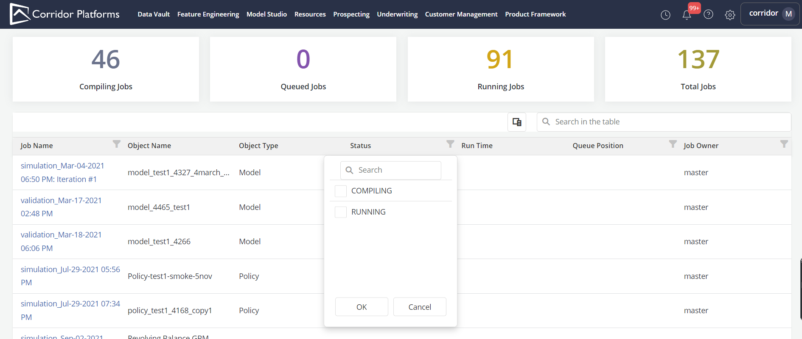

# Overview

The job board provides up to date information about the progression of the jobs in the Spark queue:

- What are the jobs currently running or in the queue
- Who are the owners
- How much resources are they taking
- If they are running how long have they been running, how much progress have they made etc.?

* This page will be accessible by clicking on clock icon on the top right corner of any page (including the landing page)

    

* The job board information displayed in a table for which there is a set of default columns

* Users can customize the default view by choosing what columns do display using the colum chooser

* Users can also sort and filter the table using all the columns

* Clicking on the Job Name will redirect to job details page

??? abstract " Job Board Samples"

    *  Sample Job Board for Compile ,Queued and  Running Jobs

        

        

    *  Samples for Job Board filters

        

        

        
