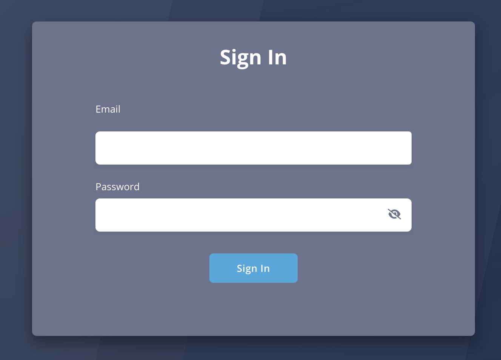
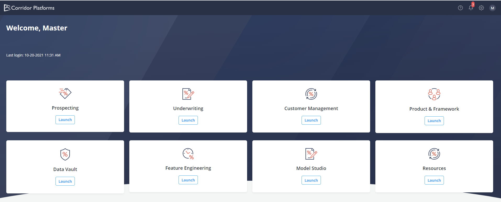
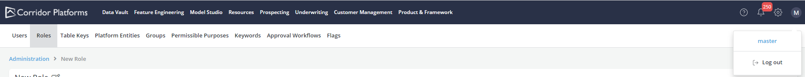
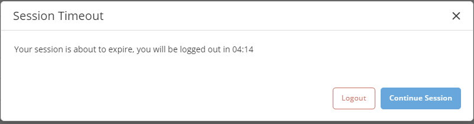

# Login/ Logout Pages

???+ abstract "Overview"

    In order to access the Platform, the user needs to Sign in and authenticate. This can be done using a few different methods, depending on the way the platform has been setup:

    * Corridor built-in Authentication
    * Central Authentication (with LDAP, ADS)
    * Single Sign-On (SSO)

??? abstract "Logging on to the Platform"

    To start using Corridor, launch the Application by opening the URL on your browser.

    Depending on the type of Authentication configured for your system - your login experience can differ.

    * When using Single Sign On - you will be redirected to your enterprise Login screen. Use your SSO username/password to login.

    * When using Corridor built-in Authentication - You will see Corridor's Login screen

    * When using Central Authentication - You will see Corridor's Login screen

    Enter the Username and Password provided to you and click on the **Sign In** button

    

    On a successful login, you should see the home page and navigate to the section that is relevant to you.

    

??? abstract "Logging out of the Platform"

    Follow the steps below to log out:

    * Click on the name icon on the top right and click on **Log Out**

    

??? abstract "Auto Logout Security Rules"

    Corridor can support multiple security configurations to ensure that user sessions are not misused. This helps to follow the security policy that is required by your organization.

    Corridor supports 3 configurations for auto-logout:

    * No auto logout - Here, users will never be logged out. This is not recommended as all responsibility of security is on the users to ensure they log out when they are done with their work.

    * Fixed time logout - Here, users will be logged out after a fixed amount of time (typically set to 30min or 60min). Before logging the user out - a popup is shown to users to check if they would like to continue using the system.

       

    * Activity based logout - Here, users will be logged out if they are inactive or idle for more than a specific time (typically set to 30min)

    ---

    In all 3 configurations, users can check how long their session will be active by using the Session-Timer on the left corner of the platform footer. It shows the user the amount of time remaining before the user will likely get logged out.

    

    If users want to extend their session - they can also manually click the refresh button to extend their session.

??? abstract "Password Reset"
For password reset, please contact system admin to reset the password and they can help you depending on the type of authentication you use.
