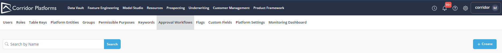
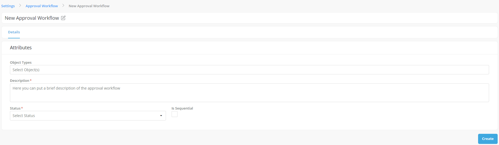
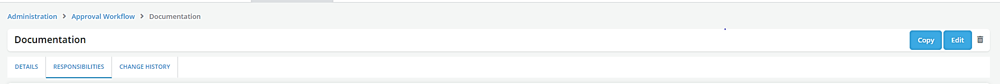
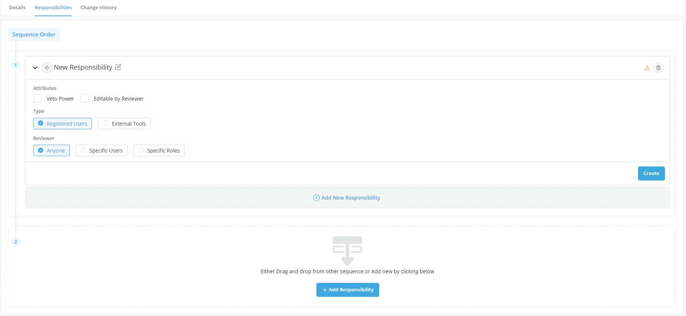
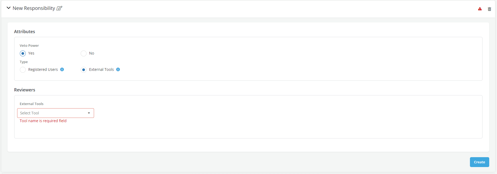
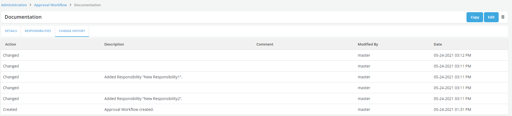

# Approval Workflow Settings

In Approval workflow set of users are defined under a workflow who collectively review and approve new objects of a certain type being registered in the platform. This Workflow is comprised of reviewers who are each assigned a specific responsibility (Note: one responsibility can be assigned to multiple reviewers). Every Workflow should have at least one responsibility

- Approval workflows can be created and edited within the **Settings** section by users with the right authority level (mainly users with Admin and Master roles)
- A responsibility can be assigned a Veto power which allows users to specify for a given responsibility in the workflow

??? abstract "How to create Approval Workflow"

    * Click on the **Settings** :material-cog: on the taskbar

    

    * Click on **Approval Workflow** option
    * Click on **Create**

    

    * Populate required details in **Details** tab
    * **Object Types**- Select the Object types to define the objects that the Committee can approve
    * Enter the description of the committee
    * Select the status : Active (i.e., make workflow available for use in new approval requests) or Inactive (i.e., don't make it available for use in new approval requests)
    * Check the "Is Sequential" box if you want to enforce a specific sequence in the workflow that would dictate in which order the different responsibilities will perform their reviews

    Notes:

        * The status of a workflow can be changed after it creation

        * A workflow with an "Active" status can be changed to "Inactive" status only if it is not being used (i.e., there is no open/incomplete approval request for that workflow)

    * Click on **Create**

    

    * Go to **Responsibilities** tab to create and define the responsibilities of the Approval Workflow
    * Click on **Edit**

    

    * Click on **Add New responsibility**

    * Select the **Veto** option to provide Veto access to the responsibility (as applicable)
    * Specify the **Editable** option to provide edit rights to the responsibility (as applicable)
    * Choose the appropriate radio button for defining the type of users:

      * **Registered Users**: Users registered on the platform with required permissions.
      * Choose the appropriate radio button for defining the Reviewer:
        * **Anyone**- Anyone with Approval rights (as defined in Roles section) to the object types (defined in Details tab) can be a reviewer.
        * **Specific Users**- Select one or more reviewers from list of users (only users with approval rights to the object type(s) selected in Details tab can be selected)
        * **Specific Roles**- Select one or more roles from list of roles (only roles with approval rights to the object type(s) selected in Details tab can be selected)

      * If the workflow **is sequential** you can move the responsibility box up or down by dragging it with the mouse in order to specify its position in the sequence

        

      * **External tools**: This option is visible if any third-party tools are configured on the platform and allow users to define a 3rd party application as a responsibility within an approval workflow. Select the appropriate tool.

    

    * **Change History** tab displays history of the changes made in Approval Workflow

    
