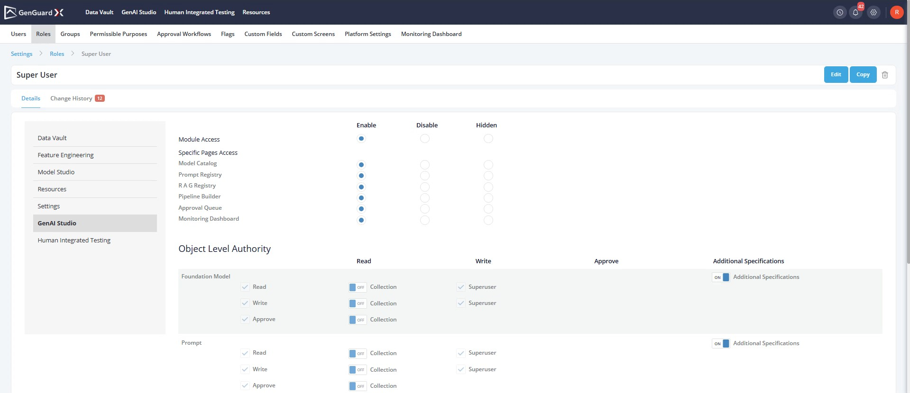

# Role Details

## Overview

The Role-Based Access Management capability is used to govern how users, with a given role access, can use the platform. Every onboarded user on the platform is assigned a User Role.

Roles can be created based on the following framework:

- The platform is structured as a set of modules (Data Vault, GenAI Studio, Resources, etc.). The modules can be Enabled, Disabled or Hidden.
- Each module comprises different pages (e.g., Table Registry, Quality Procedure, Prompts, RAGs, Reports, etc.). The pages can be Enabled, Disabled or Hidden.
- Within each page, objects such as Tables, Models, Pipelines, and Reports can be accessed.
- Objects have properties and attributes on which access can also be controlled.
- Access can be of different types: read, write, approve, and superuser.
- Access to each of the above components can be granted independently using the Roles capability.

!!! note

    Granular access control can be given to roles (such as restricting access to a particular collection of objects) using custom rules.

## How to create a New Role ?

All the roles defined on the platform can be viewed under **Roles** tab in **Settings** Module. To create a new role:

- Click on **Create** button on the Roles page.
- Fill in the **Name** for the role.
- A module and/or a specific page of the **module can be Enabled, Disabled or Hidden** for a given Role.

    - Enable: Allow to access
    - Disable: Show but not make it inactive (i.e., clickable)
    - Hidden: Hide (i.e., not visible)

- Select appropriate option to provide Module Access (Enable/Disable/Hidden) and Object Level Authority (Read/write/approve) to a Role
- There is an advance filter available (Additional Specifications) for some of the objects that can be used to grant users privileges that are limited to specific collections of objects.
- Switch on the toggle button to set the Additional Specifications. To define a collection, switch on the toggle button for **Collection**
    - User can be granted Read, Write, Approval or Superuser rights on an object
    - A Superuser role can be granted by checking the Superuser checkbox (Refer superuser section)
    - Define the collection using rules (i.e. LHS, Operator and RHS)
    - Click on the **Add** button for additional conditions.
        - On the LHS, access can be given for **Groups, Permissible Purpose**
        - Select the appropriate **Operator**
        - Select the appropriate value for the RHS field
- Click on **Create** button to finally create the role.

## Introduction to Superuser capability:

By default, the accesses granted through a role only apply to the objects that either the user have authored or those have been accessed through a share event. This access can be extended to other objects not owned by or shared with the user by adding a superuser entitlement to the role

Superuser entitlement can be granted using the following process:

- Creating a Role or enabling the existing role as Superuser.
- Assign Superuser access to the role.
- Assign the role to an existing or new user.
