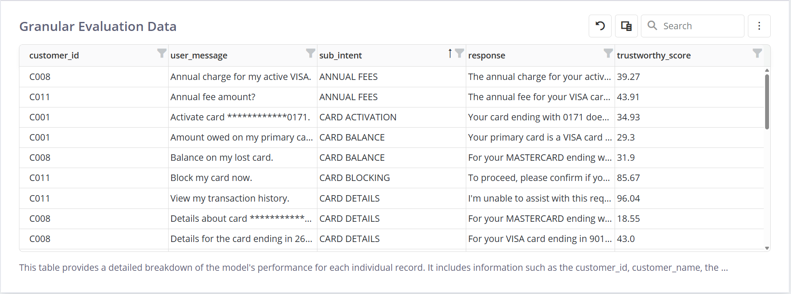
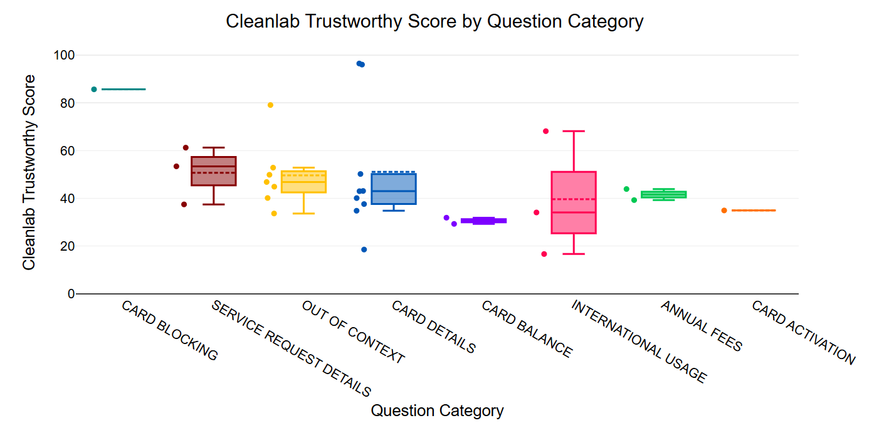

## About Cleanlab

Pioneered at MIT and proven at 50+ Fortune 500 companies, Cleanlab provides software to detect and remediate inaccurate responses from Enterprise AI applications. Cleanlab detection serves as a trust and reliability layer ensuring Agents, RAG, and Chatbots remain safe and helpful.

Recognized among the **Forbes AI 50, CB Insights GenAI 50, and Analytics India Magazine’s Top AI Hallucination Detection Tools**, the company was founded by three MIT computer science PhDs and is backed by $30M investment from Databricks, Menlo, Bain, TQ, and the founders of GitHub, Okta, and Yahoo.

## Integrating Cleanlab

Simply enter your Cleanlab API key once in the **Integrations** section of GGX. This enables authorized users to access Cleanlab’s capabilities within the platform. Once integrated, Cleanlab can be used as any other python package on the platform.

```
from cleanlab_tlm import TLM
tlm = TLM()
trustworthiness_score = tlm.get_trustworthiness_score("<your prompt>", response="<your response>")
```

## Potential Usage Within GGX

Cleanlab strengthens GGX by adding a **trust and reliability layer** that evaluates the accuracy, relevance, and safety of agents and their underlying components. With Cleanlab, one can systematically identify hallucinations, off-topic responses, unsafe outputs, and other critical issues across agents, RAG pipelines, and broader LLM workflows. Cleanlab’s metrics and scores can be used to create insightful reports for validating systems and can also serve as guardrails to ensure your agents respond safely.

### Key Use Cases

- **RAG System Evaluation**  
  Automatically detect inaccuracies, assess retrieval quality, and surface knowledge gaps in RAG pipelines.

- **Agent & Pipeline Response Evaluation**  
  Cleanlab’s TLM (Trustworthiness Language Model) assigns confidence scores to LLM responses, flagging hallucinations, ambiguous answers, and unsafe content with detailed explanations.

- **Data Quality & Reliability**  
  Identify and resolve issues such as mislabeled data, ambiguous examples, or statistical outliers ensuring your models are trained or validated on clean, trustworthy data.

### Example Use Case: Enhancing IVR System Evaluation with Cleanlab

Cleanlab significantly helps test IVR (Interactive Voice Response) systems by providing trustworthiness scores for various AI-driven processes. It evaluates the reliability of LLM decisions in classifying caller intent and routing calls, providing responses. Furthermore, Cleanlab can assesses the accuracy of human data labels used in validation, helping to pinpoint mislabeled data. For the auto-generated call summaries and candidate responses, Cleanlab's scores can highlight problematic outputs and areas where the agent may need further improvement.



For example, check below, Cleanlab can score how trustworthy each response is, making it easy to spot which types of questions or categories have issues.



## Want to Learn More ?

- [Cleanlab Codex Documentation](https://help.cleanlab.ai/codex/)
- [Cleanlab TLM Overview](https://help.cleanlab.ai/tlm/)
- [Cleanlab Studio Overview](https://help.cleanlab.ai/studio/quickstart/)
