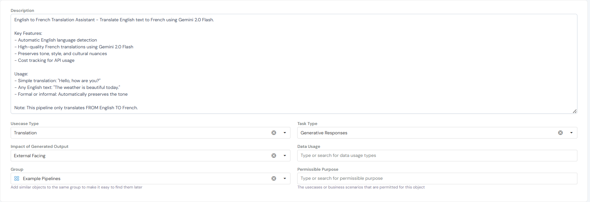
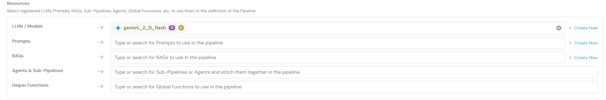
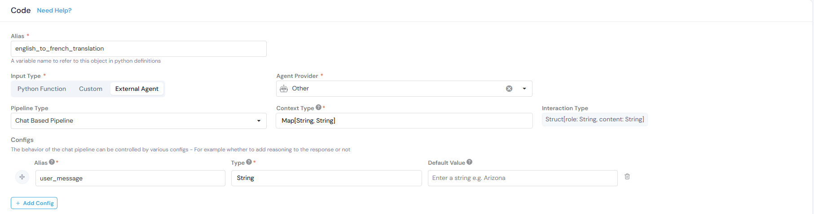
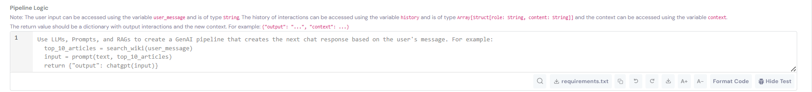
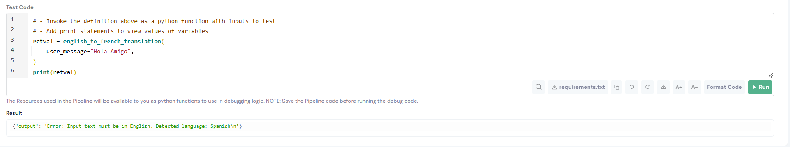

# English to French Translation Pipeline Documentation

## Overview
This pipeline provides automatic English-to-French translation using Gemini 2.0 Flash. It detects the input language and only translates English text, returning an error message for non-English inputs.

---

## Setup Instructions

### 1. Pipeline Configuration


- **Name**: English to French Translation
- **Alias**: `english_to_french_translation`
- **Type**: Chat Based Pipeline
- **Task Type**: Generative Responses
- **Group**: Example Pipelines

### 2. Resources Required


Register the following LLM in your platform:
- **Model**: `gemini_2_0_flash` (Gemini 2.0 Flash)
- **Provider**: VertexAI Agent Playbooks

> **Note**: The translation prompt can also be registered as a reusable Prompt resource on the platform for easier maintenance and version control.

### 3. Code Configuration


#### Input Variables
- `user_message`: String - The text to be translated

#### Configuration
- **Config**: `multi_turn` = `False` (Boolean)
- **Context Type**: `Map[String, String]`
- **Interaction Type**: `Struct{role: String, content: String}`

### 4. Pipeline Logic


```python
# Step 1: Generate strict translation prompt
prompt = f"""You are a language detection and translation system. Follow these rules strictly:

1. Detect if the input text is in English
2. If English: Return ONLY the French translation, nothing else
3. If NOT English: Return ONLY this exact format: "Error: Input text must be in English. Detected language: [LANGUAGE_NAME]"

Do not add any explanations, asterisks, numbering, or extra text. Return only the translation or error message.

Input text:
{user_message}"""

# Step 2: Get translation from Gemini
result = gemini_2_0_flash(
    text=prompt,
    temperature=0.3,
    system_instruction='None'
)

translated_text = result["response"]

# Step 3: Return result
return {
    "output": translated_text
}
```

---

## Usage Examples

- **Simple**: "Hello, how are you?" → "Bonjour, comment allez-vous ?"
- **Complex**: "The weather is beautiful today." → "Le temps est magnifique aujourd'hui."
- **Error**: "Hola amigo" → "Error: Input text must be in English. Detected language: Spanish"

---

## Testing the Pipeline



You can test the pipeline using the built-in test functionality:

```python
# - Invoke the definition above as a python function with inputs to test
# - Add print statements to view values of variables

retval = english_to_french_translation(
    user_message="Hola Amigo",
)

print(retval)
```

**Result:**
```
{'output': 'Error: Input text must be in English. Detected language: Spanish\n'}
```

The test demonstrates the pipeline correctly detecting non-English input and returning an appropriate error message.

---

## Notes

- This pipeline translates **FROM English TO French** only
- The prompt template can be saved as a Prompt resource for reuse across multiple pipelines
- Temperature is set to 0.3 for balanced creativity and accuracy
- Resources used in the pipeline are available as Python functions for debugging logic