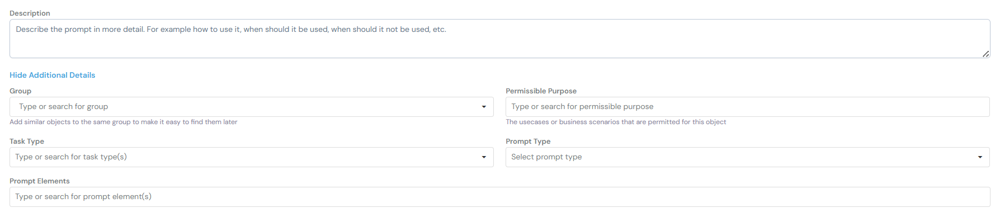
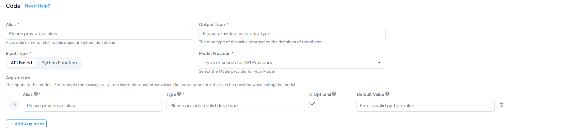
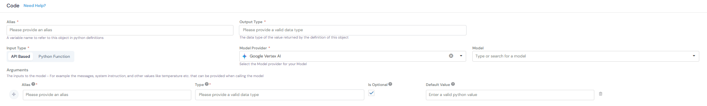
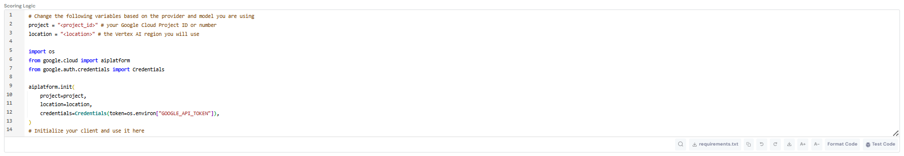
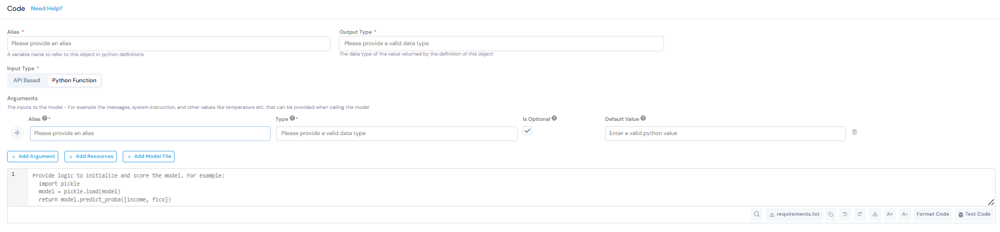

# Model Registration: Gemini 2.0 Flash

This guide covers registering the Gemini 2.0 Flash model for use in your pipelines.

## Overview

**Gemini 2.0 Flash** is Google's language model for classification and structured output tasks.

**Key Characteristics:**
- Provider: Google
- Model ID: `gemini-2.0-flash`

---

## Registration Steps

### 1. Navigate to Model Catalog

Go to **GenAI Studio → Model Catalog** and click the **Create** button.

### 2. Fill in Basic Information



**Description:**
```
Gemini 2.0 Flash 001 Model from Google.
```

**Group:** `Foundation LLMs`

**Permissible Purpose:** Type or search for applicable purposes

**Ownership Type:** `Proprietary`

**Model Type:** `LLM`

### 3. Configure Code Settings

#### Choose Input Type

**Input Type:** You have two options:

- **API Based** - Use this when working with models through API providers (OpenAI, Anthropic, Google Vertex AI, etc.)
- **Python Function** - Use this for custom Python implementations or local models

For this guide, we'll use **API Based**.



#### Select Model Provider

**Model Provider:** Select `Google Vertex AI` from the dropdown

Once you select a provider, additional fields will appear:



**Alias:** `gemini_2_0_flash`
- A variable name to refer to this object in Python definitions

**Output Type:** `Map[String, String]`
- The data type of the value returned by this model

**Model:** Select `Gemini 2.0 Flash` from the dropdown

### 4. Define Arguments

The inputs to the model - messages, system instruction, temperature, etc.

Click **+ Add Argument** to add each argument:

| Alias | Type | Is Optional | Default Value |
|-------|------|-------------|---------------|
| `text` | String | ☐ | - |
| `temperature` | Numerical | ☑ | 0 |
| `system_instruction` | String | ☑ | None |

**Argument Descriptions:**
- `text`: The input prompt to send to the model
- `temperature`: Controls randomness (0 = deterministic, 1 = creative)
- `system_instruction`: Optional system-level instructions for the model

### 5. Write Scoring Logic



Provide logic to initialize and score the model:

```python
import os
from google import genai
from google.genai import types

client = genai.Client(api_key=os.getenv("GOOGLE_API_TOKEN"))

config = types.GenerateContentConfig(
    temperature=temperature, 
    seed=2025, 
    system_instruction=system_instruction
)

response = client.models.generate_content(
    model="gemini-2.0-flash", 
    contents=text, 
    config=config
)

return {
    "response": response.text,
}
```

**What This Code Does:**
1. Authenticates using the `GOOGLE_API_TOKEN` environment variable (configured in Platform Integrations)
2. Sets up generation config with temperature and system instruction
3. Calls the Gemini 2.0 Flash model with the input text
4. Returns the generated response

**Additional Buttons Available:**
- **+ Add Resources** - Import other registered resources (models, RAGs, prompts)
- **+ Add Model File** - Upload model artifacts if needed

### 6. Test the Model


Use the platform's test interface to verify:
- API authentication works correctly
- Model responds as expected
- Output format matches your requirements

Click **Test Code** to run a sample query.

### 7. Save the Model

Add any notes or additional information in the **Additional Information** section, then click **Create** to complete registration.

---

## Python Function Alternative

If you selected **Python Function** instead of **API Based**, you would:

1. Not see the **Model Provider** or **Model** dropdowns
2. Write custom Python code to load and execute your model
3. Have full control over the implementation



**Example Python Function scoring logic:**
```python
import pickle

# Load your custom model
model = pickle.load(open('model.pkl', 'rb'))

# Score the input
result = model.predict_proba([[income, fico]])

return {
    "prediction": result[0],
    "confidence": max(result[0])
}
```

## Usage in Pipelines

Once registered, the model appears in your Resources library and can be selected when building pipelines.

**Reference in pipeline code:**
```python
# Call the registered model
response = gemini_2_0_flash(
    text=user_prompt,
    temperature=0.7,
    system_instruction="You are a helpful assistant."
)

# Access the response
output_text = response["response"]
```

---

## Related Documentation

- [Prompt Registration Guide](#) - Create reusable prompts
- [Pipeline Registration Guide](#) - Build pipelines using registered models
- [Google Gemini API Docs](https://ai.google.dev/gemini-api/docs) - Official Google documentation

---

**Next Steps:** 
1. Proceed to [Prompt Registration](#) to create prompts that use this model
2. Build [Pipelines](#) that combine your model with other resources