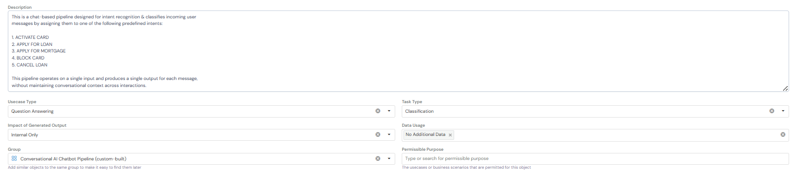
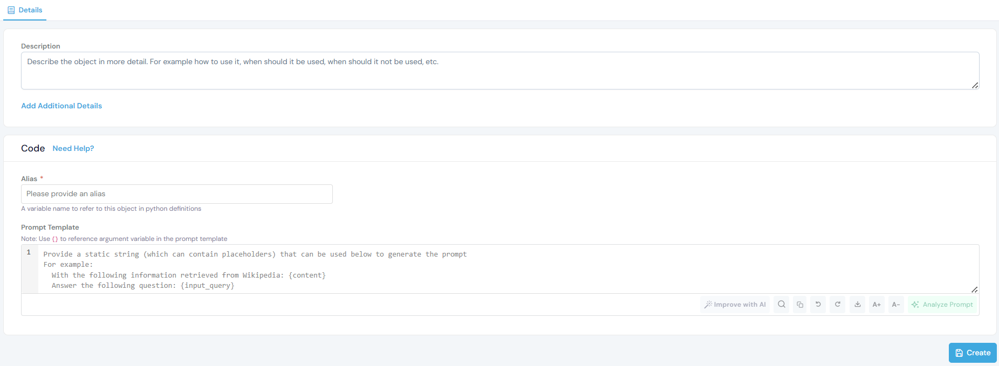
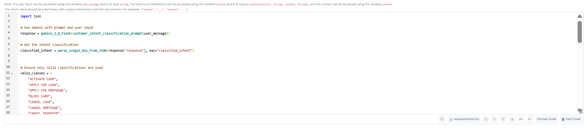
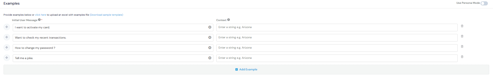

# Pipeline Registration Guide

This guide covers how to register pipelines on the Corridor platform, using an **Intent Classification Pipeline** as a working example.

## Prerequisites

Before registering a pipeline, ensure you have:

- ✅ **Registered a Model** - Follow the [Model Registration Guide](../model/) to register Gemini 2.0 Flash

- ✅ **Registered a Prompt** - Follow the [Prompt Registration Guide](../prompt/) to register the intent classification prompt

**Quick Check:** Navigate to **GenAI Studio → Model Catalog** and **Prompt Registry** to verify your resources are available.

If you haven't completed these steps, please do so before proceeding.

---

## What is a Pipeline?

A pipeline combines multiple resources (models, prompts, RAGs, helper functions) to create an end-to-end workflow. Pipelines on Corridor can be:

- Chat-based (maintain conversation history) or Free-flow (single input/output)
- Versioned and tracked
- Tested and validated
- Monitored in production

---

## Registration Steps

### 1. Navigate to Pipeline Registry

Go to **GenAI Studio → Pipeline Registry** and click the **Create** button.

### 2. Fill in Basic Information



**Basic Information** fields help organize and identify your pipeline:

- **Description:** Clear explanation of what the pipeline does and its workflow
- **Usecase Type:** The primary use case category (e.g., "Question Answering")
- **Task Type:** Specific task the pipeline performs (e.g., "Classification")
- **Impact of Generated Output:** Scope of the pipeline's usage (e.g., "Internal Only")
- **Data Usage:** Whether the pipeline uses additional data sources beyond user input
- **Group:** Category for organizing similar pipelines (e.g., "Conversational AI ChatBot Pipeline")
- **Permissible Purpose:** Approved use cases and business scenarios for this pipeline

**Example for Intent Classification Pipeline:**

```
This is a chat-based pipeline designed for intent recognition & classifies incoming user
messages by assigning them to one of the following predefined intents:

1. ACTIVATE CARD
2. APPLY FOR LOAN
3. APPLY FOR MORTGAGE
4. BLOCK CARD
5. CANCEL LOAN

This pipeline operates on a single input and produces a single output for each message,
without maintaining conversational context across interactions.
```

### 3. Configure Code Settings



**Code Settings** define how your pipeline operates and which resources it uses.

**Alias:** `customer_intent_classification_pipeline`

- A Python variable name to reference this pipeline

**Input Type:** `Python Function`

- Choose between Python Function or External Agent

**Pipeline Type:** `Chat Based Pipeline`

- Chat Based: Maintains conversation history
- Free Flow: Single input/output without context

**Context Type:** `str`

- The data type for conversation context

#### Add Resources

**Resources** are the pre-registered components your pipeline will use.

Click **+ Create New** or search for existing resources to add:

**LLMs / Models:**

- `gemini_2_0_flash` - The foundation model for generating responses

**Prompts:**

- `customer_intent_classification_prompt` - The structured instructions for intent classification

**Other Resources** (optional):

- **RAGs:** For retrieving relevant documents
- **Agents & Sub-Pipelines:** For complex multi-step workflows
- **Helper Functions:** For data processing utilities, or any other function according to your requirement

### 4. Write Pipeline Scoring Logic



**Pipeline Scoring Logic** orchestrates how resources work together:

- Combines models, prompts, and other resources
- Processes user inputs and conversation history
- Generates outputs and maintains context across turns

**Example - Intent Classification Pipeline:**

```python
import json

# Run Gemini with prompt and user input
response = gemini_2_0_flash(
    customer_intent_classification_prompt(user_message=user_message)
)

# Parse the JSON response to get the classified intent
response_json = json.loads(response["response"])
classified_intent = response_json.get("classified_intent", "UNKNOWN")

# List of valid intents
valid_intents = [
    "ACTIVATE CARD",
    "BLOCK CARD",
    "CARD DETAILS",
    "CHECK CARD ANNUAL FEE",
    "CHECK CURRENT BALANCE ON CARD",
]

# Validate the classified intent
if classified_intent not in valid_intents:
    classified_intent = "UNKNOWN"

# Return output and context
return {
    "output": f"Classified as: {classified_intent}",
    "context": classified_intent
}
```

**What This Does:**

1. Calls the Gemini model with the classification prompt and user message
2. Parses the JSON response to extract the classified intent
3. Validates the intent against the list of valid intents
4. Returns the classification result and stores it in context

**Variables Available:**

- `user_message` - The current user input (type: String)
- `history` - Previous conversation messages (type: list[TypedDict[{'role': str, 'content': str}]])
- `context` - Data from previous turns (type: String)

### 5. Add Examples (Optional)



Add test examples to validate pipeline behavior.

**Note:** Examples help with testing and documenting expected behavior.

### 6. Save the Pipeline

Click **Create** to register the pipeline.

The pipeline is now:

- Available in the Pipeline Registry
- Ready for simulation and testing

---

## Pipeline Types

### Chat Based Pipeline

- Maintains conversation history across turns
- Has access to `history` and `context` variables
- Suitable for: Chatbots, and multi-turn conversations

### Free Flow Pipeline

- Processes one input at a time
- No conversation history
- Suitable for: Single-shot classification, and one-off predictions

---

## Testing Your Pipeline

After creating the pipeline, test it to verify behavior:

### Quick Test (During Creation/Editing)

1. While creating or editing the pipeline, scroll to the **Code** section
2. Click **Test Code** in the bottom right corner
3. Enter test inputs to verify logic without saving

### Interactive Test (After Saving)

1. Navigate to your saved pipeline
2. Click **Run** → **Chat Session** (top right corner)
3. Enter sample messages to test the full conversation flow
4. Verify outputs match expected behavior

---

## Using Pipelines

### In Applications

Reference the pipeline in your application code:

```python
# Call the pipeline
result = customer_intent_classification_pipeline(
    user_message="I want to block my card",
    history=[],
    context=""
)

# Access the output
output = result["output"]  # "Classified as: BLOCK CARD"
intent = result["context"]  # "BLOCK CARD"
```

---

## Related Documentation

- [Model Registration Guide](../model/) - Register foundation models
- [Prompt Registration Guide](../prompt/) - Create reusable prompts

---

By following this guide, you can create reliable, production-ready pipelines that combine multiple AI resources into cohesive workflows.