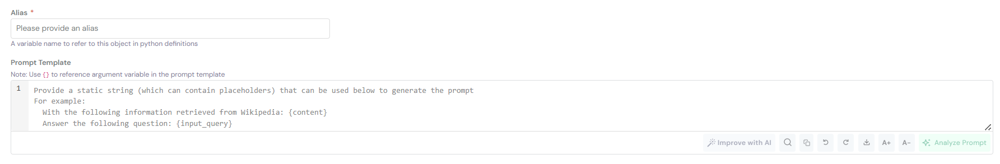
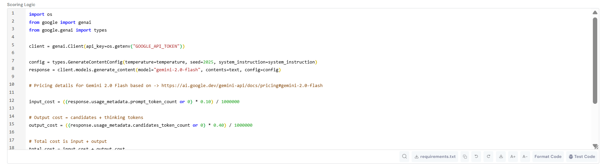

# Prompt Registration Guide

This guide covers how to register prompts on the Corridor platform, using an **Intent Classification Prompt** as a working example.

If you are new to Prompts, then this doc might help you understanding what they are and how do they work -> [Prompts](/docs/register-and-refine/inventory-management/prompts/index.md)

---

## Registration Steps

### 1. Navigate to Prompt Registry

Go to **GenAI Studio → Prompt Registry** and click the **Create** button.

### 2. Fill in Basic Information

**Description:**

Write a clear description of what your prompt does.

**Example for Intent Classification:**


**Basic Information** fields help organize and identify your prompt:

- **Description:** Clear explanation of what the prompt does and its purpose
- **Group:** Category for organizing similar prompts (e.g., "Existing Customer Credit Card Related Prompts")
- **Permissible Purpose:** Approved use cases and business scenarios for this prompt
- **Task Type:** Classification of the prompt's function (e.g., "Classification" for intent detection)
- **Prompt Type:** Format of the prompt (e.g., "System Instruction" for system-level prompts)
- **Prompt Elements:** Optional tags or metadata for additional categorization

### 3. Configure Prompt Template



**Alias:** `customer_intent_classification_prompt`

- A Python variable name to reference this prompt in pipelines

#### Example Prompt Template

The **Prompt Template** is where you write the actual instructions for the LLM:

- Use `{}` placeholders for dynamic variables (e.g., `{customer_utterance}`)
- Write clear, structured instructions for the model to follow
- Include examples to guide the model's behavior
- Define expected output format (e.g., JSON schema)

**Example Prompt Template for Intent Classification:**

````markdown
# PERSONA & TONE

You are a trusted, efficient, and security-conscious digital assistant,
specialized in handling banking-related queries for existing customers
of BankX.

Maintain a tone that is:

- Professional: Clear, formal, and polite
- Concise: Direct answers without filler
- Data-driven: Never guess; respond only based on verified data
- English only

# GOAL

Accurately predict customer intent from a predefined list of possible intents.

# TASK INSTRUCTIONS:

### Step 1: Review Intent Definitions

Thoroughly understand the predefined list of intents.

### Step 2: Pre-Defined List of Intents

#### ACTIVATE CARD

- Definition: Request to activate a newly issued card
- Examples:
  • "How do I activate my new debit card?"
  • "Activate my credit card now."

#### BLOCK CARD

- Definition: Request to block lost, stolen, or compromised card
- Examples:
  • "Block my credit card immediately."
  • "I lost my debit card, can you block it?"

#### CARD DETAILS

- Definition: Inquiry about card information
- Examples:
  • "How many cards do I have?"
  • "What is the name on my card?"

#### CHECK CARD ANNUAL FEE

- Definition: Inquiry about annual fees
- Examples:
  • "What's the annual fee for my credit card?"
  • "How much is my card's yearly charge?"

#### CHECK CURRENT BALANCE ON CARD

- Definition: Inquiry about available balance
- Examples:
  • "What's my credit card balance?"
  • "How much money is on my debit card?"

### Step 3: Disambiguate and Summarize Customer Utterance

- Overlook grammatical/spelling errors
- Ignore PII (name, age, gender, personal data)
- Focus on main intention in long sentences

### Step 4: Mapping Query to Intent

- Map to most suitable intent from predefined list
- Ensure only one intent is chosen
- Recheck classification is in predefined list

### Step 5: Schema Compliance

OUTPUT FORMAT:

```json
{{"classified_intent": "str"}}
```

# EXAMPLE SCENARIOS:

Example 1:
Input: "I need to activate my new credit card."

    REASONING STEPS:
    - Review intent definitions
    - Understand all available intents
    - No disambiguation needed (clear query)
    - Maps to "ACTIVATE CARD" intent
    - Output in JSON format

    Output:

```json
    {{"classified_intent": "ACTIVATE CARD"}}
```

# Customer Query

Query: {customer_utterance}
````

#### Define Arguments

Arguments are inputs that get passed into the prompt template.

Click **+ Add Argument** to add:

| Alias          | Type   | Is Optional | Default Value |
| -------------- | ------ | ----------- | ------------- |
| `user_message` | String | ☐ No        | -             |

**Note:** Use `{customer_utterance}` in the template and map it from `user_message` in Prompt Creation Logic.

### 4. Write Prompt Creation Logic

**Prompt Creation Logic** allows you to programmatically process arguments before they're inserted into the template. This is useful for:

- Formatting complex data structures
- Generating dynamic content (like the intent list)
- Applying conditional logic based on inputs
- Validating or transforming user inputs

**Example - Formatting Intent Definitions:**



```python
intent_definitions = [
    {
        "Intent": "ACTIVATE CARD",
        "Definition": "Request to activate a newly issued card",
        "Examples": [
            "How do I activate my new debit card?",
            "Activate my credit card now.",
        ],
    },
    {
        "Intent": "BLOCK CARD",
        "Definition": "Request to block a lost, stolen, or compromised card",
        "Examples": [
            "Block my credit card immediately.",
            "I lost my debit card, can you block it?",
        ],
    },
    {
        "Intent": "CARD DETAILS",
        "Definition": "Inquiry about card information",
        "Examples": [
            "How many cards do I have?",
            "What is the name on my card?",
        ],
    },
    {
        "Intent": "CHECK CARD ANNUAL FEE",
        "Definition": "Inquiry about annual fees",
        "Examples": [
            "What's the annual fee for my credit card?",
            "How much is my card's yearly charge?",
        ],
    },
    {
        "Intent": "CHECK CURRENT BALANCE ON CARD",
        "Definition": "Inquiry about available balance",
        "Examples": [
            "What's my credit card balance?",
            "How much money is on my debit card?",
        ],
    },
]

def get_intent_info(data_list):
    """Format intent definitions into readable text"""
    formatted_list = []
    intent_number = 1

    for item in data_list:
        formatted_list.append(f"#### {intent_number}. {item['Intent'].upper()}")
        formatted_list.append(f"- Definition: {item['Definition']}")
        formatted_list.append(f"- Examples:")
        for example in item["Examples"]:
            formatted_list.append(f"  • {example}")
        formatted_list.append("")  # Empty line between intents
        intent_number += 1

    return "\n".join(formatted_list)

# Fill in the prompt template
return prompt.format(
    customer_utterance=user_message,
    list_of_intents=get_intent_info(intent_definitions)
)
```

**What This Does:**

1. Defines 5 card-related intent definitions with examples
2. Formats them into a structured, numbered list
3. Fills in `{customer_utterance}` and `{list_of_intents}` placeholders

### 5. Save the Prompt

Click **Create** to register the prompt.

The prompt is now:

- Available in the Prompt Registry
- Usable in pipelines and other objects

### 6. Analyze and Improve the Prompt

After saving the prompt, you can test and refine it directly within **GenAI Studio**:

- **🔍 Analyze Prompt:**  
  Click the **Analyze Prompt** button to evaluate how your prompt behaves with different inputs.  
  This helps you confirm that argument mappings, placeholders, and output formats are working correctly.

- **✨ Improve with AI:**  
  Use the **Improve with AI** button to automatically optimize your prompt.  
  This provides AI-generated suggestions to enhance clarity, tone, and structure — helping improve prompt performance and consistency.

---

## Using Prompts in Pipelines

Once registered, prompts can be used in pipelines:

```python
# Reference the prompt in pipeline code
intent_result = customer_intent_classification_prompt(
    user_message=user_input
)

# Access the classified intent
classified_intent = intent_result["classified_intent"]

# Use in downstream logic
if classified_intent == "ACTIVATE CARD":
    # Handle card activation
    pass
elif classified_intent == "BLOCK CARD":
    # Handle card blocking
    pass
```

---

## Related Documentation

- [Model Registration Guide](../model/) - Register LLM models to use with prompts
- [Pipeline Registration Guide](../pipeline/) - Combine prompts with models in workflows

---

## Next Steps

After registering your prompt:

1. **Register a model** - If you haven't already, register the LLM to use with this prompt
2. **Build a pipeline** - Combine your prompt with a model and other resources

---

By following this guide, you can create well-structured, maintainable prompts that drive reliable LLM behavior across your organization.