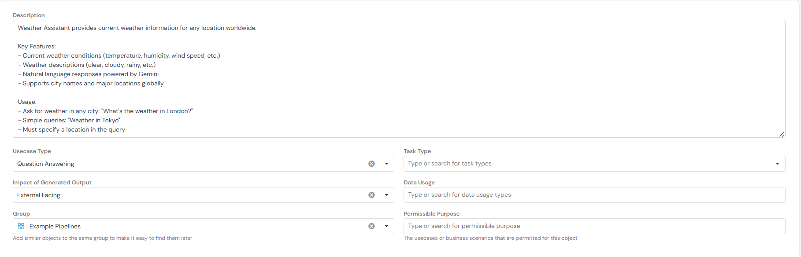
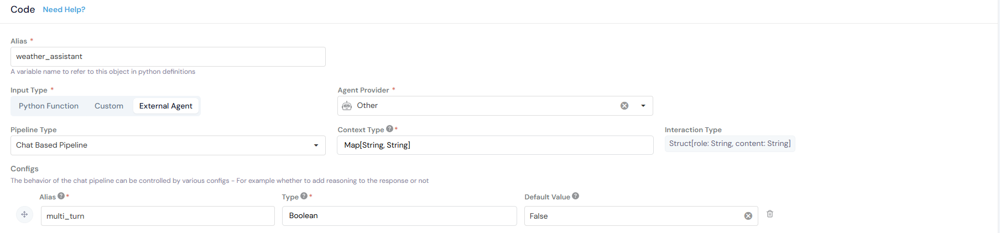
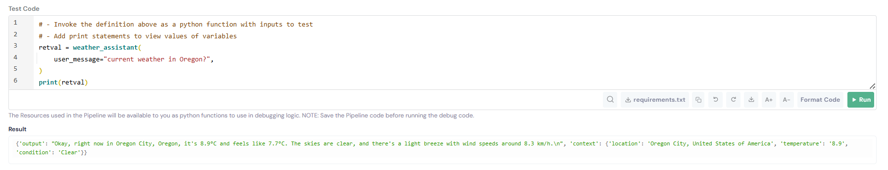

# Weather Assistant Pipeline Documentation

## Overview
This pipeline provides current weather information for any location worldwide. It uses Gemini to extract location from natural language queries and generates conversational responses with real-time weather data from WeatherAPI.

---

## Setup Instructions

### 1. Pipeline Configuration


- **Name**: Weather Assistant
- **Alias**: `weather_assistant`
- **Type**: Chat Based Pipeline
- **Usecase Type**: Question Answering
- **Task Type**: Others
- **Group**: Example Pipelines

### 2. Code Configuration


#### Input Variables
- `user_message`: String - The weather query from the user

#### Configuration
- **Input Type**: External Agent
- **Agent Provider**: Other
- **Pipeline Type**: Chat Based Pipeline
- **Config**: `multi_turn` = `False` (Boolean)
- **Context Type**: `Map[String, String]`
- **Interaction Type**: `Struct{role: String, content: String}`

### 3. Pipeline Logic

The pipeline consists of three main functions:

#### Function 1: Get Weather Data
```python
def get_weather_data(location: str, api_key: str) -> dict:
    """Fetch weather data from WeatherAPI.com."""
    base_url = "https://api.weatherapi.com/v1/current.json"
    params = {
        'q': location,
        'key': api_key
    }
    
    response = requests.get(base_url, params=params, timeout=10)
    response.raise_for_status()
    return response.json()
```

#### Function 2: Initialize Gemini
```python
def init_gemini():
    """Initialize Gemini client."""
    from google import genai
    
    client = genai.Client(api_key="YOUR_API_KEY")
    return client
```

#### Function 3: Generate Response with Location
```python
def generate_response_with_location(client, user_query: str, weather_api_key: str) -> dict:
    """Use LLM to extract location and generate response."""
    
    # First, ask the LLM to extract the location
    extraction_prompt = f"""Extract the location from this weather query. Reply with ONLY the location name, nothing else.
If no location is mentioned, reply with "NONE".
User query: {user_query}
Location:"""
    
    response = client.models.generate_content(
        model='gemini-2.0-flash',
        contents=extraction_prompt
    )
    
    location = response.text.strip()
    
    if location == "NONE" or not location:
        return {
            "output": "Please specify a location to get weather information.",
            "context": {}
        }
    
    try:
        # Get weather data
        weather_data = get_weather_data(location, weather_api_key)
        
        # Generate natural response
        response_prompt = f"""You are a helpful weather assistant. Based on the following weather data, provide a natural, conversational response to the user's query.
User Query: {user_query}
Weather Data:
- Location: {weather_data['location']['name']}, {weather_data['location']['country']}
- Region: {weather_data['location']['region']}
- Temperature: {weather_data['current']['temp_c']}°C
- Feels Like: {weather_data['current']['feelslike_c']}°C
- Condition: {weather_data['current']['condition']['text']}
- Humidity: {weather_data['current']['humidity']}%
- Wind Speed: {weather_data['current']['wind_kph']} km/h
Provide a concise, friendly response that answers the user's question. Keep it natural and conversational, 2-3 sentences maximum."""
        
        response = client.models.generate_content(
            model='gemini-2.0-flash',
            contents=response_prompt
        )
        
        return {
            "output": response.text,
            "context": {
                "location": f"{weather_data['location']['name']}, {weather_data['location']['country']}",
                "temperature": str(weather_data['current']['temp_c']),
                "condition": weather_data['current']['condition']['text']
            }
        }
    
    except requests.exceptions.HTTPError as e:
        if e.response.status_code == 400:
            return {
                "output": f"Location '{location}' not found. Please check the spelling and try again.",
                "context": {}
            }
        return {
            "output": "There was an API problem. Please try again later.",
            "context": {}
        }
    except requests.exceptions.RequestException:
        return {
            "output": "There was an API problem. Please try again later.",
            "context": {}
        }
```

#### Main Logic
```python
# -- MAIN LOGIC --
WEATHER_API_KEY = "YOUR_WEATHER_API_KEY"

try:
    # Initialize LLM if not cached
    if "llm_client" not in cache:
        cache["llm_client"] = init_gemini()
    
    llm_client = cache["llm_client"]
    
    # Generate response (LLM handles location extraction)
    result = generate_response_with_location(llm_client, user_message, WEATHER_API_KEY)
    
    return result
except Exception:
    return {
        "output": "There was an API problem. Please try again later.",
        "context": {}
    }
```

---

## Testing the Pipeline



You can test the pipeline using the built-in test functionality:

```python
# - Invoke the definition above as a python function with inputs to test
# - Add print statements to view values of variables

retval = weather_assistant(
    user_message="current weather in Oregon?",
)

print(retval)
```

**Result:**
```
{'output': "Okay, right now in Oregon City, Oregon, it's 8.9°C and feels like 7.7°C. The skies are clear, and there's a light breeze with wind speeds around 8.3 km/h.\n", 'context': {'location': 'Oregon City, United States of America', 'temperature': '8.9', 'condition': 'Clear'}}
```

The test demonstrates the pipeline successfully extracting the location, fetching weather data, and generating a natural conversational response.

---

## Usage Examples

- **Ask for weather in any city**: "What's the weather in London?"
- **Simple queries**: "Weather in Tokyo"
- **Must specify a location in the query**

---

## Notes

- The pipeline uses **Gemini 2.0 Flash** to extract locations from natural language queries
- Weather data is fetched from **WeatherAPI.com** in real-time
- In this example, all functions are included inside the pipeline logic, but they can also be registered as resources (Global Functions) on the platform and then used here for better reusability
