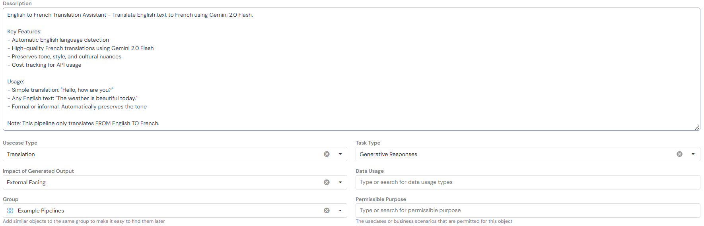
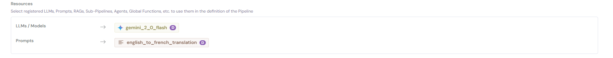
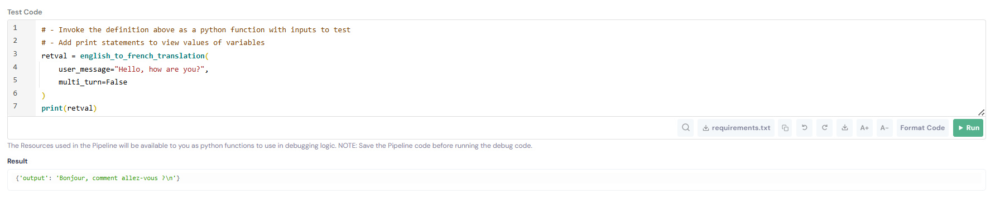

# Pipeline Registration Guide: English to French Translation

This guide walks you through registering an **English to French Translation Pipeline** on the Corridor platform. This pipeline automatically detects English text and provides high-quality French translations using Gemini 2.0 Flash.

**What This Pipeline Does:**

- Detects if input text is in English
- Translates English text to French with preserved tone and style
- Returns error messages for non-English input
- Tracks API usage costs

If you are new to Pipelines, read [What are Pipelines?](../../inventory-management/pipelines/index.md) to understand how they work.


## Prerequisites

Before registering this pipeline, ensure you have:

- ✅ **Registered Gemini 2.0 Flash Model** - Follow the [Model Registration Guide](../../model/) to register the model

- ✅ **API Token Configured** - Ensure `GOOGLE_API_TOKEN` is set up in Platform Integrations

**Quick Check:** Navigate to **GenAI Studio → Model Catalog** and verify `gemini_2_0_flash` is available.

If you haven't completed these steps, please do so before proceeding.


## Registration Steps

### Step 1. Navigate to Pipeline Registry

Go to **GenAI Studio → Pipeline Registry** and click the **Create** button.

### Step 2. Fill in Basic Information



**Basic Information** fields help organize and identify your pipeline:

- **Description:** Clear explanation of what the pipeline does and its workflow
- **Usecase Type:** The primary use case category - select **Translation**
- **Task Type:** Specific task the pipeline performs - select **Generative Responses**
- **Impact of Generated Output:** Scope of the pipeline's usage - select **External Facing**
- **Data Usage:** Whether the pipeline uses additional data sources - leave empty for this pipeline
- **Group:** Category for organizing similar pipelines - select **Example Pipelines**
- **Permissible Purpose:** Approved use cases and business scenarios for this pipeline

**Example Description:**

```
English to French Translation Assistant - Translate English text to French using Gemini 2.0 Flash.

Key Features:
- Automatic English language detection
- High-quality French translations using Gemini 2.0 Flash
- Preserves tone, style, and cultural nuances
- Cost tracking for API usage

Usage:
- Simple translation: "Hello, how are you?"
- Any English text: "The weather is beautiful today."
- Formal or informal: Automatically preserves the tone

Note: This pipeline only translates FROM English TO French.
```

### Step 3. Configure Code Settings


**Code Settings** define how your pipeline operates and which resources it uses.

**Configuration Fields:**

- **Alias:** `english_to_french_translation`: A Python variable name to reference this pipeline in code

- **Input Type:** Select **Python Function** : This pipeline uses custom Python code for translation logic

- **Agent Provider:** Select **Other** : We're not using a pre-built agent provider for this translation pipeline

- **Pipeline Type:** Select **Chat Based Pipeline** :Enables conversational interface and message history.
 
- **Context Type:** `dict[str, str]`
  
  - Data type for storing information across conversation turns
  - For this pipeline, context stores translation metadata (costs, language detection)

- **Interaction Type:** `TypedDict[{'role': str, 'content': str}]`
  
  - Format for conversation history messages
  - Standard chat message format with role (user/assistant) and content

 
💡 *Note: While this is a single-turn translation, Chat Based Pipeline allows for future enhancements like multi-turn conversations*


### Step 4. Add Resources



**Resources** are the pre-registered components your pipeline will use.

Click **+ Create New** or search for existing resources to add:

**LLMs / Models:** `gemini_2_0_flash` - The foundation model for generating translations

**Prompts (Optional):** `english_to_french_translation` - The translation prompt for generating translations

- Follow the [Prompt Registration Guide](../../intent-classification-pipeline-registration/prompt/) to create a reusable prompt

**Other Resources** (Not required for this pipeline):

- **RAGs:** For retrieving translation dictionaries or context
- **Agents & Sub-Pipelines:** For complex multi-step translation workflows
- **Helper Functions:** For pre/post-processing text

### Step 5. Write Pipeline Scoring Logic


**Pipeline Scoring Logic** orchestrates how resources work together to perform the translation.

**Variables Available in the Pipeline:**

- `user_message` - The English text to translate (type: String)
- `history` - Previous conversation messages (type: list[TypedDict[{'role': str, 'content': str}]])
- `context` - Information stored across turns (type: dict[str, str])

**Complete Pipeline Code:**

```python
# Step 1: Generate strict translation prompt
prompt = english_to_french_translation(user_message=user_message)

# Step 2: Get translation from Gemini
result = gemini_2_0_flash(
    text=prompt,
    temperature=0.3,
    system_instruction='None'
)

translated_text = result["response"]

# Step 3: Return result
return {
    "output": translated_text
}
```

**What This Code Does:**

- Use the registered Translation Prompt to convert the user's message to a French translation
- Call the registered Gemini 2.0 Flash Model with the translation prompt to generate the translation:
- Return the translation as the output of the pipeline

### Step 6. Add Examples (Optional)


Add test examples to validate pipeline behavior:

| Input | Expected Output |
|-------|----------------|
| "Hello, how are you?" | "Bonjour, comment allez-vous ?" |
| "The weather is beautiful today." | "Le temps est magnifique aujourd'hui." |
| "Thank you very much!" | "Merci beaucoup !" |
| "Hola, ¿cómo estás?" (Spanish) | "Error: Input text must be in English. Detected language: Spanish" |

**Note:** Examples help with testing and documenting expected behavior. They also serve as regression tests when updating the pipeline.

### Step 7. Save the Pipeline

Click **Create** to register the pipeline.

The pipeline is now:

- ✅ Available in the Pipeline Registry
- ✅ Ready for simulation and testing
- ✅ Ready for use in downstream applications


## Testing Your Pipeline

After creating the pipeline, test it to verify translation quality and error handling

### Quick Test (During Creation/Editing)



1. While creating or editing the pipeline, scroll to the **Code** section
2. Click **Test Code** in the bottom right corner
3. Enter test inputs to verify logic without saving

**Sample Test Cases:**

```python
# Test Case 1: Simple greeting
user_message = "Hello, how are you?"
# Expected: "Bonjour, comment allez-vous ?"

# Test Case 2: Non-English input (error handling)
user_message = "Hola, ¿cómo estás?"
# Expected: "Error: Input text must be in English. Detected language: Spanish"
```

### Interactive Test (After Saving)

- Navigate to your saved pipeline
- Click **Run** → **Chat Session** (top right corner)
- Enter sample English messages to test the translation flow

**Verify:**

   - Translations are accurate and natural
   - Tone and style are preserved (formal/informal)
   - Non-English inputs return proper error messages
   - Output format is clean (no extra explanations)

**Chat Session Testing Tips:**

- Test both formal and informal language
- Try technical terms and idioms
- Verify cultural nuances are preserved
- Test edge cases (very short/long text, special characters)

## Want to Improve/Extend Your Pipeline? Try These Ideas:

- Auto-detect source language using NLP techiques and see how it performs compared to the current pipeline
- Add translation confidence scores and quality of the translations using evaluation providers
- Extend to support other languages

## Conclusion: 

You've successfully learned how to register an English to French Translation Pipeline that:

- ✅ Detects English language automatically
- ✅ Provides high-quality French translations
- ✅ Handles non-English input gracefully
- ✅ Maintains clean, production-ready code with reusable translation prompt and Gemini 2.0 Flash model

## Related Documentation

- [Model Registration Guide](../../model/) - Register foundation models like Gemini 2.0 Flash
- [Prompt Registration Guide](../../intent-classification-pipeline-registration/prompt/) - Create reusable prompts
