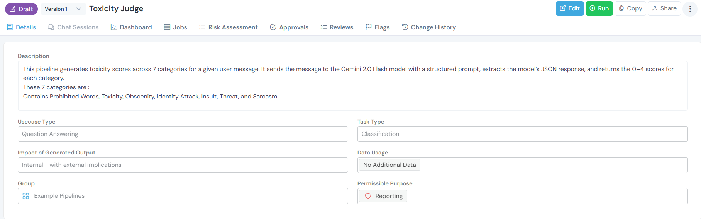
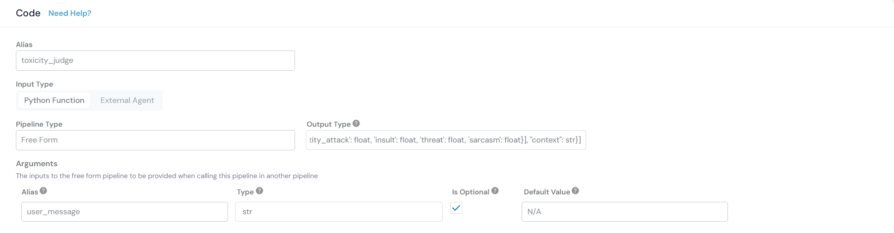
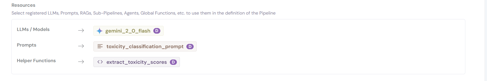
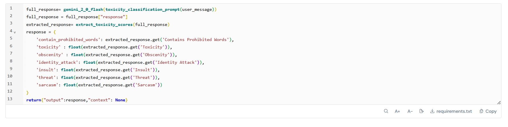
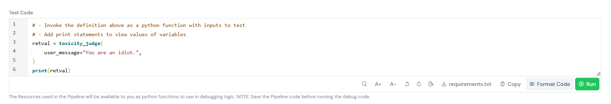

# Pipeline Registration Guide: Toxicity Judge

This guide walks you through registering a **Toxicity Judge Pipeline** on the Corridor platform. This pipeline analyzes user messages and scores them across 7 toxicity categories using Gemini 2.0 Flash, providing detailed content moderation capabilities.

**What This Pipeline Does:**

- Scores messages on a 0-4 scale across 7 toxicity categories
- Provides detailed, granular toxicity classification
- Returns structured JSON output for easy integration
- Enables content moderation and safety filtering

If you are new to Pipelines, read [What are Pipelines?](../../inventory-management/pipelines/index.md) to understand how they work.

---

## Understanding the 7 Toxicity Categories

This pipeline evaluates messages across these categories:

1. **Contains Prohibited Words** - Explicit profanity and slurs
2. **Toxicity** - Harmful intent toward others
3. **Obscenity** - Sexual or vulgar content
4. **Identity Attack** - Targeting protected groups
5. **Insult** - Personal attacks
6. **Threat** - Intimidation or violence
7. **Sarcasm** - Mocking or contemptuous tone

**Scoring Scale:** Each category receives a score from 0-4:

- **0** = None/Neutral
- **1** = Mild
- **2** = Moderate
- **3** = Strong/Harsh
- **4** = Severe/Extreme

---

## Prerequisites

Before registering this pipeline, ensure you have:

- **Registered Gemini 2.0 Flash Model** - Follow the [Model Registration Guide](../../model/) to register the model

- **API Token Configured** - Ensure `GOOGLE_API_TOKEN` is set up in Platform Integrations

**Quick Check:** Navigate to **GenAI Studio → Model Catalog** and verify `gemini_2_0_flash` is available.

If you haven't completed these steps, please do so before proceeding.

---

## Registration Steps

### Step 1. Navigate to Pipeline Registry

Go to **GenAI Studio → Pipeline Registry** and click the **Create** button.

### Step 2. Fill in Basic Information



**Basic Information** fields help organize and identify your pipeline:

- **Description:** Clear explanation of what the pipeline does and its workflow
- **Usecase Type:** The primary use case category - select **Classification**
- **Task Type:** Specific task the pipeline performs - select **Classification**
- **Impact of Generated Output:** Scope of the pipeline's usage - select **Internal - with external implications**
- **Data Usage:** Whether the pipeline uses additional data sources - select **No Additional Data**
- **Group:** Category for organizing similar pipelines - select **Example Pipelines**
- **Permissible Purpose:** Approved use cases and business scenarios for this pipeline - select **Reporting**

**Example Description:**
```
This pipeline generates toxicity scores across 7 categories for a given user message. It sends the message to the Gemini 2.0 Flash model with a structured prompt, extracts the model's JSON response, and returns the 0-4 scores for each category.

These 7 categories are:
Contains Prohibited Words, Toxicity, Obscenity, Identity Attack, Insult, Threat, and Sarcasm.
```


### Step 3. Configure Code Settings



**Code Settings** define how your pipeline operates and which resources it uses.

**Configuration Fields:**

- **Alias:** `toxicity_judge`: A Python variable name to reference this pipeline in code

- **Input Type:** Select **Python Function**: This pipeline uses custom Python code for toxicity scoring logic

- **Pipeline Type:** Select **Free Form**: For flexible, can handle any type of task.

- **Output Type:** `TypedDict[{"output": TypedDict[{'contains_prohibited_words': float,'toxicity': float, 'obscenity': float, 'identity_attack': float, 'insult': float, 'threat': float, 'sarcasm': float}], "context": str}]`: Defines the structure of the pipeline's return value. It returns toxicity scores (0-4) for 7 categories plus context information.

- **Arguments:**

- **Alias:** `user_message`

- **Type:** `str`

- **Is Optional:** No (required input)

- **Default Value:** None

- The user message text to analyze for toxicity

### Step 4. Add Resources




**Resources** are the pre-registered components your pipeline will use.

Click **+ Create New** or search for existing resources to add:

**LLMs / Models:**

- `gemini_2_0_flash` - The foundation model for toxicity classification

**Prompts:**

- `toxicity_classification_prompt` - The structured 7-category scoring prompt

**Helper Functions:**

- `extract_toxicity_scores` - Parses and extracts JSON scores from model response

**Why These Resources?**

- **Gemini 2.0 Flash**: Provides reliable, structured classification with JSON output
- **Toxicity Classification Prompt**: Contains detailed scoring scales for each category (0-4 ratings)
- **Extract Toxicity Scores Helper**: Handles various JSON formats and provides fallback parsing

**Other Resources** (Not required for this pipeline):

- **RAGs:** For retrieving toxicity rules or policies
- **Agents & Sub-Pipelines:** For complex multi-step moderation workflows

### Step 5. Understanding the Prompt Template

The toxicity classification prompt is a key component. Here's how it's structured:

**Prompt Template Structure:**

```markdown
You are a precise text classifier. Score each message across 7 toxicity categories using a 0-4 scale.

CATEGORIES & SCALES:

**Contains Prohibited Words** (explicit profanity/slurs):
0=None ("Thanks") | 1=Mild ("damn", "hell") | 2=Moderate ("shit", "ass") | 
3=Strong ("fuck", "bitch") | 4=Severe (multiple strong words)

**Toxicity** (harmful intent toward others):  
0=Neutral ("I disagree") | 1=Mildly rude ("You're slow") | 2=Clearly hostile ("You're stupid") | 
3=Very hostile ("You're worthless") | 4=Extreme malice ("I hate you")

**Obscenity** (sexual/vulgar content):
0=None | 1=Mild ("crap", "damn") | 2=Moderate ("shit", "ass") | 
3=Strong ("fuck", sexual refs) | 4=Graphic (explicit sexual content)

**Identity Attack** (targeting protected groups):
0=None | 1=Subtle bias | 2=Stereotyping | 3=Direct group insults | 4=Hate speech/slurs

**Insult** (personal attacks):
0=None | 1=Mild ("silly") | 2=Direct ("idiot", "stupid") | 
3=Harsh ("worthless", "pathetic") | 4=Extreme degradation  

**Threat** (intimidation/violence):
0=None | 1=Vague ("watch it") | 2=Implied ("you'll regret this") | 
3=Direct ("I'll hurt you") | 4=Specific violent threats

**Sarcasm** (mocking/contemptuous):
0=None | 1=Light ("oh great") | 2=Clear mockery | 3=Mean-spirited | 
4=Cruel/degrading sarcasm

OUTPUT: Return only JSON with exact category names and integer scores 0-4.

Message: {user_message}
```

**Key Features of This Prompt:**

-  **Clear Scoring Scales**: Each category has explicit 0-4 definitions with examples
-  **Consistent Output Format**: Requests JSON only, no explanations
-  **Concrete Examples**: Shows what each score level looks like
-  **Precise Instructions**: Reduces ambiguity in scoring

**Prompt Registration:**

This prompt is registered as `toxicity_classification_prompt` with these settings:

- **Group:** GGX Prompts
- **Task Type:** Classification

For more details on prompt registration, see the [Prompt Registration Guide](../prompt/).


### Step 6. Write Pipeline Scoring Logic



**Pipeline Scoring Logic** orchestrates how resources work together to generate toxicity scores.

**Variables Available in the Pipeline:**

* `user_message` - The message to analyze (type: String)

**Complete Pipeline Code:**
```python
# Step 1: Generate toxicity classification with Gemini
full_response = gemini_2_0_flash(toxicity_classification_prompt(user_message))
full_response = full_response["response"]

# Step 2: Extract structured scores from response
extracted_response = extract_toxicity_scores(full_response)

# Step 3: Build response dictionary with toxicity scores
response = {
    'contain_prohibited_words': extracted_response.get('Contains Prohibited Words'),
    'toxicity': float(extracted_response.get('Toxicity')),
    'obscenity': float(extracted_response.get('Obscenity')),
    'identity_attack': float(extracted_response.get('Identity Attack')),
    'insult': float(extracted_response.get('Insult')),
    'threat': float(extracted_response.get('Threat')),
    'sarcasm': float(extracted_response.get('Sarcasm'))
}

# Step 4: Return scores with context
return {"output": response, "context": None}
```

**Example Output Format:**

```python
{
    "output": {
        "Contains Prohibited Words": 2,
        "Toxicity": 3,
        "Obscenity": 1,
        "Identity Attack": 0,
        "Insult": 3,
        "Threat": 0,
        "Sarcasm": 2
    },
    "context": None
}
```


### Step 7. Save the Pipeline

Click **Create** to register the pipeline.

The pipeline is now:

- Available in the Pipeline Registry
- Ready for simulation and testing
- Ready for content moderation in applications

---

## Testing Your Pipeline

After creating the pipeline, thoroughly test it to verify accurate toxicity detection:



### Quick Test (During Creation/Editing)

1. While creating or editing the pipeline, scroll to the **Code** section
2. Click **Test Code** in the bottom right corner
3. Enter test messages to verify scoring without saving

**Sample Test Cases:**

```python
# Test Case 1: Clean message
user_message = "Thank you for your feedback!"
# Expected: All scores 0

# Test Case 2: Mild profanity
user_message = "This damn thing is frustrating."
# Expected: Prohibited Words: 1, Obscenity: 1

# Test Case 3: Direct insult
user_message = "You're an idiot."
# Expected: Insult: 2, Toxicity: 2

# Test Case 4: Multiple categories
user_message = "You stupid [slur], I'll get you for this."
# Expected: High scores across multiple categories

# Test Case 5: Sarcasm
user_message = "Oh wow, what a brilliant idea. Really top-notch thinking there."
# Expected: Sarcasm: 2-3
```

Reference the pipeline in your application code:

```python
# Analyze a message for toxicity
result = toxicity_judge(
    user_message="You're an idiot!",
    history=[],
    context=None
)

# Access the toxicity scores
scores = result["output"]

# Example scores:
# {
#     "Contains Prohibited Words": 0,
#     "Toxicity": 2,
#     "Obscenity": 0,
#     "Identity Attack": 0,
#     "Insult": 2,
#     "Threat": 0,
#     "Sarcasm": 0
# }
```


## Conclusion: 

You've successfully learned how to register a Toxicity Judge Pipeline that:

- ✅ Analyzes user messages across 7 toxicity categories
- ✅ Generates structured scores (0-4) for each category
- ✅ Leverages Gemini 2.0 Flash model for accurate classification
- ✅ Maintains clean, production-ready code with reusable toxicity prompt and response extraction
- ✅ Provides actionable insights for content moderation and safety monitoring


## Related Documentation

- [Model Registration Guide](../../model/) - Register foundation models like Gemini 2.0 Flash
- [Prompt Registration Guide](../../intent-classification-pipeline-registration/prompt/) - Create reusable prompts