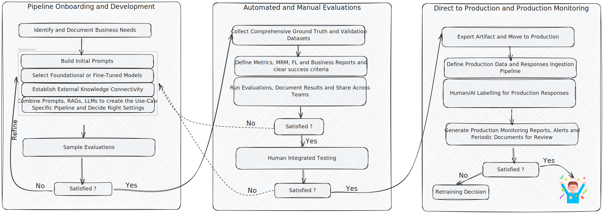

## Generative AI Lifecycle:

The Generative AI development lifecycle is a systematic framework designed to help businesses create effective AI-driven solutions across various applications. Each phase is vital in ensuring the technology’s accuracy, dependability, and ethical implementation.

Below is a breakdown of each stage and its significance:

#### **1. Business Use Case Identification**

The first step in the lifecycle involves defining the problem statement and objectives that the solution aims to address. Clearly defining the business goals is a very crucial first step as it lays the foundation for a well-structured development and validation strategy.

#### **2. Training and Validation Data Collection**

A GenAI pipeline relies heavily on high-quality, diverse datasets that cover all the business scenarios for testing and validation. Data must be gathered from reliable sources, preprocessed for consistency, and cleaned to remove noise. The platform enforces strong data governance and data quality checks that ensure integrity, compliance, and fairness, which directly impact model performance and validation. Usually, sample data is created out of this for quick testing during the pipeline development phase to expedite iterations.

#### **3. Pipeline Development**

Developing an AI pipeline is an iterative process aimed at rapidly building the first version of prompts, models, and Retrieval-Augmented Generation (RAG) components to address a specific business use case. Once the initial version is ready, incremental improvements can be made by refining each component and analyzing performance gains.

- **Crafting the Initial Prompt**
  Designing an effective prompt is crucial for generating accurate and relevant responses. However, prompt engineering is an iterative process that requires multiple refinements as development progresses.

- **Connecting to External Knowledge**
  Enhancing model responses with external knowledge sources improves contextual accuracy. In GenAI pipelines, this is achieved using RAG techniques. Building a robust RAG architecture ensures the pipeline retrieves the most relevant information, significantly impacting overall accuracy.

- **Choosing the Best LLM for the Use Case**
  Selecting an optimal LLM depends on various factors such as the business problem, expected outcomes, cost, and operational efficiency. Choosing the right model ensures the pipeline aligns with business objectives.

- **Pipeline Creation**
  Once the foundational components are established, end-to-end pipeline development begins. Often creating multiple pipeline versions and comparing them helps in selecting the best-performing one. One can swap in and swap out multiple building blocks of the pipeline to get to the best state.

- **Experimentation with Algorithms and Settings**
  Optimizing a pipeline requires experimenting with different models, algorithms, and hyperparameter settings (e.g., temperature, top-k, top-p). Fine-tuning these parameters ensures the model generates responses that align with performance goals.

#### **4. Evaluations - Automated and Human-based**

Before deploying a GenAI pipeline, it must be rigorously tested for accuracy, fairness, stability and robustness. A combination of automated evaluation techniques and human assessments ensures comprehensive validation. Tracking performance metrics and refining the model based on evaluation results helps maintain reliability and transparency.

#### **5. Move to Production**

Once the pipeline is validated, it is deployed into production environments where it integrates with existing business systems so that it can be used for real-world decision-making.

#### **6. Production Monitoring**

Continuous monitoring is crucial to maintaining performance and mitigating issues such as response drift and biases. Implementing monitoring tools ensures sustained accuracy and compliance with business and regulatory requirements.

## How does Corridor help with GenAI Lifecycle Management?

- **Data Integration:** Supports validation and testing data registration by integrating with production data lakes and in-house storage solutions.
- **Component Inventory:** Maintains a registry of essential GenAI pipeline components, including models, RAGs, prompts, and use-case-specific pipelines to enhance reusability and develop smaller building blocks.
- **Governance and Collaboration:** Provides features such as version management, change history, approvals, ongoing reviews, lineage tracking, impact assessment, and team collaboration to enhance governance, experiment tracking, MRM, FL and business approvals.
- **Evaluation and Reporting:** Enables assessment of complete pipelines and individual components using standardized (tailored for MRM, Fair Lending, and business needs) and custom reports.
- **Human-Integrated Pre-Production Testing:** Facilitates real-world-like testing by allowing different teams to conduct robust validation before deployment.
- **Artifact Export and Documentation:** Supports production artifact export and ODD generations.
- **Monitoring:** Connects to production data sources for response labelling and automated performance monitoring and alerting.
