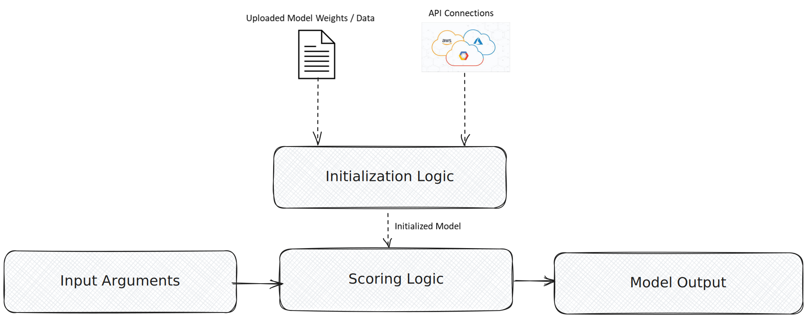

<helper-panel object='FoundationModel' location='list'>

## What is a Model?

A model is a software program that uses algorithms/rules to make informed decisions, predictions, or generations based on a set of inputs without being given explicit instructions for every scenario. (e.g., ML models, Lookup tables, If-Else rules, LLMs, etc.)

A model typically includes one or more of the following components:

- **Model file:** Stores learned weights/parameters, lookup tables, tensors, and other important data to be used for initializing the model.
- **Initialization Logic:** Prepares the model or client for processing multiple inputs if needed.
- **Scoring Logic:** Code that applies the initialized model to provide inputs to generate/predict responses.

GGX supports the registration of various types of models:

- **API-based models**: Connect to externally hosted models like OpenAI, Gemini, etc., using APIs.
- **Python-based models**: Lightweight Python logic using various libraries or rule-based models.
- **Custom models**: Uploaded model files, including Scikit-learn models, NLP models like BERT, and any fine-tuned models.

## Managing Models on the Platform:

The **Model Catalog** organizes all the registered models into customized groups at this centralized location, allowing easier tracking, monitoring, and model creation.

### Registering a Model:

1. Click on **Create** button in Model Catalog.
2. Fill in important details like **Name**, **Attributes** (Output Type, Alias), **Properties** (Group, Permissible Purpose, Description, Approval Workflow).
3. **Define Input Arguments** along with their types and default values.
4. **Select registered resources** (like Model, Global Functions, Prompts, etc.) to use in model definition.
5. **Select Input Type** (API-Based, Python-based, or Custom registration).
6. **Upload weights** if required. Define model logic by **writing code in Initialization Logic and Scoring Logic**.
7. **Select Training and Validation data**(if any) used for building or testing the models.
8. **Add notes**, **attach documentation** if available in the **Additional Information** section.
9. Lastly, click on **Save** to complete the registration process.

The registered models can be evaluated in the Model Catalog or used in downstream objects (like RAG, Model, Pipeline, Reports, etc.).

## Benefits of Model Registration:

- Automated tracking and **recording of modifications** with efficient version upgrades.
- Automatic detection of **Permissible Purpose violations**.
- **Testing and Comparison** with other registered models using custom and standardized validation kits.
- **Enhances reusability** across downstream applications and enables usage tracking with **Lineage Tracking**.
- Journey to production becomes more **transparent and fully auditable**, and **production monitoring** gets easier.
- Extract ready-to-productionize **executable artifact**.
- **Fingerprinting** of external API connectivity.
- **Better collaboration** for continuous model building and testing.

</helper-panel>
