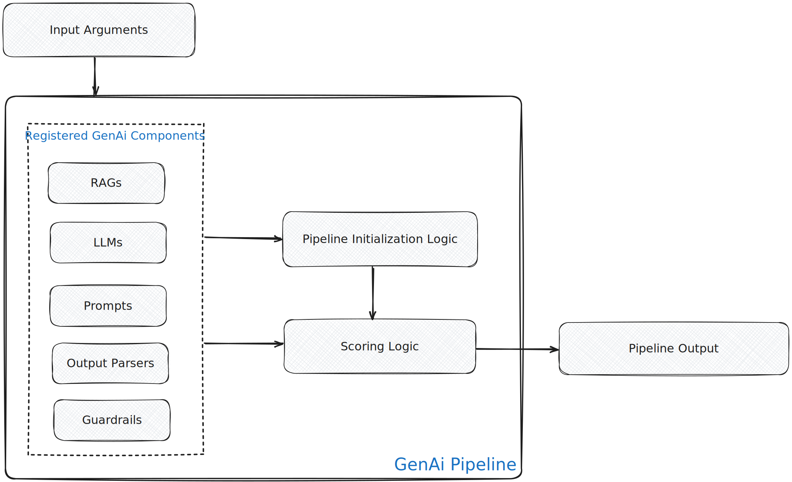

<helper-panel object='Pipeline' location='list'>

## What is a Pipeline?

A pipeline is a combination of multiple reusable components such as Models, RAGs, Prompts, Guardrails, and Other Sub Pipelines. It processes inputs through a logically structured sequence of these components to generate or predict an output.

For example, consider an **IVR (Interactive Voice Response) pipeline** that automates customer support calls. This pipeline can be constructed by combining two subpipelines:

1. **Intent Classification Subpipeline:**  
   This component analyzes the user's spoken or typed input (e.g., "I want to check my account balance") and classifies the intent, such as "Check Balance", "Report Lost Card", or "Speak to Agent".  
   - It can use a **Large Language Model (LLM)** and a **Prompt** to interpret the user's message and determine the intent. For example, a prompt can be designed to instruct the LLM to extract the intent from the input text.

2. **Response Generation Subpipeline:**  
   Based on the classified intent, this subpipeline generates an appropriate response. For example, if the intent is "Check Balance", it fetches the account balance and formulates a response; if the intent is "Report Lost Card", it initiates the card blocking process and confirms to the user.  
   - This subpipeline can use an **LLM**, a **Prompt**, and a **RAG (Retrieval-Augmented Generation) component** to access customer data or knowledge bases. For instance, the RAG can retrieve the latest account information or support policies, which the LLM then uses (guided by a prompt) to generate a personalized and accurate response.

The IVR pipeline orchestrates these subpipelines in sequence:

- **Step 1:** Receives the user's message.

- **Step 2:** Passes the message to the Intent Classification subpipeline to determine the user's intent.

- **Step 3:** Forwards the intent (and possibly the original message) to the Response Generation subpipeline to produce the final reply.

This modular approach allows you to reuse the LLMs, Intent Classification and Response Generation subpipelines in other pipelines as well. You can register each subpipeline and then stitch them to create an overall IVR pipeline in the Pipeline Registry.

**Example Flow:**

1. User says: "I lost my credit card."

2. Intent Classification subpipeline (using LLM + Prompt) detects intent: "Report Lost Card".

3. Response Generation subpipeline (using LLM + Prompt + RAG to customer data) replies: "I'm sorry to hear that. I have blocked your card. Would you like to request a replacement?"

Pipelines in GGX can be categorized into two types:

- **Chat-based Pipelines:** Maintain history and context across multiple user messages and pipeline responses, enabling context-aware interactions.
- **Free-Flow Pipelines:** Process one input at a time, generating a single output without retaining context from previous interactions.

A typical pipeline consists of:

- **Resources:** Like Model, RAGs, Prompts, Guardrails, Other Pipelines, etc.
- **Pipeline Scoring Logic:** Code that applies the pipelines to provided inputs and uses the various components to generate/predict responses.

## Managing Pipelines on the Platform

The **Pipeline Registry** organizes all the registered pipelines into customized groups at a centralized location, allowing easier tracking, monitoring, and new pipeline creation.

### Registering a Pipeline:

#### Create a Pipeline from Scratch

1. Click the **Create** button in the Pipeline Registry.
2. Fill in important details such as **Name** and **Properties** (Group, Permissible Purpose, Description, Approval Workflow), along with any other relevant information.
3. **Provide an alias** for the pipeline.
4. **Select Input Type** (Python-based, Custom Registration, or External Agent) and also choose the Pipeline Type (Chat-based or Free-Flow).
5. **Define input arguments or configs** along with their types and default values.
6. **Select registered resources** (such as Model, Global Functions, Prompts, RAGs, etc.) to use in the pipeline definition.
7. **Upload custom files/models if required** and define pipeline logic by writing code in the **Scoring Logic** section.
8. Optionally, configure starting examples for human-in-the-loop testing.
9. **Add notes** and **attach documentation** if available in the **Additional Information** section.
10. Finally, click **Save** to complete the registration process.

#### Connect to External Agents/Pipelines

External agents which has been built in another development environment can be connected to the GGX platform. This can be done by connecting to the external agent's API. For example, if an external agent has been built in Vertex AI Agent Playbooks, it can be connected to the GGX platform by connecting to the Vertex AI Agent Playbooks API.

Integrations to external agent providers like Vertex AI Agent Playbooks, AgentForce, Microsoft Copilot Studio, Vapi AI, etc. are available an can be configured in the Integration Module. New provider integrations can be added to the platform by extending the existing integration framework.

> **Note:**

> - The output type for Chat pipelines is fixed as a dictionary `{"output": string, "context": custom type}`. The context type can be defined in the **Formula Section**.
> - For chat pipelines, there is a default argument called `user_message`.
> - For chat pipelines, `history`, `context`, and `user_message` are available by default, maintaining historical messages in the standard OpenAI format (`Struct[content: String, role: String]`), context for information retention across turns, and `user_message` for the current message.
> - A `cache` variable is available by default which can be used to store any intermediate and resuable object/logic to avoid recomputation. One pipeline have one cache and it is shared across all the sessions.

Registered pipelines can be evaluated in the **Pipeline Registry**, **Human Integrated Testing**, or used in **downstream pipelines**. Live monitoring of pipelines can be done **Monitoring Module and Annotation Queues**.

</helper-panel>

## Pipeline Risk Assessment:
Platform provides a separate risk assessment tab for pipelines to document the assumptions, risks, and mitigations for the pipeline.
The users can document the risk assessment for the pipeline in this tab in various dimensions like : Accuracy, Stability, Ethics and Vulnerability. It also allow attaching the simulation to show the testing done.

## Benefits of Pipeline Registration:

- Automated tracking and **recording of modifications** with efficient version upgrades.
- Automatic detection of **Permissible Purpose violations**.
- **Testing and Comparison** with other registered pipelines using custom and standardized validation kits.
- **Enhances reusability** across downstream applications and enables usage tracking with **Lineage Tracking**.
- Journey to production becomes more **transparent and fully auditable**, and **production monitoring** becomes easier.
- Maintain a **Risk Assessment** record of the pipeline and its components.
- **Human Integrated Testing** and feedback logging for chat-based pipelines.
- Extract ready-to-productionize **executable artifacts**.
- **Better Collaboration** for continuous development and testing.

