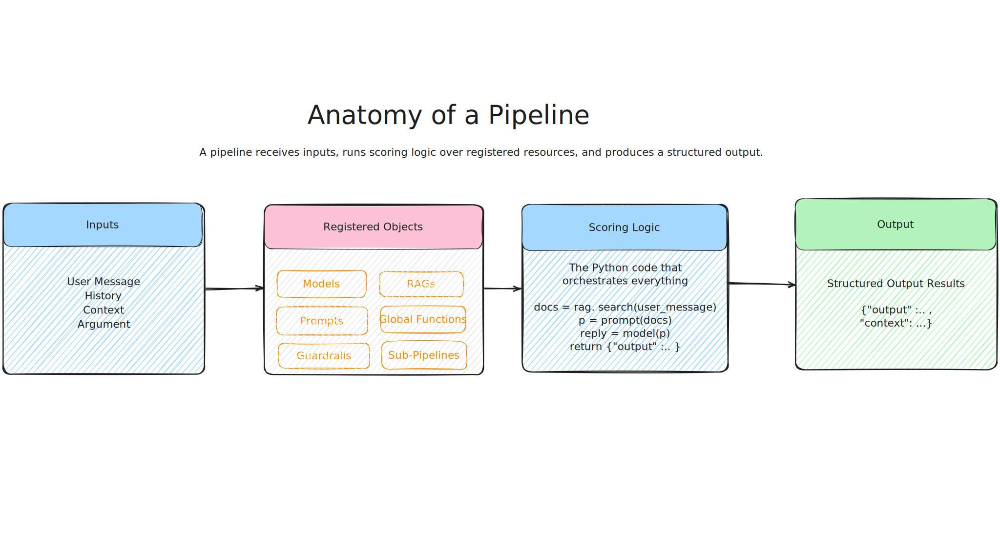

<helper-panel object='Pipeline' location='list'>
# Pipelines
 
## :material-help-circle-outline: What is a Pipeline?
 
A **pipeline** is a combination of reusable components (Models, RAGs, Prompts, Guardrails, and other sub-pipelines) wired together by a piece of code called orchestration logic. It takes an input, runs it through that logical sequence of components, and returns a generated or predicted output.
 
!!! tip "A simple way to picture it"
    Think of a pipeline as a **recipe**: the registered components are the ingredients, and the **orchestration logic** is the set of instructions that decides how they combine.
 
### Example: an IVR assistant pipeline
 
Consider an **IVR (Interactive Voice Response) pipeline** that automates customer support calls. Rather than building it as one large block of logic, you compose it from two smaller, reusable sub-pipelines.
 
<div class="grid cards" markdown>
-   :material-numeric-1-circle-outline: __Intent Classification__
    
    Reads what the caller said and labels their intent — for example `Check Balance`, `Report Lost Card`, or `Speak to Agent`.
    Pairs an **LLM** with a **Prompt** that instructs the model to extract a single intent from the caller's message.

-   :material-numeric-2-circle-outline: __Response Generation__
    
    Takes the detected intent and produces the reply.
    Uses an **LLM**, a **Prompt**, and a **RAG** component to pull live customer data — account details, support policies — so the answer is accurate and personalized.
</div>
 
The IVR pipeline simply orchestrates the two in sequence:
 
| Step | What happens |
|:----:|--------------|
| 1 | The caller's message arrives. |
| 2 | Intent Classification labels the intent. |
| 3 | Response Generation uses that intent to produce the final reply. |
 
Because each sub-pipeline is registered on its own, you can reuse it elsewhere — the same Intent Classification sub-pipeline could power a chat widget or an email triage tool.
 
!!! example "End-to-end flow"
    1. Caller says: *"I lost my credit card."*
    2. Intent Classification (LLM + Prompt) returns intent: `Report Lost Card`.
    3. Response Generation (LLM + Prompt + RAG) replies: *"I'm sorry to hear that. I've blocked your card. Would you like a replacement?"*
 
---
## :material-shape-outline: Pipeline Types
 
Every pipeline in GGX is one of three types. Choosing the right one is the first real decision you make when registering.
 
<div class="grid cards" markdown>
-   :material-chat-outline: __Chat-Based__
 
    **Best for:** conversations, assistants, multi-turn support.

    - :material-check: Keeps `history` and `context` across turns
    - :material-check: Stays aware of an ongoing conversation
    - :material-package-variant-closed: Output fixed: `{"output": ..., "context": ...}`
    > *Example:* a support chatbot that recalls earlier messages.

-   :material-flash: __Free-Flow__
 
    **Best for:** one-shot generative tasks — summarization, drafting, extraction.
    
    - :material-close: No memory — each input is independent
    - :material-lightning-bolt: Processes one input and is done
    - :material-package-variant: Output shape is whatever you define
    > *Example:* a pipeline that summarizes a document in one pass.

-   :material-tag-outline: __Classification__
 
    **Best for:** sorting an input into a known category — sentiment, intent, routing.

    - :material-format-list-bulleted: Returns one label from a set you predefine
    - :material-tune-variant: Can run single-turn, or take prior `context`
    - :material-package-variant-closed: Output is a fixed label, e.g. `positive`
    > *Example:* a pipeline that labels a review as `positive` or `negative`.
</div>

!!! question "Which should I choose?"
    Pick **Chat-Based** for a back-and-forth conversation, **Classification** when the answer must be one of a fixed set of labels, and **Free-Flow** for any other one-shot task.
 
## :material-sitemap-outline: Anatomy of a Pipeline
 
Regardless of type, every pipeline has the same three-part shape: it receives **inputs**, runs **scoring logic** that draws on **registered resources**, and returns an **output**.
 

   
<div class="grid cards" markdown>

-   :material-cube-outline: __Resources__
    
    The registered building blocks the logic can call: Models, RAGs, Prompts, Guardrails, and other pipelines.

-   :material-code-braces: __Scoring Logic__
 
    The code that applies those resources to the input to generate or predict a result.
</div>
!!! note
    For chat pipelines, the returned `context` is fed back in on the next turn — that is how the pipeline stays aware of an ongoing conversation.
 
---

## :material-view-grid-outline: Managing Pipelines in the Pipeline Registry
 
The **Pipeline Registry** is the central place where all registered pipelines live, organized into customizable groups. From here you can track, monitor, test, and create pipelines.
 
There are two ways to add a pipeline to the Registry:
 
<div class="grid cards" markdown>

-   :material-pencil-plus-outline: __Create from scratch__
 
    Build the pipeline logic directly within GGX using the Python Function Editor. This provides a more transparent, white-box approach where all components are registered within the GGX environment and seamlessly stitched together to form a pipeline. Each component can then be independently tested, validated, and debugged within the framework.

-   :material-connection: __Connect an external agent__
 
    Integrate a pipeline that is already running in an external environment through its API. This follows a more black-box approach, where the internal workings of the agent are abstracted away, and the interaction is limited to invoking the pipeline and consuming its outputs.
</div>
---
## :material-rocket-launch-outline: Registering a Pipeline from Scratch
 
You register a pipeline by clicking on the **Create** button on the Pipeline Registry page.
 
!!! abstract "Step 1 — Name and Description"
    Give the pipeline a clear **Name**, then write a **Description** explaining what it does, when to use it, and when not to.
 
    The description is plain English — it is what teammates read when deciding whether to reuse your pipeline, so it is worth a sentence or two of care.
 
    Under **Add Additional Details**, set the **Group**, **Permissible Purpose** and other metadata like **Usecase Type**, **Task Type** etc.
 
!!! abstract "Step 2 — Alias"
    The **Alias** is a variable name that other pipelines use to refer to this one in their code. It is **required**.
 
    Use a short, descriptive, code-safe name — lowercase with underscores, no spaces. For our running example: `card_assistant`.
 
!!! abstract "Step 3 — Input Type"
    Choose how the pipeline's logic is supplied:
 
    - **Python Function** — you write the logic in the Scoring Logic editor on this page.
    - **External Agent** — you connect to an agent built elsewhere (see *Connecting an External Agent* below).
 
!!! abstract "Step 4 — Pipeline Type, Interaction Type, and Context Type"
    These three fields move together and define how the pipeline handles data.
 
    | Field | What to do |
    |-------|------------|
    | **Pipeline Type** | Pick **Chat Based**, **Free-Flow**, or **Classification** (see the comparison above). |
    | **Interaction Type** | Set automatically from Pipeline Type — for chat pipelines it is `TypedDict[{'role': str, 'content': str}]`. No action needed. |
    | **Context Type** | Required for chat pipelines. Defines the data type of the `context` carried between turns — for example `dict[str, str]`. |
 
!!! abstract "Step 5 — Add Config, Resources, and Model File"
    Three buttons let you attach what the scoring logic needs:
 
    - :material-tune: **Add Config** — define input arguments or configuration values, each with a type and default. These become variables in your code.
    - :material-cube-outline: **Add Resources** — select registered components: Models, Prompts, RAGs, Global Functions, Guardrails, or other pipelines.
    - :material-file-upload-outline: **Add Pipeline Model File** — upload a custom model or supporting file if your logic depends on one.
 
!!! abstract "Step 6 — Write the Scoring Logic"
    In the **Scoring Logic** editor, write the Python code that ties everything together and returns the result. The resources from Step 5 are available as variables, alongside the default variables described below.
 
    Use the editor's built-in actions while you work:
 
    - **Format Code** — tidies indentation and spacing.
    - **Test Code** — runs the logic against sample input so you can confirm it works before saving.
 
!!! abstract "Step 7 — Finish Registration"
    Optionally configure starting examples for human-in-the-loop testing, and add notes or attach documentation under **Additional Information**.
 
    Then click **Create** to validate and register the pipeline. It is saved as a **Draft** until promoted.
 
---

## :material-variable: Variables Available in Scoring Logic
 
When you write scoring logic for a **chat pipeline**, several variables are provided automatically — you do not need to declare them.
 
| Variable | Type | What it holds |
|----------|------|---------------|
| `user_message` | `str` | The current message from the user. |
| `history` | `list[TypedDict[{'role': str, 'content': str}]]` | All previous messages, in standard OpenAI format. |
| `context` | your **Context Type** | Information carried over from earlier turns. |
| `cache` | any | A store for intermediate, reusable objects, so expensive work is not repeated. One cache per pipeline, shared across all execution. |
 
!!! info "About the output"
    The output of a chat pipeline is fixed as a dictionary — `{"output": string, "context": custom type}`. The `output` is the reply shown to the user; the `context` is whatever you want available on the next turn. The context's data type is the **Context Type** you set in Step 4.
 
---

## :material-clipboard-check-outline: Testing Your Pipeline
 
Once a pipeline is created, validate its behaviour before relying on it. There are three ways to test, in increasing order of thoroughness — from a quick check on a single input to a full run over an entire dataset.
 
<div class="grid cards" markdown>

-   :material-flash: __1 · Quick Test__
    
    Check the scoring logic on a single input.

-   :material-chat-processing-outline: __2 · Interactive Test__
    
    Run a saved pipeline live and step through a real conversation.

-   :material-database-arrow-right-outline: __3 · Bulk Simulation__
 
    Execute the pipeline over a full dataset to validate it at scale.
</div>

### :material-flash: 1 — Quick Test (during creation or editing)
 
Use this for a fast sanity check while you are still writing the logic. It runs the code without saving the pipeline.
 
!!! abstract "Steps"
    1. While creating or editing the pipeline, scroll to the **Code** section.
    2. Click **Test Code** in the bottom-right corner of the editor.
    3. Enter sample inputs to verify the logic runs and returns what you expect.
 
### :material-chat-processing-outline: 2 — Interactive Test (after saving)
 
Once the pipeline is saved, test it the way an end user would experience it.
 
!!! abstract "Steps"
    1. Navigate to your saved pipeline.
    2. Click **Run → Chat Session** in the top-right corner.
    3. Enter sample messages to walk through the full conversation flow.
    4. Confirm the outputs match the expected behaviour.
 
!!! note "Chat Session is for chat-based pipelines"
    **Chat Session** is available only for **chat-based** pipelines. For **free-flow** and **classification** pipelines, use the **Test Code** button instead — call the pipeline function with sample inputs to check the output.
 
### :material-database-arrow-right-outline: 3 — Bulk Simulation (validation at scale)
 
A single test input tells you the pipeline *works*; a **bulk simulation** tells you how it behaves across many real cases. It takes a full dataset and runs every row through the pipeline, producing one output per record so you can review results in bulk rather than one at a time.
 
Use a bulk simulation to:
 
- :material-magnify: Spot edge cases and inconsistent outputs that a single quick test would miss.
- :material-chart-line: Measure quality across a representative dataset before promoting the pipeline.
- :material-paperclip: Attach the run as evidence in the pipeline's **Risk Assessment** tab.
!!! tip "When to use which"
    Reach for **Quick Test** while writing the logic, **Interactive Test** to feel the end-user experience, and a **Bulk Simulation** before promoting the pipeline to production — it is the most thorough check of the three.
 
---

## :material-test-tube: Example: A Card Replacement Assistant
 
This example fills in every field for a realistic **chat-based pipeline** that helps customers replace a lost card.
 
??? note "Page fields for `card_assistant`"
 
    | Field | Value |
    |-------|-------|
    | Description | *"Conversational assistant that helps a customer report a lost card and request a replacement. Use for card-servicing chats; not for fraud disputes."* |
    | Alias | `card_assistant` |
    | Input Type | Python Function |
    | Pipeline Type | Chat Based Pipeline |
    | Context Type | `dict[str, str]` |
    | Resources | `kb` (a RAG over the card-policy knowledge base), `reply_prompt` (a Prompt), `chat_model` (an LLM) |
 
=== "Chat-Based scoring logic"
 
    ```python
    # Retrieve relevant card-policy passages for the user's message
    docs = kb.search(user_message, top_k=3)  # (1)!
 
    # Fill the prompt with the retrieved policy and the conversation so far
    filled_prompt = reply_prompt(
        user_message=user_message,
        history=history,
        policy_docs=docs,
    )
 
    # Generate the reply
    reply = chat_model(filled_prompt)
 
    # Track where we are in the flow so the next turn knows the
    # customer has already confirmed the card was lost
    updated_context = dict(context)
    updated_context["stage"] = "replacement_offered"  # (2)!
 
    return {"output": reply, "context": updated_context}  # (3)!
    ```
 
    1. `kb`, `reply_prompt`, and `chat_model` are **Resources** added in Step 5. `user_message` and `history` are provided automatically.
    2. On the next turn, `context["stage"]` is available again — so the pipeline knows not to ask *"did you lose your card?"* twice.
    3. Chat pipelines **must** return this exact `{"output", "context"}` shape.
 
=== "Free-Flow variant"
 
    A **Free-Flow** pipeline is simpler — no history, no context, and you define the output shape. For example, scoring the urgency of a support ticket:
 
    ```python
    # `ticket_text` is a Config argument defined via Add Config
    filled_prompt = urgency_prompt(ticket=ticket_text)
    score = chat_model(filled_prompt)
 
    return {"urgency": score}
    ```
 
=== "Classification variant"
 
    A **Classification** pipeline returns one label from a set you predefine at registration. For example, routing an incoming support message to the right team:
 
    ```python
    # Allowed labels are predefined when the pipeline is registered
    filled_prompt = routing_prompt(message=user_message)
    label = chat_model(filled_prompt)  # one of: billing, technical, general
 
    return label
    ```
 
---
## :material-link-variant: Connecting an External Agent
 
If a pipeline already runs in another environment, you can connect it to GGX instead of rebuilding it. On the New Pipeline page, set **Input Type** to **External Agent** and provide the agent's API connection.
 
For example, an agent built in **Vertex AI Agent Playbooks** can be connected through the Vertex AI Agent Playbooks API. Integrations for common providers — **Vertex AI Agent Playbooks, AgentForce, Microsoft Copilot Studio, Vapi AI**, and others — are available and configured in the **Integration Module**. New providers can be added by extending the existing integration framework.
 
!!! note
    Once connected, an external agent is tracked, tested, and monitored exactly like a pipeline built from scratch.
 
!!! info "Where pipelines go next"
    Registered pipelines can be evaluated in the **Pipeline Registry** or through **Human Integrated Testing**, and used inside **downstream pipelines**. Live monitoring is handled by the **Monitoring Module** and **Annotation Queues**.
 
---

</helper-panel>

## :material-shield-check-outline: Pipeline Risk Assessment
 
Each pipeline has a dedicated **Risk Assessment** tab for documenting its assumptions, risks, and mitigations.
 
Risks can be recorded across several dimensions, and you can attach simulations as evidence of the testing performed:

Note : These are some of the example risk dimensions, but this is configurable and can be auto-detected based on pipeline configurations. 

<div class="grid cards" markdown>

-   :material-target: __Accuracy__
    
    How reliably the pipeline produces correct results.

-   :material-scale-balance: __Stability__
 
    How consistently it behaves across inputs and over time.

-   :material-account-heart-outline: __Ethics__
 
    Fairness, bias, and responsible-use considerations.

-   :material-bug-outline: __Vulnerability__
 
    Exposure to misuse, adversarial input, or failure modes.
</div>


---
 
## :material-star-outline: Capabilities Enabled Through Registration:
 
<div class="grid cards" markdown>
-   :material-history: __Change tracking__
 
    Automatic recording of modifications, with efficient version upgrades.

-   :material-shield-alert-outline: __Purpose enforcement__
 
    Automatic detection of Permissible Purpose violations.

-   :material-compare: __Testing & comparison__
    
    Evaluate against other pipelines using custom and standardized validation kits.

-   :material-recycle: __Reusability__
    
    Reuse across downstream applications, with visibility through Lineage Tracking.

-   :material-clipboard-check-outline: __Auditable path to production__
    
    A transparent, fully auditable journey, with easier production monitoring.

-   :material-account-group-outline: __Human Integrated Testing__
    
    Feedback logging and human-in-the-loop testing for chat-based pipelines.

-   :material-package-variant-closed: __Executable artifacts__
    
    Extract ready-to-productionize artifacts straight from the Registry.

-   :material-handshake-outline: __Better collaboration__
    
    A shared base for continuous development and testing.
</div>
