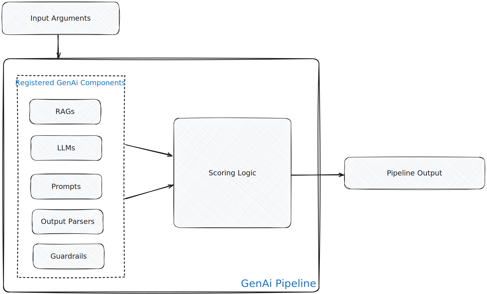

<helper-panel object='Pipeline' location='list'>

## What is a Pipeline?

A pipeline is a use-case-specific combination of multiple reusable components such as Models, RAGs, Prompts, Guardrails, and Other Pipelines. It processes inputs through a logically structured sequence of these components to generate or predict an output.

Pipelines in GGX can be categorized into two types:

- **Chat-based Pipelines:** Maintain history and context across multiple user messages and pipeline responses, enabling context-aware interactions.
- **Free-Flow Pipelines:** Process one input at a time, generating a single output without retaining context from previous interactions.

A typical pipeline consists of:

- **Resources:** Like Model, RAGs, Prompts, Guardrails, Other Pipelines, etc.
- **Pipeline Initialization Logic:** Prepares the pipeline for multiple requests if needed.
- **Pipeline Scoring Logic:** Code that applies the initialized pipelines to provided inputs and uses the various resources to generate/predict responses.

## Managing Pipelines on the Platform

The **Pipeline Registry** organizes all the registered pipelines into customized groups at a centralized location, allowing easier tracking, monitoring, and new pipeline creation.

### Registering a Pipeline:

1. Click on **Create** button in the Pipeline Registry.
2. Fill in important details like **Name**, **Attributes** (Output Type, Alias, Pipeline Type), **Properties** (Group, Permissible Purpose, Description, Approval Workflow)
3. **Define Input Arguments or Configs** along with their types and default values.
4. **Select registered resources** (like Model, Global Functions, Prompts, RAGs, etc.) to use in pipeline definition.
5. **Select Input Type** (Python-based or Custom registration).
6. **Upload custom files/models if required** and define pipeline logic by writing code in **Initialization Logic** and **Scoring Logic**.
7. **Add notes** and **attach documentation** if available in the **Additional Information** section.
8. Lastly, click **Save** to complete the registration process.

> **Note:**

> - The output type for Chat pipelines is fixed as a dictionary `{"output": string, "context": custom type}`. The context type can be defined in the **Formula Section**.
> - For chat pipelines, there is a default argument called `user_message`.
> - For chat pipelines, `history`, `context`, and `user_message` are available by default, maintaining historical messages in the standard OpenAI format (`Struct[content: String, role: String]`), context for information retention across turns, and `user_message` for the current message.

Registered pipelines can be evaluated in the **Pipeline Registry**, **Human Integrated Testing**, or used in **downstream pipelines**. Live monitoring of pipelines can be done **Monitoring Module and Annotation Queues**.

</helper-panel>

## Benefits of Pipeline Registration:

- Automated tracking and **recording of modifications** with efficient version upgrades.
- Automatic detection of **Permissible Purpose violations**.
- **Testing and Comparison** with other registered pipelines using custom and standardized validation kits.
- **Enhances reusability** across downstream applications and enables usage tracking with **Lineage Tracking**.
- Journey to production becomes more **transparent and fully auditable**, and **production monitoring** becomes easier.
- **Human Integrated Testing** and feedback logging for chat-based pipelines.
- Extract ready-to-productionize **executable artifacts**.
- **Better Collaboration** for continuous development and testing.

