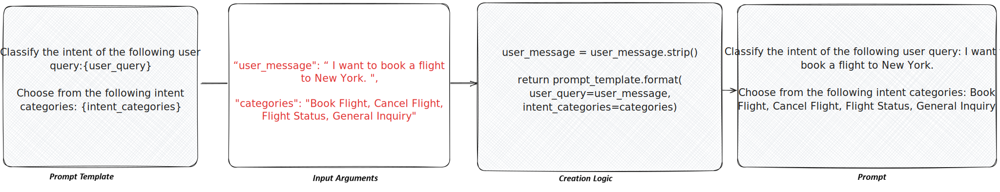

<helper-panel object='Prompt' location='list'>

## What is a Prompt?

A prompt is a natural language instruction provided to a generative model to direct its response or produce a desired outcome. It may include questions, commands, contextual details, few-shot examples, or partial inputs for the model to complete or extend.

Every prompt in Corridor consists of three key components that work together to generate dynamic, contextual instructions:

* **Prompt Template**: An instruction containing placeholders for dynamic content
* **Input Arguments**: Dynamic inputs that replace the placeholders in the template
* **Creation Logic**: Code that generates, retrieves, or formats the input arguments and fills them into the template

**Note:** System prompts and static prompts might not always require Input Arguments. For prompts without processing logic, the creation logic can directly return the prompt template.

## Managing Prompts in the Prompt Registry

The **Prompt Registry** serves as a centralized location that organizes all registered prompts into customized groups, enabling easier tracking, monitoring, and prompt creation across your organization.

## How to Register a Prompt

### Basic Information
1. Navigate to **Prompt Registry** and click **New Prompt**
2. In the **Details** tab, provide a **Description** of your prompt, including its purpose, when to use it, and expected output format
3. Click **Add Additional Details** to include supplementary information if needed

### Prompt Configuration
4. In the **Code** section, configure the following:
   * **Alias**: Provide a variable name to refer to this prompt in Python definitions
   * **Prompt Template**: Write your instruction template with placeholders for dynamic content

### Arguments and Resources
5. **Define Arguments**: Add input parameters for your prompt
   * **Alias**: Variable name for the argument
   * **Type**: Data type of the input
   * **Is Optional**: Check if the argument is optional
   * **Default Value**: Provide default values for optional arguments
6. Click **Add Argument** to include additional input parameters
7. **Select Resources & Inputs**: Choose other objects like Global Functions that are being used in this definition

### Prompt Implementation
8. **Write Prompt Creation Logic**: Implement code that:
   * Processes and formats input arguments
   * Retrieves any necessary context or data
   * Accesses the Prompt Template using the variable `prompt` (type `str`)
   * Returns the final prompt string
9. For simple static prompts, the creation logic can directly return the template

### Finalization
10. **Save** your prompt to complete the registration process

Once registered, prompts can be evaluated directly in the Prompt Registry or used in downstream objects such as models, RAG systems, pipelines, and reports.

## Benefits of Prompt Registration

### Version Control and Governance
* **Automated tracking** and recording of modifications with efficient version control
* **Automatic detection** of Permissible Purpose violations
* **Transparent and fully auditable** prompt evolution and usage history

### Testing and Optimization
* **Standardized evaluations** using custom and built-in validation kits

### Collaboration and Reusability
* **Enhanced reusability** across downstream applications and teams
* **Usage tracking** with comprehensive Lineage Tracking
* **Better collaboration** for prompt engineering and optimization
* **Centralized prompt management** for consistent messaging and quality control

</helper-panel>