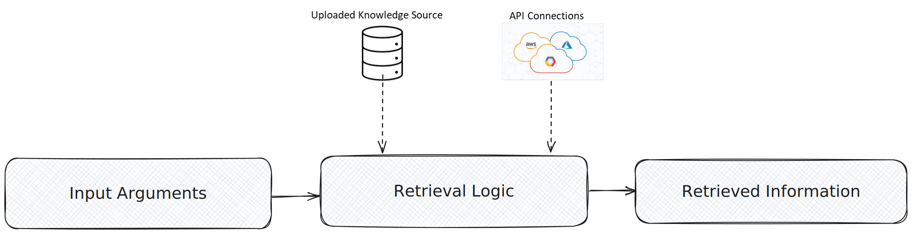

<helper-panel object='Rag' location='list'>

## What is a RAG?

**Retrieval-Augmented Generation (RAG)** is an AI approach that helps language models by integrating a retrieval mechanism that fetches relevant external information in real-time. This information allows the model to generate more accurate, up-to-date, and context-aware responses beyond its pre-trained knowledge.

The retrieval mechanism in a RAG system typically consists of:

- **Knowledge Source:** A repository of external information. This can include documents, vector databases, Neo4j, or other structured/unstructured data sources.
- **Retrieval Logic:** A set of algorithms designed to fetch the most relevant information based on provided inputs. It often leverages embedding models, similarity functions, and ranking techniques to define the retrieval process.

GGX supports the registration of various types of Retrieval Systems:

- **API-based Retrieval:** Communicates with external knowledge sources like Neo4j, vector databases, etc., using APIs to retrieve information from outside environments.
- **Python-based Retrieval:** For lightweight Python logic using various libraries or rule-based retrieval systems.
- **Custom Retrieval:** Leverages uploaded knowledge sources like CSV, Vector databases, etc., to retrieve information.

## Managing RAGs on the platform:

The **RAG Registry** organizes all the registered RAGs into customized groups at this centralized location, allowing easier tracking, monitoring, and new RAG creation.

### Registering a RAG:

1. Click on **Create** button in RAG Registry.
2. Fill in important details like **Name**, **Attributes** (Output Type, Alias), **Properties** (Group, Permissible Purpose, Description, Approval Workflow).
3. **Define Input Arguments** along with their types and default values.
4. **Select registered resources** (like Model, Global Functions, Prompts, etc.) to use in RAG definition.
5. **Select Input Type** (API-Based, Python-based, or Custom registration).
6. **Upload custom knowledge file** if required. Define RAG logic by **writing code in Retrieval Logic** section.
7. **Add notes**, **attach documentation** if available in the **Additional Information** section.
8. Lastly, click on **Save** to complete the registration process.

The registered RAGs can be evaluated in the RAG Registry or used in downstream objects (like Models, Pipeline, Reports, etc.).

## Benefits of RAG Registration:

- Automated tracking and **recording of modifications** with efficient version upgrades.
- Automatic detection of **Permissible Purpose violations**.
- **Testing and Comparison** with other registered RAGs using custom and standardized validation kits.
- **Enhances reusability** across downstream applications and enables usage tracking with **Lineage Tracking**.
- Journey to production becomes more **transparent and fully auditable**, and **production monitoring** gets easier.
- Extract ready-to-productionize **executable artifact**.
- **Fingerprinting** of external API connectivity.
- **Better Collaboration** for continuous development and testing.

</helper-panel>
