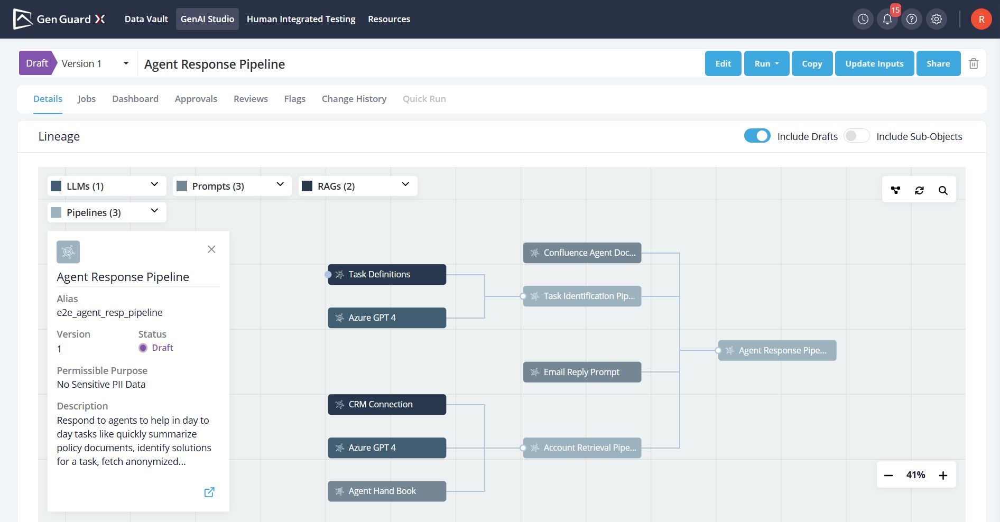

Lineage tracking records and visualizes the complete lifecycle of an object and depicts the flow of execution, showing how objects interact, are transformed and executed. It captures its origins, building blocks used, transformations, and usages across the organization.

## Why Lineage Tracking is Important?

- **Ensures Traceability** by providing a clear link between all artefacts, ensuring transparency in dependencies and usages.
- **Easier Impact Assessment** for modifications.
    - Provides a clear view of all dependent objects that would be affected by changes.
    - Identifies necessary updates across dependencies to introduce changes.
- **Enhances Collaboration** by providing visibility into how different teams and models interact within the pipeline.
- **Ensures Compliance** with regulations like the **[EU AI Act (Article 13 & 14)](https://eur-lex.europa.eu/resource.html?uri=cellar:e0649735-a372-11eb-9585-01aa75ed71a1.0001.02/DOC_1&format=PDF)**, which mandates transparency and human oversight.
- **Identifying redundant processes**.

## Lineage Structure on GGX Platform:

A Lieage is created and automatically maintained by the platform as soon as an object is registered. The lineage graph which is present on the details page is a **horizontal-tree representation** that maps how an object is created, used, and executed within the pipeline.

It consists of three key elements:

- **Precedents (Inputs)**: Represent the sources or dependencies that contribute to the creation of an object.
- **Dependents (Usage)**: Indicate other objects that rely on a given object.

