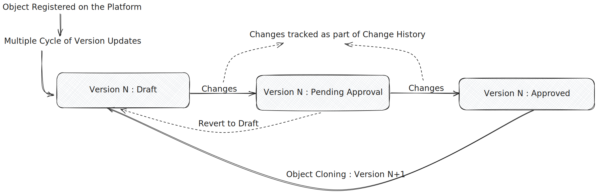
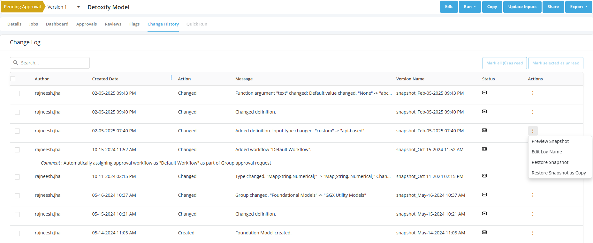

Version management is the process of systematically tracking, organizing, and controlling changes to an object. A version of an object is created every time the object’s definition is either newly created or subsequently changed.

## Benefits of Version Management?

- **Ensures Reproducibility** of results and artefacts.
- **Facilitates Collaboration** by managing contributions from multiple users.
- **Auditability & Compliance** by maintaining a clear history of changes and versions.
- **Allows Rollback & Recovery** by reverting to stable versions in case of failures or unintended modifications.
- **Experiment Tracking** by enabling comparison of different versions.
- **Supports Continuous Improvement** by keeping track of incremental changes and their impact over time.

## Maintaining Version on the platform:

A **Draft Version** (i.e. Version 1) is created as soon as an object is registered on the platform. All the modification done to a Draft Version is automatically logged in the **Change History** tab. Post approval process, the object can be **cloned** to create a new draft version (i.e. Version 2) which goes through the same cycle of changes and approvals.

### Version Tracking within Drafts

**Change History** is a structured **log of modifications** made to Generative AI pipelines over time ensuring a **clear audit trail** of changes and the ability to **revert to any previous versions** if needed.

Maintaining a **comprehensive change history** is very important for several reasons:

- **Enhances traceability**, allowing teams to track when, why, and by whom changes were made.
- **Improves accountability**, ensuring responsible AI deployment and governance.
- **Facilitates debugging**, helping teams identify and roll back problematic updates.
- **Ensures compliance** with regulations like the **[EU AI Act (Article 12)](https://eur-lex.europa.eu/resource.html?uri=cellar:e0649735-a372-11eb-9585-01aa75ed71a1.0001.02/DOC_1&format=PDF)**, which mandates record-keeping for high-risk AI systems.
- **Builds trust** by providing **transparency** into model evolution.

All objects start their lifecycle as a "Draft". Drafts typically are modified multiple times before they are approved and locked. To ensure a clear record of these changes, the platform keeps track of all changes being made to a Draft.

The history of changes on a given object is recorded in the **Change History** tab. The Change History is a collection of **snapshots**:

- The platform takes a snapshot of an object every time the object is edited and saved
- A snapshot is an exact copy of an object at the time of saving
- A change can be reverted back by restoring the **snapshot** at that point in time
- Snapshots can be Named and previewed or even restored as a copy

### Version Tracking for Approved items

Once a Draft is approved - it can not be modified. But by creating a **clone** (i.e. a new version) new changes can be made to continue working on that item. The new version will be a copy of the object being cloned with the same Name, Alias, and Type.

Only the latest approved version of an object can be cloned.

By design, all previous uses of the older version of the object will keep using the previous versions - and not be updated to the new version unless it is explicitly updated to use the newer version. This is different compared to changes made to a Draft, as changes in a Draft are immediately propagated downstream.
