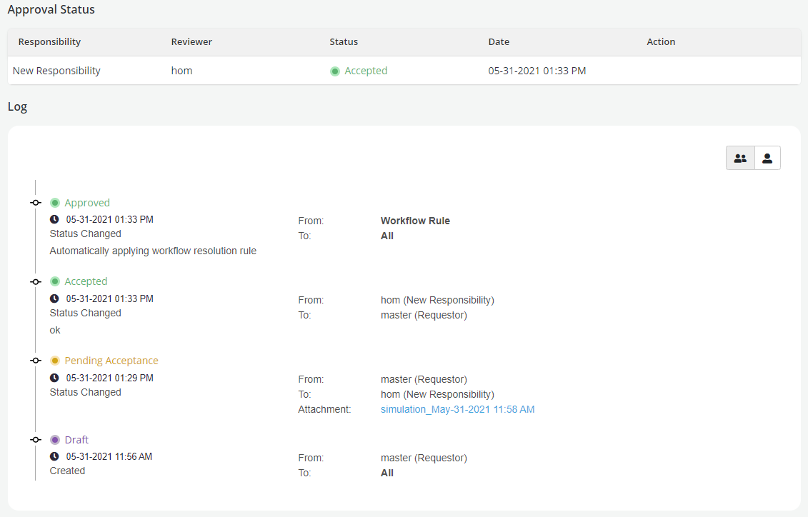

# Approval Workflow

???+ abstract "Overview"
A workflow is an oversight structure that can be set up in Settings
This oversight structure is comprised of **Responsibilities** and **Reviewers**:

    * **Responsibilities** are functional designation of reviewers (e.g., Compliance, Legal, Business Owner, etc)

    * **Reviewers** are actual users on the platform that are assigned a given responsibility

    ??? "Note"

        * A Responsibility can have multiple reviewers. Similarly, a reviewer can be assigned multiple responsibilities

        * However, every request for review or approval and and every approval decision must have first a responsibility and then a reviewer for that responsibility

??? abstract "How is this done?"

    **Process Flow**

    

    ??? "Actions by Requester"

        * To send the request for review and approval of the newly created object, click on the **Request Review** button in the **Approvals** tab

        

        ??? "Note"
            Run a simulation to be attached to the approval request before sending the object for approval

        * Refer [Approval Workflow settings](../../getting-started/settings/approval-workflow-settings.md) to know more about the approvals and responsibilities.
        * Fill Request Approval form and Click on **Save Changes**

          

        * **Select Specific Reviewer**: [Selected by default] This option decides whether the review is being sent to a specific user or anyone in the responsibility.
            * If selected: A reviewer needs to be chosen the Reviewers dropdown - and the request notifications and communications will only be received by the reviewer that is chosen, and only that reviewer can perform actions on this review. Only 1 reviewer can be chosen.
            * If not selected: The review is sent to all the reviewers who have been assigned by the Admin. All the reviewers will receive notifications and communications about this review. And any of them can perform actions like Approve, Reject, etc. on behalf of the team.

        Example:

        

        

        * Users are allowed to select multiple job results for supporting Analysis (If request is Approved then all the jobs will mark as verified )

        

        ??? "Note"

            * User can add multiple Responsibilities for the approval. Individual request is required to be sent to each responsibility for review and approval

            * If the responsibility includes third party applications, then the approval process takes place in third party application and the decision outcome is reflected in the Platform

            * The Object status changes to Pending for Approval and review status changes to Pending Acceptance

        * Requester can perform following actions on the request:

            * **Add Comment**: Adding a comment or a note for the reviewer
            * **Cancel**: This action will cancel the review request
            * **Send Reminder**: To send reminder to the reviewer in case of any delays in approval
        * **Close Requests**: This will cancel all your existing reviews, and move the object to ‘Rejected’ status. To continue using the object, you can clone the ‘Rejected’ version.

        

        ??? "Note"

            * If the request is sent to Veto Responsibility, object is locked for editing
            * If the request is sent to Non-Veto Responsibility where ALL the responsibilities are non-Veto, then object is not locked and is editable

            * The Object status remains in Pending Approval status until one of the following events occurs:
                * If one of the approvers has requested for Need Info or Need Change then the object status continues to be in Pending Approval,though the Review status would change to Need Info or Need Change, respectively.
            * If an approvers with Veto responsibility rejects the request then the object is rejected
            * If all the approvers accepts the request objects status changes to Approved automatically

            * Object will be locked as soon as a request for approval is sent to the responsibility
            * Unlocking the object can only be done by cancelling the entire approval request (meaning cancelling all requests for all responsibilities)
            * After changes are made a new request for approval will have to be sent to all responsibilities including the 3rd party responsibility (as applicable)

    ??? "Actions by Approver"

        * Refer [Approval Workflow settings](../../getting-started/settings/approval-workflow-settings.md) to know more about the approvals and responsibilities.
        * Following actions can be performed by the approver on the review request:

        * **Accept**: To accept the review of the object created. If there is one responsibility assigned for approval, the object changes to Approved after acceptance. If there are more than one responsibility assigned for approval, review status continues to be in Pending Acceptance till acceptance is received from each responsibility

        * **Add Comment**: To add a comment for the requester

        * **Need Change**: To ask for any change required in the object. User need to make the required changes and Resubmit the request for approval.

        * **Need Info**: Reviewer can send back the request to the requester for additional information required for approval. Requestor can Resubmit the request to provide the requested information.
            * Requester needs to Resubmit the request after doing the modifications

        * Refer section Resubmitting Approval Request for details

        * **Reject**: Reviewers can use the reject option to reject a request. In the default setting of the platform, all approvers have to accept the request for it to be approved; hence a reject from one reviewer will result in the object being rejected regardless of the response from other reviewers.

        

        * A Log is created for all the transactions that has taken place in the Approval history and a complete audit trail can be seen in the **Approvals** tab
        * User can view the entire approval log for all responsibilities by clicking on the Group icon or can see the log for his own bucket by clicking on the User icon

        ??? "Note"

            * In case of automatic approval or rejection, the comment would show up as

                From: Workflow Rule

                To: All

                Automatically applying workflow resolution rule

            

    ??? "Resubmitting Approval Request"

        When a Reviewer has asked for more info  or any change the Review status changes to Need Info or Need Change. Requestor can attach a Job run while resubmitting the request for approval

        * From the Action dropdown, select **Resubmit** option

        

        * Select the Job run i.e. simulation, validation or comparison as per the request from the Reviewer and **Save Changes**

        

??? abstract "Veto Power"

    Granting veto power to a responsibility will activate the following properties:

    * A reject decision by the responsibility will cause the object to be rejected (regardless of other committee rules and other responses)
    * Once the responsibility starts a review no edits will be allowed on the object (unless the responsibility takes an action to do so as part of the review)
    * Once the responsibility accepts a review the related object’s version is locked
