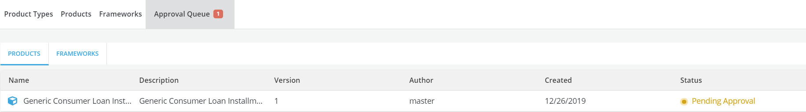
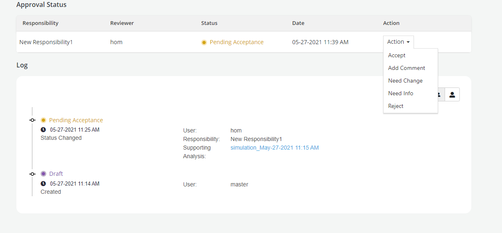
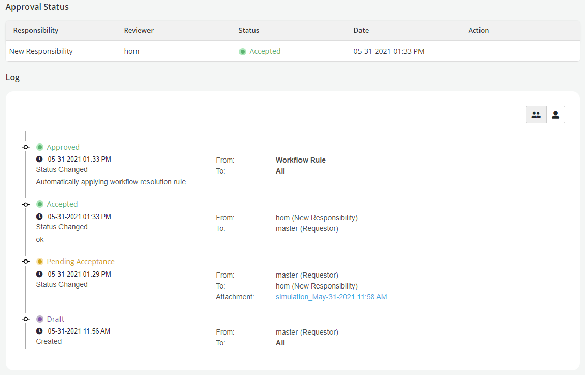
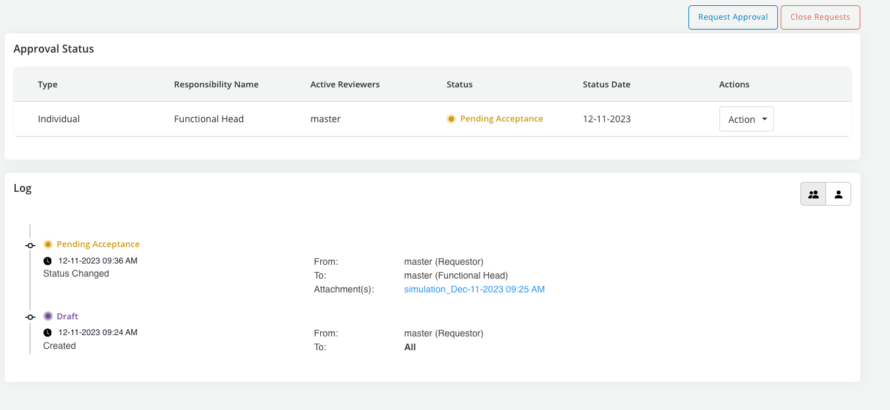
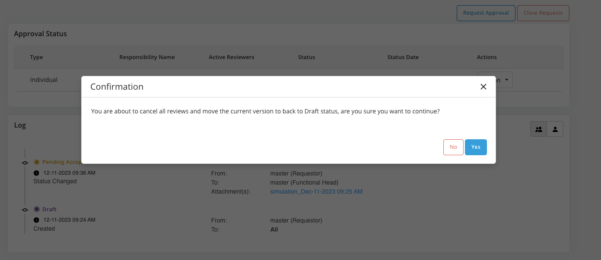
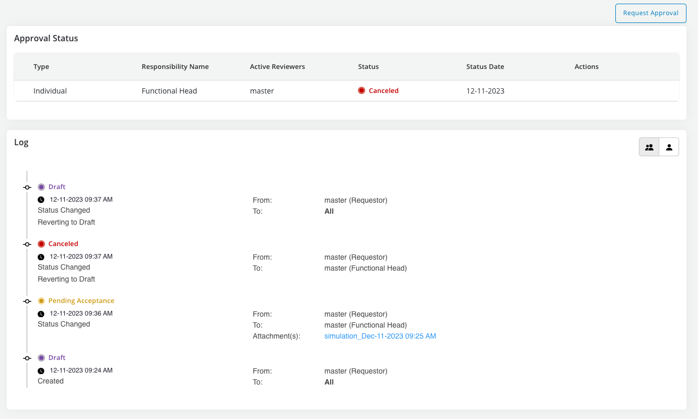

# Approve, Reject, Cancel or Close

Once the object is created, it is required to be approved by its assigned approval workflow to be available in the platform for further use.

??? abstract "Where is this done?"

    The submission for approval of a newly created object would appear in the **Approval Queue** tab of the module.

    The **Approval Queue** tab is only visible and accessible to users with approval authority.

??? abstract "Approving, rejecting or canceling a request"

    * Open the **Approval Queue** within the module and click on the object with the status as **Pending Approval**
    * Click on the request to open and validate the details and take appropriate action

    

    Following actions can be performed by the approver on the review request - **actions apply only to the approver taking them and each approver has take thier own action for the request to be completed**:

    * **Accept**: To accept the approval of the object created. If there is one responsibility assigned for approval, the object changes to Approved after acceptance. If there are more than one responsibility assigned for approval, approval status continues to be in Pending Acceptance till acceptance is received from each responsibility

    * **Add Comment**: To add a comment or question for the requester

    * **Need Change**: To ask for any change required in the object.

    * **Need Info**: Reviewer can send back the request to the requester for additional information required for approval.

    * **Resubmit**: Reviewer can resubmit a request to restart the approval process; at that point the responsibility's status gets rest to "Pending Acceptance" and another cycle of exchanges can happen.

    * **Reject**: Reject option is available for all approvers. By default, one rejection results in a full rejection of the request. Post rejection,the object can be copied or cloned to make the necessary changes and resubmitted for approval

    * **Cancel**: A request to a responsibility can be canceled at which time it will have to be resubmitted for that responsibility to restart its review

    * **Reject**: Reject option is available for all approvers. Post rejection,the object can be copied or cloned to make the necessary changes and resubmitted for approval

        ***Note: While taking any of these actions users will be given an option to run jobs, attach job results and make comments***

    

    * A Log is created for all the transactions that has taken place in the Approval history and a complete audit trail can be seen in the **Approvals** tab

    

    * The log, in particular, captures the name of the job reports that were attached to a given approval request. If, during the course of an approval process the object is changed then the previous job report attachments will be marked as OLD.

??? abstract "Closing a request"

    * **Closing** a request that is in pending approval status means **cancelling all the completed or pending decisions** for each responsibility AND **reverting the object to draft status**

    * To close a request click on the **Close Requests** button at the top of the **Approvals** page

    

    * Next click on **Yes** to confirm intention to close

    

    * Object is reverted back to draft and all requests are closed (this applies also to input objects that are part of the request in case of a group approval)

    
