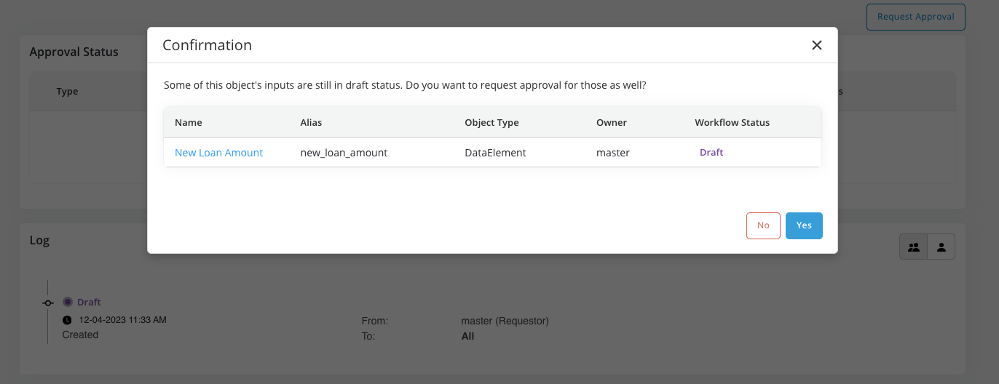
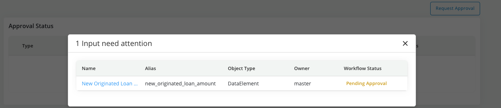
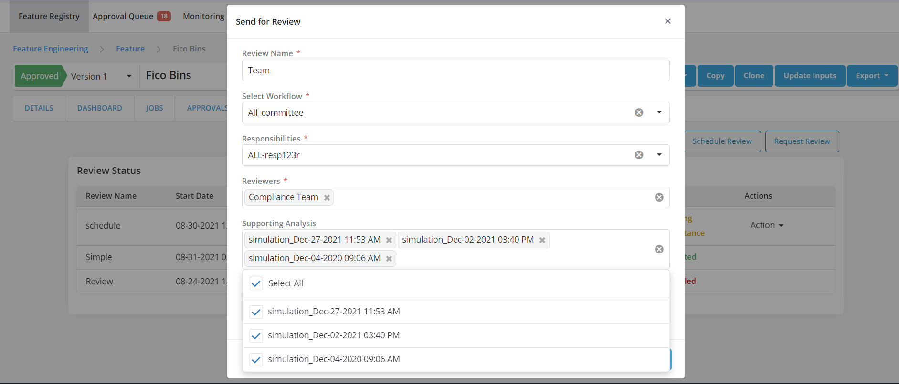
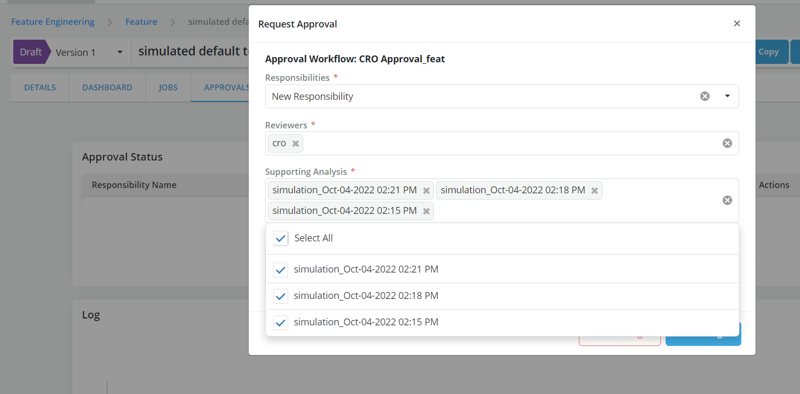
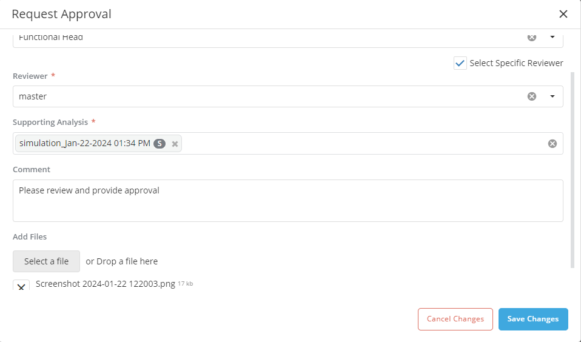
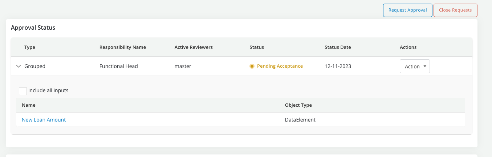
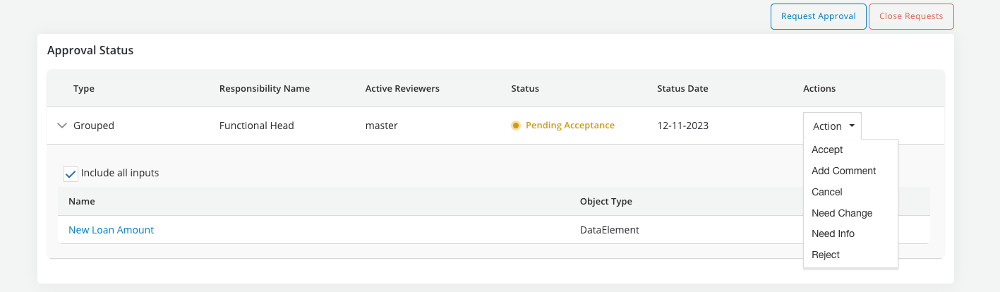
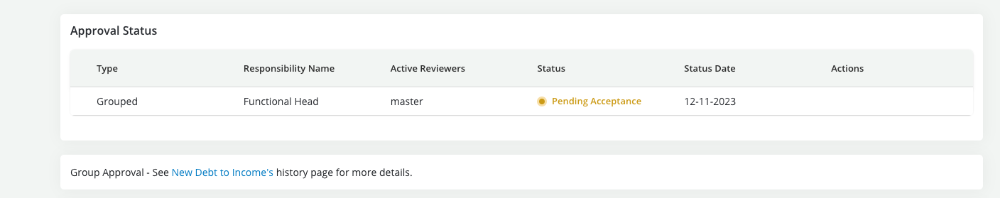
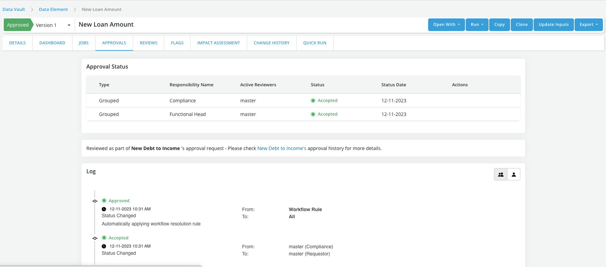

# Request Approval

Once an Object is registered it can be sent for review and approval for further use in the platform

??? info
When the mode **Publish Drafts** is enabled, draft can be used by other objects prior to being approved. Otherwise, only approved or chared objects can be used as inputs to other objects. By default, a **simulation must be appended to the request for approval**. This requirement to attach a simulation can be changed in Settings by a user with the right approval authority"

??? abstract "Requesting an approval"

    * Go to **Approvals** tab

    * Click on **Request Approval** button

        ** **Case 1: If the object has inputs that are in draft status** then you will be prompted to confirm that they also want to include the draft inputs in the approval request

        

        ** **Case 2: If the object has inputs that are in pending approval status** then you will be prompted to complete or cancel the approval request of the pending approval inputs before submitting the request

        

        ** **If the object all the inputs of the object are in approved status**  or **Case 1** or **Case 2** have been resolved then you will be prompted to fill the approval request form

    

    * Fill the request form

        ** Selecting multiple job results for supporting Analysis is allowed
        ** Refer [Approval Workflow](../../tasks/approving-objects/approval-workflow.md) for details

        

        ** Add comments and attach files

        

    * Click on **Save Changes**

??? abstract "Requesting group approval"

    * While requesting the approval of an object (a.k.a., main object) you can request of any of its inputs that are still in draft  this process is called **group approval** request and works as follows:

        ** Step#1: Request approval for the **main object** (i.e., the object that is in draft and which definition includes draft inputs)

        ** Step#2: When prompted confirm that the you want to include the draft inputs in the request

        

        * If the group approval request is confirmed the **main object**'s approval history page will show in the summary section the list of input including in the request

        

        ** Step#3: Have reviewers review all objects and **make their decision on the approval page of the main object**

        * All decisions made on the **main object** will apply to the input objects

        * However decisions cannot be made without checking the checkbox of each input as shown below:

        

        * If any input is left unchecked the user will get an error when trying to take an action

        * The **main object**'s approval history page will record all the details of the approval process as per usual

        * A reference link to the main object's approval history page will be shown in the approval history page of each input object

        During the review

        

        And post approval

        
