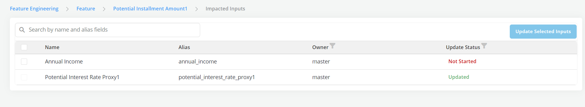

# Update Inputs

When a NEW VERSION of an object's input (i.e., precedent) is approved, all the objects that are using the previous versions will potentially need to be updated (because they are now using an obsolete version). This update is not automatic by design as we want the user to make a decision to make the update or not. In case a decision to make an update is made we provide users will tools to automate the process through the Update Inputs capability.

The Update Input page allow users to to keep track of :

- **Updated Inputs Page:** Shows list of inputs which need to be updated (i.e., have a new approved version)

- **Status:** This tracks the update status of the inputs (e.g., if an input has still not be updated the status will be market as "Not Started", etc.). There currently 4 possible statuses:

    **Not started:** A new approved version of the precedents exists but this new version has not yet used

    **In Progress:** The process of updating the input with the new version is in Progress (i.e New version is used in the object but the object is not yet Approved )

    **Partially updates:** A new approved version of the input exists but it only partially uses the new version (i.e., the object is still using the old version somewhere)

    **Updated:** A new approved version of the object exists and it is using the new version of the input

    **Skipped:** A new approved version of the object exists but it is NOT using the new version of the input

- **Update selected inputs:** This will create a clone of the object that will have the latest versions of the selected inputs (the clone will be in draft status until it is approved)

**Notify the User:**

    When a new version of an object is approved, the platform can identify all the downstream object that are directly or indirectly using it as an input , So notification will allows users with write access (owners and share-recipients) and approval access of these downstream impacted objects to notified of the change :

    *  Notifications will be sent once as soon as the new version is approved

    *  Notifications will be sent to all owners, share-recipients of approver of impacted downstream objects (direct or indirect)

    *  Each owner, share-recipient or approver will only receive one notification

- The notification will include:

    - The name of the object for which a new version has been approved (with hyperlink)
    - The date of approval

    - The creator of the new version

    - The approver of the new version

    - A list of all the impacted objects that the user owns, has been a share recipient of or is an approver of (with hyperlinks)
    - New lines in the notification panel (similar to job completion notification) - which if clicked will open the registry page of the new version of the input object.

- Notifications will be in form of:

    - Email messages
