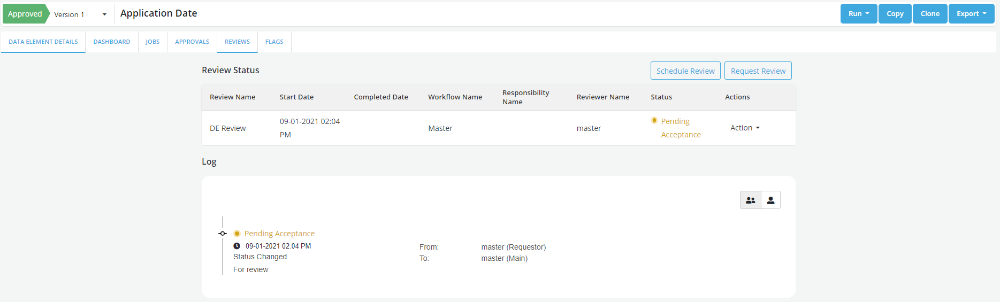

# Overview

After an object gets approved user can submit it for reviews by members of the Approval workflow. Reviews can be scheduled or requested adhoc. A workflow is created to track the review status. Review workflows are similar to approval workflows and are conducted using the same tools (Workflows, responsibilities, actions can all be used the same way as in Approval request workflows). Reviewers must be part of Approval workflows which can be created in Setting. A corkflow generally has multiple responsibilities and each responsibility may have or or multiple reviewers. System generated notifications are sent to the reviewers and requesters as events occur during the review process.

Types of reviews:

- One-time Review

- Scheduled Review

??? abstract "How is this done?"
_ To send the request for review for an approved object or schedule a review, click on the **Request Review** button in the **Review** tab
_ **Request Review**- this option is used to request one time review \* **Schedule Review**- this option is used to schedule the review for a future date

    ??? info
        Multiple reviews can be performed in parallel.

??? abstract "Send request for Review"
• Click on Request Review

    

    •	Capture the required details in the form and **Submit**

    

    •	Review status changes to **Pending Acceptance**
    Note: Review status can be seen in the audit trail.

    

??? abstract "Resubmit the Approval Request"

    When a Reviewer has asked for more info or changes, requestor provides required info or can attach a Job run while resubmitting the request for approval

    * From the Action dropdown, select **Resubmit** option

    

??? abstract "Schedule a Review?"

    * Review can be scheduled for a future date
    * Enter the details in the form and submit

    

??? abstract "Actions Performed by the Reviewer"

    * Click on the Action drop down and select appropriate option
    Following actions can be performed by the Reviewer on the review request:

    * **Accept**: To accept the review of the object created. If there is one responsibility assigned for review, the overall review status changes changes to Accepted  after that single responsibilty's acceptance. If there are more than one responsibility assigned for review, review status continues to be in Pending Acceptance till acceptance is received from each responsibility.

    * **Add Comment**: To add a comment for the requester

    * **Need Change**: To ask for any change required in the object. User need to make the required changes and Resubmit the request for approval.

    * **Need Info**: Reviewer can send back the request to the requester for additional information required for approval. Requestor can Resubmit the request to provide the requested information.
        * Requester needs to Resubmit the request after doing the modifications

    * **Reject**: Reject option is only available for Veto Responsibility to Reject the request. Object can be copied or cloned to make the necessary changes and resubmitted for approval

    
