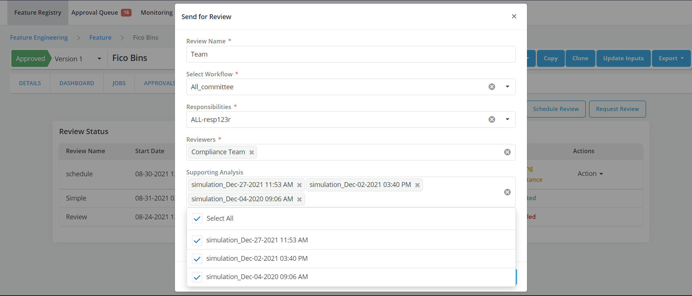

# Request Review

Once an Object is registered and simulation is run, it can be sent for review and approval for further use in the platform

??? info
When the mode **Publish Drafts** is enabled, draft can be used by other objects prior to being approved. Otherwise, only approved objects can be used as inputs to other objects. By default, a **simulation must be appended to the request for approval**. This requirement can be changed at installation time or by the Tech support team."

??? abstract "Reviewing a request"

    * Go to **Reviews** tab

    * Click on **Request Review** button

    

    * Fill the request form and click on **Save Changes**
    * Users are allowed to select multiple job results for supporting Analysis
    * Refer [Approval Workflow](../../tasks/approving-objects/approval-workflow.md) for details

    
