# Feedback Portals
Source: https://docs.genguardx.ai/evaluate-and-approve/feedback-portals/
Markdown: https://docs.genguardx.ai/evaluate-and-approve/feedback-portals/index.md
The Feedback Portal is a platform feature designed to help teams evaluate, test, and improve AI pipelines by collecting structured feedback from domain experts and testers. It bridges the gap between raw pipeline outputs and real-world quality assessment by letting subject matter experts interact with a pipeline directly and provide detailed evaluations of every session.

It is especially useful for pipelines that involve classification, triage, or decision-making, where correctness needs to be validated by humans with domain knowledge.

---

## How It Works

The Feedback Portal wraps around an existing AI pipeline and adds three layers of structured evaluation:

### 1. Test Definition

Before starting a session, the tester can optionally define what they expect the pipeline to output. This allows the platform to later compare expected vs actual results and surface discrepancies at scale.

### 2. Live Session

The tester interacts with the pipeline through a chat interface, exactly as a real user would. The pipeline processes each message and returns its output. The tester observes the behavior and can rate individual responses using thumbs up or thumbs down during the session.

### 3. Closing Questions

At the end of the session, the tester is shown a structured feedback form that captures their final assessment. This includes whether the pipeline's predictions were correct, what the correct answer should have been, and any additional observations.

---

## Key Concepts

### Pipeline

The AI system being evaluated. It receives a user message and returns an output along with optional context data such as token counts, latency, and cost metrics.

### Processing Logic

A lightweight code layer that sits between the pipeline and the portal. It calls the pipeline, optionally transforms the output for display, and can extract key metrics into `collected_fields` to track them as session-level statistics in the portal's results table.

### Instructions for User Impersonator

A prompt that instructs an AI to simulate realistic user messages during testing. It defines how the AI should behave when generating messages on behalf of a test user, including the tone, context, and constraints it should follow.

### Advanced Configs

A single JSON object that combines the `testDefinition` and `closingQuestions` field arrays. The `testDefinition` array defines fields shown before a session starts, and the `closingQuestions` array defines fields shown at the end of a session.

### Collected Fields

A dictionary available in the processing logic that can be populated with values extracted from the pipeline's context. These values appear as columns in the portal's results table, making it easy to track metrics like latency, cost, and token usage alongside correctness feedback.

---

## Portal Configuration

When creating a Feedback Portal, you configure the following settings:

| Field | Description |
|---|---|
| Name | The display name of the portal |
| Group | Organizes the portal alongside related portals |
| Description | A summary of what the portal is evaluating |
| Feedback Instructions | Instructions shown to testers before they start, written in plain text |
| Pipeline | The AI pipeline this portal collects feedback for |
| Processing Logic | Custom code to call the pipeline and optionally extract metrics |
| Instructions for User Impersonator | A prompt that instructs an AI to simulate realistic user messages during testing |
| Advanced Configs | A single JSON object combining the `testDefinition` and `closingQuestions` field arrays |

---

## Building a Feedback Portal — Step by Step

### Step 1 — Create the Portal

Navigate to **Human Integrated Testing → Feedback Portals** and click **+ Create**.

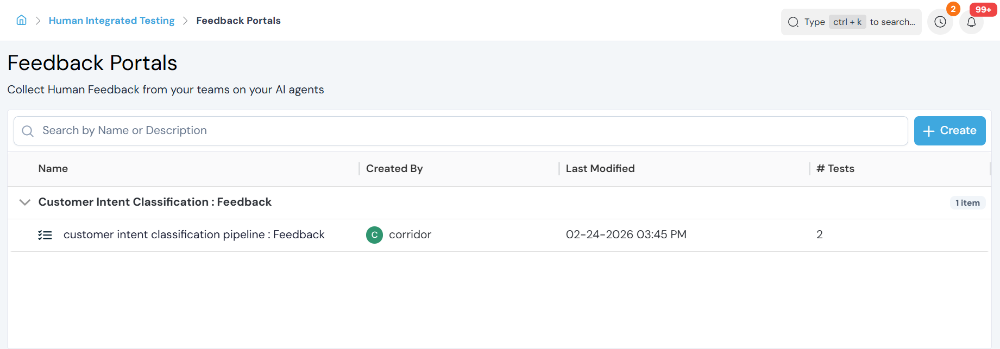

Fill in the Name, Group, Description, and Feedback Instructions. These top-level fields are shown on the portal's settings page:

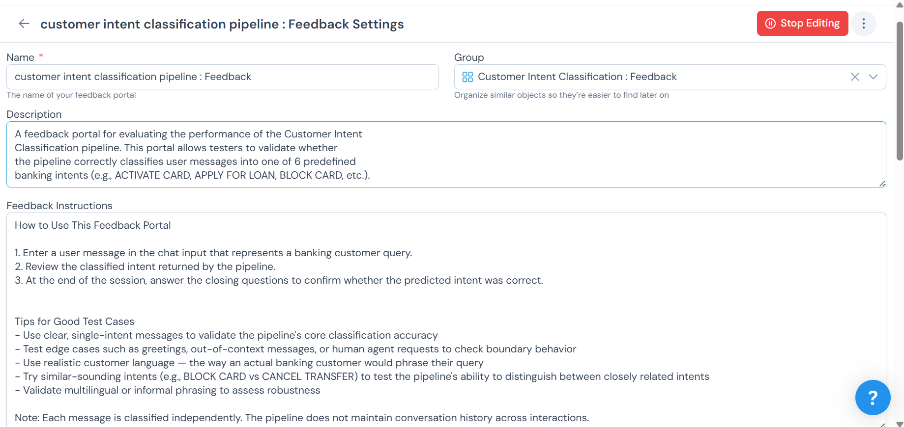

### Step 2 — Select a Pipeline and Write the Processing Logic

Scroll down to the **Pipeline** section and select the pipeline you want to evaluate. Then enable **Processing Logic** to write a Python snippet that calls your pipeline and returns the result.

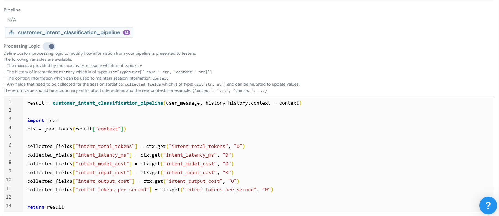

At a minimum, the processing logic looks like this:

```python
return my_pipeline(user_message, history=history, context=context)
```

If your pipeline returns useful metrics in the context (such as latency, token counts, or cost), you can surface them as tracked statistics using `collected_fields`:

```python
import json

result = my_pipeline(user_message, history=history, context=context)
ctx = json.loads(result["context"])

collected_fields["latency_ms"] = ctx.get("latency_ms", "0")
collected_fields["total_tokens"] = ctx.get("total_tokens", "0")
collected_fields["model_cost"] = ctx.get("model_cost", "0")

return result
```

The variables available in the processing logic are:

- `user_message` — the message typed by the tester, of type `str`
- `history` — the full conversation history, of type `list[TypedDict[{"role": str, "content": str}]]`
- `context` — the current session context, used to maintain state across turns
- `collected_fields` — a `dict[str, str]` that can be mutated to track session-level statistics

The return value must be a dictionary with the following keys:

```python
{
    "output": "The text response shown to the tester",
    "context": ...  # Updated context, can be a dict or JSON string
}
```

### Step 3 — Write the Instructions for User Impersonator

The **Instructions for User Impersonator** field lets you define how an AI should simulate realistic user messages during a test session. Write a plain text prompt that describes the persona, context, and constraints the AI should follow when generating messages.

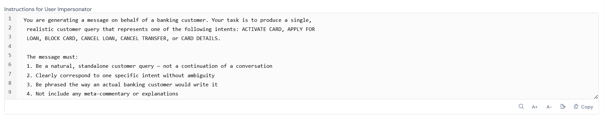

A good impersonator prompt describes:

- The role the AI is playing (e.g., a banking customer, a patient)
- The style and tone of messages it should generate
- Any rules it should follow, such as staying in context or avoiding meta-commentary

### Step 4 — Configure the Advanced Configs

The **Advanced Configs** section replaces the previous separate Test Definition and Closing Question schema editors. It accepts a single JSON object with two keys: `closingQuestions` and `testDefinition`.

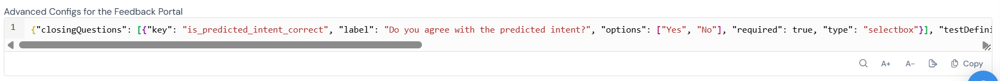

Each field in either array follows this structure:

```json
{
  "key": "field_key",
  "label": "Human readable label",
  "options": ["Option A", "Option B", "Option C"],
  "placeholder": "Placeholder text shown in the dropdown",
  "type": "selectbox"
}
```

The `required` property is set directly on the field object and only needs to be included when set to `true`. Supported field types include `selectbox` for dropdown selection and `text` for free text input.

Example for a classification pipeline:

```json
{
  "closingQuestions": [
    {
      "key": "is_predicted_intent_correct",
      "label": "Do you agree with the predicted intent?",
      "options": ["Yes", "No"],
      "required": true,
      "type": "selectbox"
    },
    {
      "key": "correct_intent",
      "label": "If the above is No, what is the correct intent?",
      "options": [
        "ACTIVATE CARD",
        "APPLY FOR LOAN",
        "BLOCK CARD",
        "CANCEL LOAN",
        "CANCEL TRANSFER",
        "CARD DETAILS"
      ],
      "type": "selectbox"
    },
    {
      "key": "additional_comments",
      "label": "Any additional comments on why the classification was incorrect or could be improved?",
      "placeholder": "e.g. The message could also be interpreted as BLOCK CARD due to similar phrasing",
      "type": "text"
    }
  ],
  "testDefinition": [
    {
      "key": "expected_intent",
      "label": "Expected Intent",
      "options": [
        "ACTIVATE CARD",
        "APPLY FOR LOAN",
        "BLOCK CARD",
        "CANCEL LOAN",
        "CANCEL TRANSFER",
        "CARD DETAILS"
      ],
      "placeholder": "Select which intent this test is EXPECTED to classify",
      "type": "selectbox"
    }
  ]
}
```

Supported field types for closing questions also include `qna`, which renders an interactive question-and-answer widget where testers can add multiple question-answer pairs. This is useful for conversational pipelines where testers want to record follow-up questions they would have asked.

---

## Using the Feedback Portal — Tester Guide

### Starting a Session

Click **+ New Test** from the portal page to open a new session. The **Start a Conversation** screen will appear.

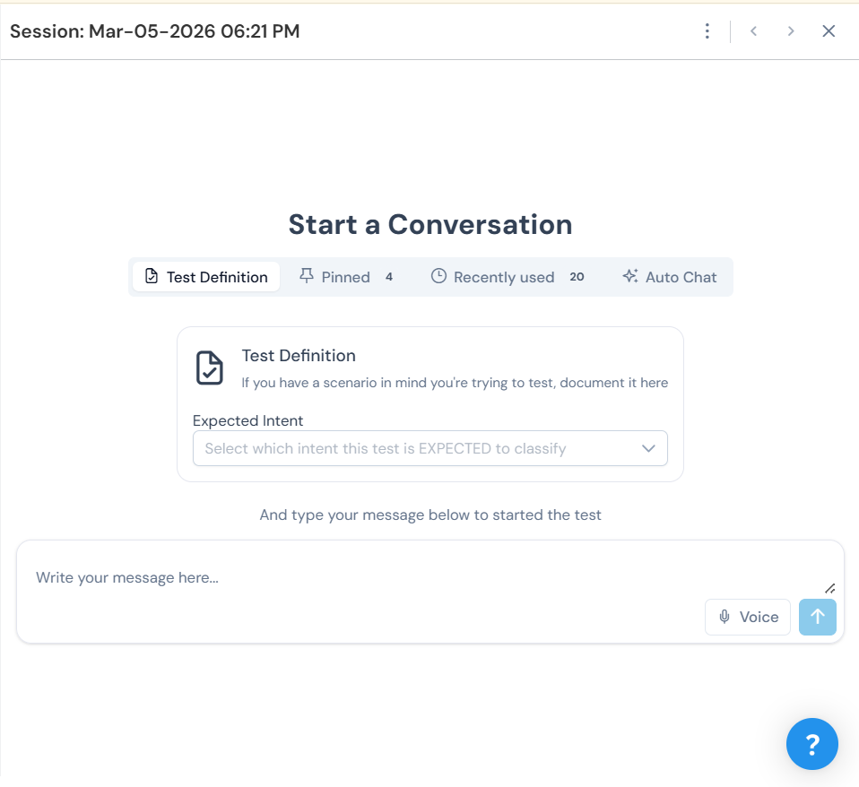

If a Test Definition is configured, you can optionally select your expected values before typing your message. Use the **Pinned** and **Recently used** tabs to quickly reuse common test definitions. Then type your message in the chat input and press send to begin.

### During the Session

The pipeline processes your message and returns its response in the chat view.


You can rate individual responses using the thumbs up or thumbs down buttons. Continue the conversation if the pipeline is multi-turn, or move to closing if it is single-turn. When you are ready to finish, click the **End Session** link that appears below the last response.

### Ending the Session

Clicking **End Session** opens the **Review Session** modal.


The modal shows:

- **Feedback Summary** — a collapsible section summarising any thumbs down ratings from the session
- **Testing Notes** — a free text field to document your overall observations
- **Closing Questions** — a collapsible section with the structured questions defined in the Advanced Configs, with the pipeline's actual predictions shown inline in the question labels
- **Mark all unmarked responses as 👍** — a checkbox to bulk-approve all responses that have not yet been rated

Fill in your notes, answer the closing questions, and click **End Session** to submit.

### Auto Chat

If the portal has **Instructions for User Impersonator** configured, you can use the **Auto Chat** tab to let an AI automatically generate and send user messages on your behalf.

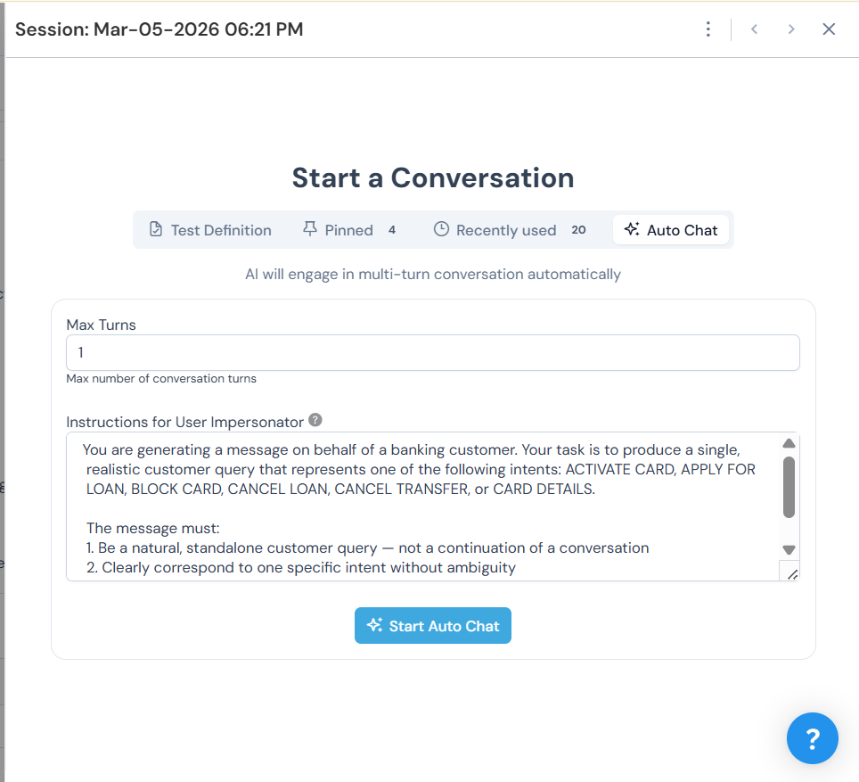

Select the **Auto Chat** tab, set the **Max Turns**, and click **Start Auto Chat**. The AI will use the impersonator instructions as its prompt to generate realistic user messages and send them to the pipeline automatically. This is useful for quickly generating test sessions without manually typing each message.

Once complete, a confirmation banner shows how many turns were run. The AI-generated messages appear in the chat view alongside the pipeline's responses, and you can proceed to end the session and fill in the closing questions as normal.

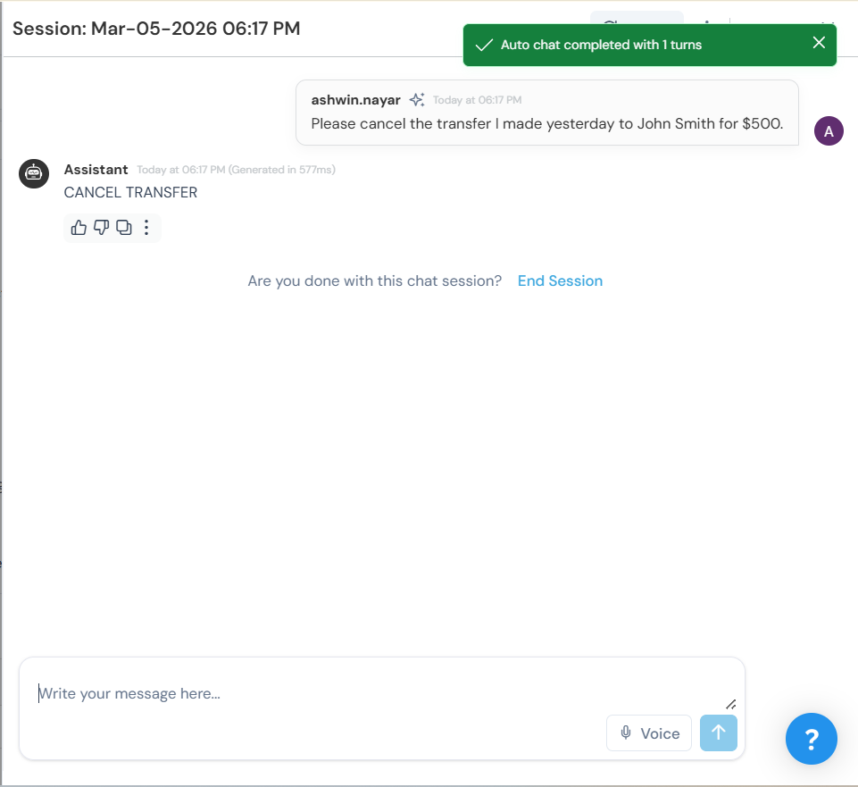

---

## Results and Insights

### Sessions Table

All completed sessions are listed in the portal's results table. Each row represents one session and shows the session name, rating summary, status, testing notes, the date it was created, and any fields populated via `collected_fields`.


Once a session is submitted, its status changes from **Ongoing** to **Completed** and the testing notes appear inline in the table. The **Created By** column shows which team member ran each session, allowing multiple contributors to provide feedback in parallel.

Use the **Filter by status** dropdown to narrow the view to completed or ongoing sessions.

### Insights

Click **Insights** in the top right of the portal to open the Insights view. It provides aggregate analysis across all sessions, organized into four tabs.

#### Summary

Shows high-level counts for the portal: total tests created, tests passed, tests failed, and sessions pending feedback. A Messages Summary section breaks down liked, disliked, and pending-feedback message counts.

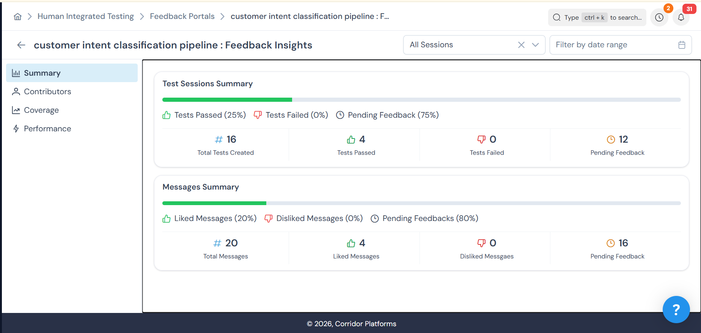

#### Contributors

Shows how many tests each team member has run over time, with a bar chart of tests by date and a per-contributor breakdown.

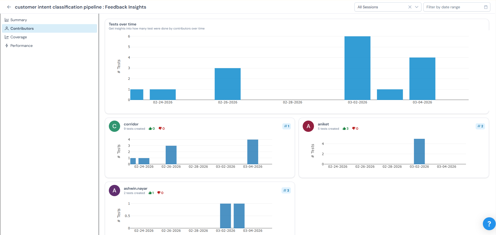

#### Coverage

Shows which Test Definition values have been exercised and which have not. A warning badge highlights options that have not yet been tested, helping you identify gaps in coverage.

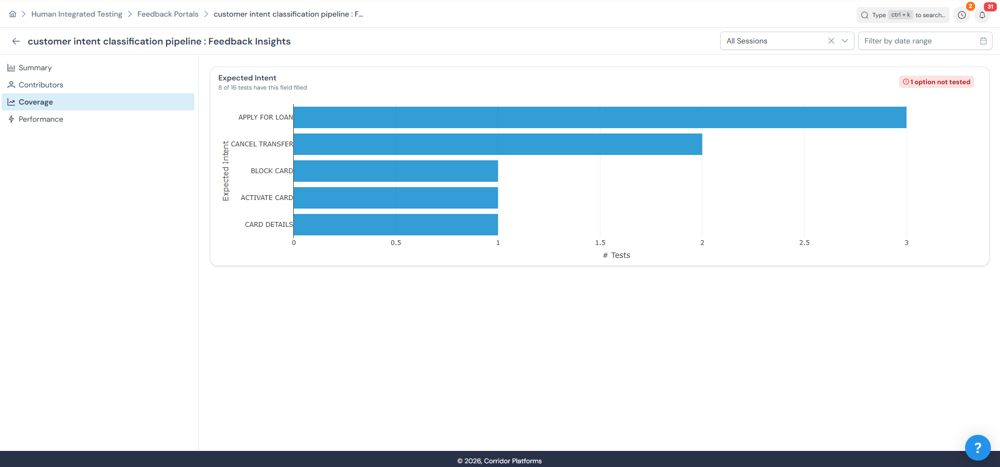

#### Performance

Shows overall test session performance over time, color-coded by outcome: all likes (green), containing dislikes (red), or no feedback (grey). Below the chart, a per-intent breakdown lets you drill into how performance varies across different expected values.

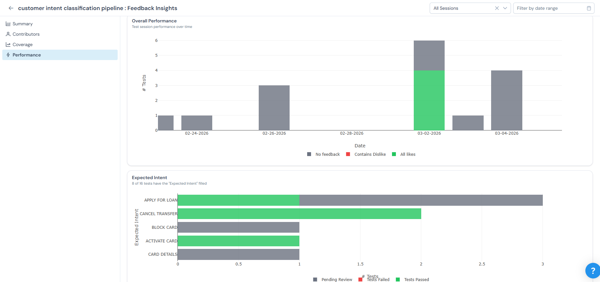

---

## Tips for Portal Designers

- Use `collected_fields` to surface any performance metrics your pipeline tracks — latency, cost, and token counts are especially valuable for benchmarking.
- Write feedback instructions in plain text without markdown formatting for the best display in the portal UI.
- Design closing questions to mirror your test definition fields so expected vs actual comparisons are easy to make in the results table.
- Write the User Impersonator instructions to match the persona of your real end users — this ensures simulated messages are representative of actual traffic.

---

## Example — Customer Intent Classification Portal

The following is a complete example of a Feedback Portal configured for a banking customer intent classification pipeline that classifies messages into 6 predefined intents: ACTIVATE CARD, APPLY FOR LOAN, BLOCK CARD, CANCEL LOAN, CANCEL TRANSFER, and CARD DETAILS.

### Instructions for User Impersonator

```
You are generating a message on behalf of a banking customer. Your task is to produce a single, realistic customer query that represents one of the following intents: ACTIVATE CARD, APPLY FOR LOAN, BLOCK CARD, CANCEL LOAN, CANCEL TRANSFER, or CARD DETAILS.

The message must:
1. Be a natural, standalone customer query — not a continuation of a conversation
2. Clearly correspond to one specific intent without ambiguity
3. Be phrased the way an actual banking customer would write it
4. Not include any meta-commentary or explanations
```

### Feedback Instructions

```
How to Use This Feedback Portal

1. Enter a user message in the chat input that represents a banking customer query.
2. Review the classified intent returned by the pipeline.
3. At the end of the session, answer the closing questions to confirm whether the predicted intent was correct.

Tips for Good Test Cases
- Use clear, single-intent messages to validate the pipeline's core classification accuracy
- Test edge cases such as greetings, out-of-context messages, or human agent requests to check boundary behavior
- Use realistic customer language — the way an actual banking customer would phrase their query
- Try similar-sounding intents (e.g., BLOCK CARD vs CANCEL TRANSFER) to test the pipeline's ability to distinguish between closely related intents
- Validate multilingual or informal phrasing to assess robustness

Note: Each message is classified independently. The pipeline does not maintain conversation history across interactions.
```

### Processing Logic

```python
import json

result = customer_intent_classification_pipeline(user_message, history=history, context=context)
ctx = json.loads(result["context"])

collected_fields["intent_total_tokens"] = ctx.get("intent_total_tokens", "0")
collected_fields["intent_latency_ms"] = ctx.get("intent_latency_ms", "0")
collected_fields["intent_model_cost"] = ctx.get("intent_model_cost", "0")
collected_fields["intent_input_cost"] = ctx.get("intent_input_cost", "0")
collected_fields["intent_output_cost"] = ctx.get("intent_output_cost", "0")
collected_fields["intent_tokens_per_second"] = ctx.get("intent_tokens_per_second", "0")

return result
```

### Auto Chat

Since this pipeline classifies each message independently in a single turn, set **Max Turns** to **1** when using Auto Chat. This ensures the AI generates one realistic customer query per session, which the pipeline then classifies.


### Advanced Configs

```json
{
  "closingQuestions": [
    {
      "key": "is_predicted_intent_correct",
      "label": "Do you agree with the predicted intent?",
      "options": ["Yes", "No"],
      "required": true,
      "type": "selectbox"
    },
    {
      "key": "correct_intent",
      "label": "If the above is No, what is the correct intent?",
      "options": [
        "ACTIVATE CARD",
        "APPLY FOR LOAN",
        "BLOCK CARD",
        "CANCEL LOAN",
        "CANCEL TRANSFER",
        "CARD DETAILS"
      ],
      "type": "selectbox"
    },
    {
      "key": "additional_comments",
      "label": "Any additional comments on why the classification was incorrect or could be improved?",
      "placeholder": "e.g. The message could also be interpreted as BLOCK CARD due to similar phrasing",
      "type": "text"
    }
  ],
  "testDefinition": [
    {
      "key": "expected_intent",
      "label": "Expected Intent",
      "options": [
        "ACTIVATE CARD",
        "APPLY FOR LOAN",
        "BLOCK CARD",
        "CANCEL LOAN",
        "CANCEL TRANSFER",
        "CARD DETAILS"
      ],
      "placeholder": "Select which intent this test is EXPECTED to classify",
      "type": "selectbox"
    }
  ]
}
```