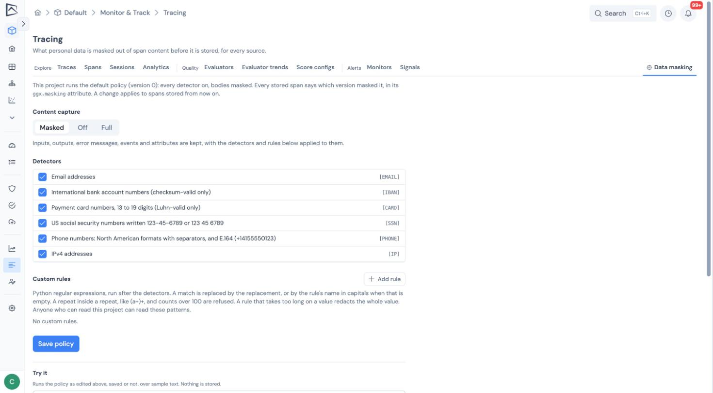

Before anything is stored, GGX masks personal data in every span, from every source. Masking covers inputs and outputs, error messages, exception details, event text and attribute values, including values inside JSON and numbers that look like card or social security numbers.

| | Text |
| --- | --- |
| **Sent** | My card 4111 1111 1111 1111 exp 12/25 was stolen. SSN 123-45-6789, reach me at ana@example.com |
| **Stored** | My card `[CARD]` exp 12/25 was stolen. SSN `[SSN]`, reach me at `[EMAIL]` |

## Built-in detectors

| Detector | Replaced with | Notes |
| --- | --- | --- |
| Email address | `[EMAIL]` | |
| Phone number | `[PHONE]` | |
| US social security number | `[SSN]` | Dashed form in text; nine-digit numeric values too |
| Payment card number | `[CARD]` | Checked with the Luhn digit, with or without spaces and dashes |
| IBAN | `[IBAN]` | Checked against the country's length and check digits |
| IPv4 address | `[IP]` | Version numbers such as _version 1.2.3.4_ are left alone |

## Managing a project's policy

Open **Monitor & Track → Tracing → Data masking** and pick a project. The page shows the policy version and who last changed it.

- **Content capture** is **Masked** (the default: store content with personal data masked), **Off** (store no bodies at all), or **Full** (store content unmasked; organization admins only).
- **Detectors** can be switched on or off individually.
- **Custom rules** (up to 20) add your own patterns, such as internal account numbers, each with its own replacement token.
- **Try it** masks a sample text with your draft policy before you save it.

Project editors can tighten masking: add detectors or rules, or switch capture to **Off**. Anything that weakens it, such as turning a detector off, removing or changing a rule, or moving from **Off** back to **Masked**, needs an organization admin.

:::note[What Off keeps]
With capture **Off**, GGX still stores what monitoring needs: span names and kinds, timings, status, the model and provider, token counts and cost, and ids. It drops inputs and outputs, message content in the attributes, any attribute text over 128 characters, and the text of non-error events.
:::

## Proof that masking ran

Every stored span carries a `ggx.masking` attribute naming the policy version and detector version it passed through, for example `v3+d2`. It is written by GGX and cannot be set by the sender. The trace page shows how many of a trace's spans were masked.

## What is not masked

- Span names, user and session ids, tags and resource attributes are not masked, because they are used to group and filter traces. Keep personal data out of them.
- Custom rule patterns are visible to everyone who can read the project.
- Error text from GGX's own AI features is reduced to the exception type unless your administrator has turned on content capture for platform traces.

## What to read next

- [Sending traces](../sending-traces/): the sources masking applies to.
- [Governance signals](../governance-signals/): the PII leak investigator files a finding when stored content still contains personal data.
- [Search, analytics and export](../search-and-analytics/#metadata-dimensions): metadata dimensions are set on the same page.
