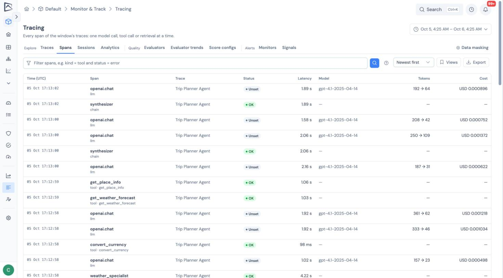
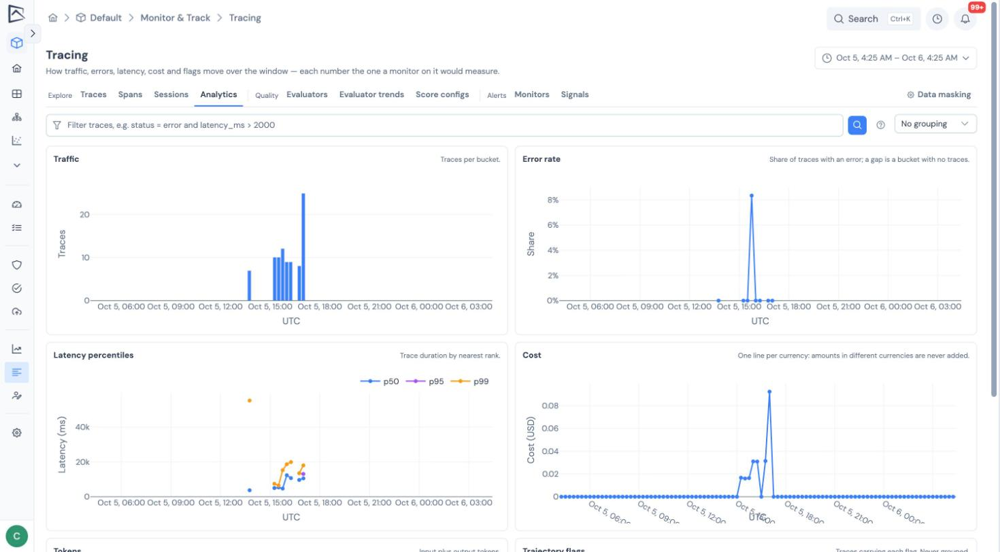

## The query box

The **Traces** and **Spans** tabs have a query box that takes one line, for example:

```text
status = error and model ~ gpt-4o and latency_ms > 2000
```

- **Operators**: `=`, `!=`, `>`, `>=`, `<`, `<=`, `~` (contains, any case) and `in (a, b)`, combined with `and`, `or`, `not` and parentheses. Quote values that contain spaces.
- **Help as you type**: the box suggests field names and values, a help panel lists every field, and a mistake is highlighted where it is.
- **Missing values**: a comparison against a value a trace does not have is false.

| Searching | Fields |
| --- | --- |
| Traces | `trace_id`, `name`, `status`, `environment`, `service`, `session_id`, `user_id`, `deployment_id`, `pipeline_version_id`, `latency_ms`, `input_tokens`, `output_tokens`, `tokens`, `cost`, `currency`, `span_count`, `error_count`, `tool_calls`, `model`, `tag`, `flag`, `input` and `output` (contains only), `score.<name>`, `metadata.<key>`, `span(…)` |
| Spans | `trace_id`, `span_id`, `name`, `kind`, `status`, `provider`, `model`, `environment`, `service`, `session_id`, `user_id`, `tool`, `agent`, `cost_status`, `currency`, `latency_ms`, `ttft_ms`, `input_tokens`, `output_tokens`, `tokens`, `cost`, `health`, `input` and `output` (contains only), `attr.<key>` |

More examples:

```text
score.helpfulness < 0.5 or flag = loop
metadata.customer_tier = "gold" and not environment in (dev, test)
span(kind = tool and status = error) and span(model ~ gpt-4o)
```

- `score.<name>` compares a score's number, or its label when you give text.
- `span(…)` finds traces that contain a span matching the condition inside. With two `span(…)` terms, the trace must contain a span matching each.

A query holds up to 32 conditions and three `span(…)` terms. A `span(…)` search follows at most 1,000 traces: when there were more, the page says its results are a lower bound.

## The Spans tab

**Spans** searches every step of the traces in your range at once: every tool call, model call and retrieval. Sort by start time, duration, cost or tokens, and select a row to open its trace with that step selected.



A search reads a bounded number of stored spans (fewer when it looks inside inputs, outputs or attributes); if it stops early, the page says there may be more. Adding a condition on `kind`, `name`, `status` or `latency_ms` keeps searches quick.

## Metadata dimensions

A project can promote up to 10 of its own attribute keys, such as `app.version` or `metadata.customer_tier`, to dimensions. Set them under **Tracing → Data masking → Metadata dimensions**.

Each trace takes the key's value from its root span, then any span, then the resource, after masking. Dimensions then appear as filters in the Traces sidebar, as `metadata.<key>` in queries, and as a grouping in Analytics. Only traces received after a key is added carry it.

## Analytics

The **Analytics** tab charts traffic, error rate, latency (50th, 95th and 99th percentile), cost per currency, tokens and agent flags over the selected range.



- It uses the query and filters from the Traces tab and names the ones in force, with a button to clear them.
- Group the charts by environment, trace name, deployment, model or a dimension to compare the five largest groups, with the rest shown as **Other**.
- Every number is computed exactly as [monitors](../monitors/) and the summary tiles compute it.
- Each chart has a text summary for screen readers.

The summary tiles on the Traces tab also show a small trend line. Moving between Traces, Sessions and Analytics keeps your range and filters.

## Saved views and columns

- **Views** on Traces, Spans and Sessions save the filters, query, range, columns and sort under a name. A view is yours unless you share it with the project, which needs write access to the project. Only its owner can change it.
- **Columns** on the Traces list chooses which columns show. Your choice is remembered in your browser and saved with views.

## Export

**Export** downloads the Traces list or a Spans search, as filtered and sorted, as CSV or JSON Lines.

- Up to 50,000 rows, with content masked. Span exports contain summary columns only.
- When a file is cut short, its last line and the page say so.
- CSV cells a spreadsheet would run as a formula are neutralized.
- One export per person at a time; when the service is busy, the page says how long to wait.
- Every export is recorded: who asked, when, for what, how many rows, and whether it was cut short. Organization admins can list all exports; everyone else sees their own.

## What to read next

- [Exploring traces](../exploring-traces/): the trace list and the span inspector.
- [Monitors](../monitors/): alert on the same measures the Analytics tab charts.
- [API reference](../api-reference/): the search, time-series and export endpoints.
