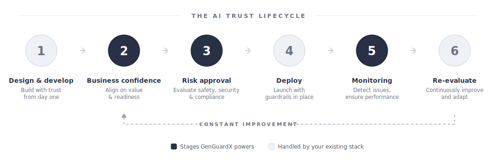
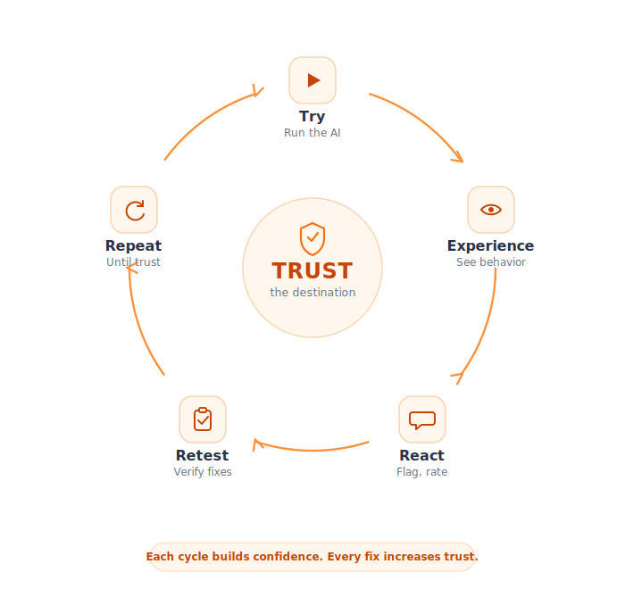
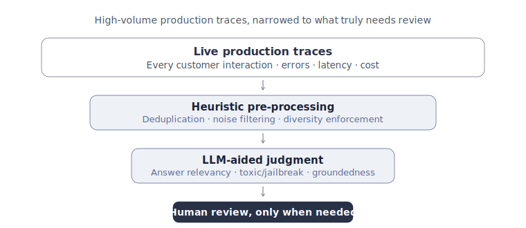

import { Card, CardGrid, LinkCard } from '@astrojs/starlight/components';

[Corridor GenGuardX (GGX)](https://ggx.corridorplatforms.com) is the flagship **Responsible AI governance platform** from [Corridor Platforms](https://www.corridorplatforms.com) — a single, shared environment where teams **test, approve, monitor, and track** GenAI solutions across its entire lifecycle. Designed by risk-management and banking veterans, GGX gives organizations the clarity and control to move GenAI from experimentation to high-ROI, customer-facing production — with the end-to-end pipeline testing, regulatory governance, and continuous human-in-the-loop oversight that regulated industries demand.

GGX is industry-agnostic and already running in production at a **Tier 1 global bank**, a **leading US health system**, and a **major credit union** — and is SOC 2 Type 2 certified.

:::tip[From AI pilot → production, without a leap of faith]
GGX gives business and risk teams the evidence they need to confidently launch — and keep running — high-impact GenAI applications such as IVR systems, agent-assist tools, and chatbots.
:::

<video controls>
    <source src="GGX_Home_video.mp4" type="video/mp4" />
    Your browser does not support the video tag.
</video>

## The industry problem: 95% of GenAI pilots never reach production

Most GenAI initiatives stall after the proof-of-concept. Roughly **95% of GenAI pilots never reach production**, leaving a wide gap between AI spend and realized business value. The hard part isn't building a demo — it's earning enough trust to put GenAI in front of customers, in exactly the high-stakes, customer-facing use cases that carry the highest ROI.

Before a GenAI application can go live, **two teams have to say "yes"** — and most pilots stall because neither has the right tools to get there.

<CardGrid>
<Card title="The business blocker">
**"Does the AI do what it's supposed to?"** Business owners own the experience but are often sidelined during technical testing.

- **Trust gap** — no hands-on way to validate AI behaviour before it reaches customers.
- **Reputation risk** — logic errors and hallucinations become public brand liabilities.
- **Unclear readiness** — no objective proof that the AI is ready for production.
</Card>

<Card title="The risk blocker">
**"Is the AI blocking what it shouldn't?"** Risk and legal teams need more than a demo — they need evidence.

- **Novel risks** — bias, data leakage, and jailbreak attempts.
- **No evidence trail** — subjective testing is hard to defend to audit and regulators.
- **No thresholds** — no clear, measurable definition of "safe".
</Card>
</CardGrid>

And approval isn't a one-time event: after launch, inputs drift, LLMs update, and third-party agents shift — so confidence has to be maintained, not just earned once.

<figure class="ggx-figure">

<figcaption>The AI trust lifecycle. GenGuardX powers the three stages where pilots most often stall — business confidence, risk approval, and ongoing monitoring.</figcaption>
</figure>

> Confidence comes not from seeing, but from trying.

## How GenGuardX solves it

GGX turns trust into a repeatable process. Instead of a one-time sign-off, it gives each team a structured way to build — and maintain — confidence across the lifecycle.

### Build business confidence

GGX gives your Subject Matter Experts a safe environment to stress-test scenarios, flag behavioural gaps, and verify fixes **before the AI reaches a single customer**. Every interaction follows a simple loop — *try, experience, react, retest, repeat* — and every cycle builds trust.

<figure class="ggx-figure">

<figcaption>Every cycle builds confidence; every fix increases trust.</figcaption>
</figure>

<CardGrid>
<Card title="Interactive playground">Business users run realistic scenarios against the AI application before launch — no developer required.</Card>
<Card title="Feedback portal">One-click flagging, ratings, and structured findings on every interaction.</Card>
<Card title="Findings database">Every issue tracked from raised to resolved — no scattered feedback lost.</Card>
<Card title="Progress tracking">Version-over-version proof that issues are being fixed.</Card>
</CardGrid>

:::note[The byproduct: ground truth]
Every flag, rating, and annotation from a business user becomes reusable **ground truth** — structured data that powers objective measurement, faster iteration, monitoring, and future evaluation sets. Capture it once, reuse it across the entire AI lifecycle.
:::

### Give risk teams evidence they can approve

GGX turns GenAI risk review into a repeatable workflow run against curated datasets, expected outputs, and thresholds — not one-off scripts.

<CardGrid>
<Card title="1 · Identify">Map use-case-specific risks: accuracy, stability, bias, toxicity, privacy leakage, groundedness, prompt injection, jailbreaking, dark patterns, and agent tool use.</Card>
<Card title="2 · Measure">Run standardized, reproducible evaluations against curated datasets, policies, and thresholds.</Card>
<Card title="3 · Mitigate">Apply guardrails, prompt changes, or routing logic, then prove the gap was closed.</Card>
<Card title="4 · Monitor">Watch for drift, threshold breaches, and new failure modes after deployment.</Card>
</CardGrid>

This framework aligns with emerging standards such as the **EU AI Act** and the **NIST AI Risk Management Framework**, and produces results that are auditable, reproducible, and comparable — backed by a risk library, standardized reports, and a controlled evaluation environment.

> Stop guessing what your risk exposure is.

### Keep both teams confident after launch

Approval isn't the finish line. GGX turns high-volume production traces into alerts, evidence, and new ground truth — surfacing only what truly needs a human's attention.

<figure class="ggx-figure">

<figcaption>From every customer interaction down to the few that truly need a human reviewer.</figcaption>
</figure>

<CardGrid>
<Card title="For the business team">See when AI behaviour drifts from the approved version — before it becomes a reputational issue.</Card>
<Card title="For the risk team">Track threshold breaches, new failure modes, and control performance in production, with audit trails.</Card>
<Card title="For both">Production findings become new test cases and approval evidence, feeding the next cycle of refinement.</Card>
</CardGrid>

## Key pillars of the GGX platform

export const pillarRow = { display: 'flex', gap: '1.25rem', alignItems: 'flex-start', borderTop: '2px solid #eef1f6', paddingTop: '1.4rem' };
export const pillarNum = { fontSize: 'clamp(40px, 6vw, 56px)', fontWeight: 800, color: '#5b6a96', lineHeight: 1, flex: '0 0 auto', minWidth: '68px', letterSpacing: '-0.02em' };
export const pillarTitle = { fontSize: '18px', fontWeight: 700, color: '#293147', margin: '0 0 0.35rem' };
export const pillarLead = { fontSize: '14px', color: '#4b5563', margin: '0 0 0.85rem', lineHeight: 1.55 };
export const pillarChips = { display: 'flex', flexWrap: 'wrap', gap: '8px' };
export const pillarChip = { display: 'inline-block', padding: '6px 12px', borderRadius: '999px', background: '#eef1f6', color: '#293147', fontSize: '13px', fontWeight: 500, border: '1px solid #d7dcec', lineHeight: 1.3 };

  

    
01

    

      
Centralized, governed platform

      
One organized GenAI studio to register, evaluate, and govern LLM pipelines and every component.

      

        Version tracking &amp; lineage
        Comprehensive audit
        Automated approval workflows
        Role-based governance
        End-to-end pipeline testing
        CI/CD for production
      

    

  

  

    
02

    

      
Standardized risk &amp; compliance testing

      
Curated datasets and standardized reports to identify and mitigate risk, with auditable results.

      

        Bias, toxicity &amp; data-leakage tests
        Model Risk Management (MRM) dashboards
        Fair Lending (FL) dashboards
        Human-Integrated Testing (HIT)
        Annotation queues
      

    

  

  

    
03

    

      
Easy ecosystem connectivity

      
Plug into the models and enterprise systems you already use, then ship straight to production.

      

        Compatible with leading hyperscaler and AI ecosystems
        API integration for RAG &amp; models
        Conversation-log monitoring
        One-click pipeline export
      

    

  

## A structured lifecycle

GGX organizes everything into three stages. Explore the documentation for each:

<CardGrid>
  <LinkCard title="Register & Refine" href={`${import.meta.env.BASE_URL}register-and-refine/`} description="Point-and-click building of GenAI apps, with prompt, RAG, and pipeline optimization." />
  <LinkCard title="Evaluate & Approve" href={`${import.meta.env.BASE_URL}evaluate-and-approve/`} description="Standardized and custom testing, human-in-the-loop dashboards, and approval tracking." />
  <LinkCard title="Deploy & Monitor" href={`${import.meta.env.BASE_URL}deploy-and-monitor/`} description="Direct-to-production deployment with continuous monitoring and alerts." />
</CardGrid>

## The Responsible AI Sandbox

In July 2025, Corridor Platforms — together with **Oliver Wyman** and **Google Cloud** — launched the **GenGuardX Responsible AI Sandbox**, a guided cohort program where enterprises run real use cases through the full AI lifecycle with governance and AI-risk experts in the room. Building on the earlier *Project GGX* collaboration, the Sandbox is hosted on Google Cloud's secure infrastructure (including Vertex AI and Gemini), and participants can also bring their own tools and LLMs. The first cohort focuses on customer-facing Conversational AI for U.S. financial institutions.

<LinkCard
  title="Press release: Corridor Platforms and Oliver Wyman launch Responsible AI Sandbox with Google Cloud"
  href="https://www.businesswire.com/news/home/20250723939849/en/Corridor-Platforms-and-Oliver-Wyman-Launch-Responsible-AI-Sandbox-with-Google-Cloud"
  description="Read the full announcement on BusinessWire."
/>
