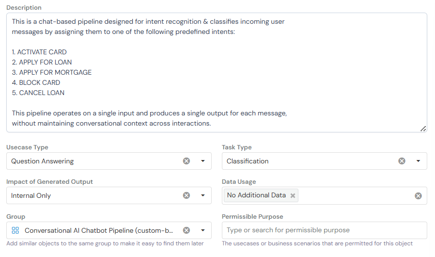
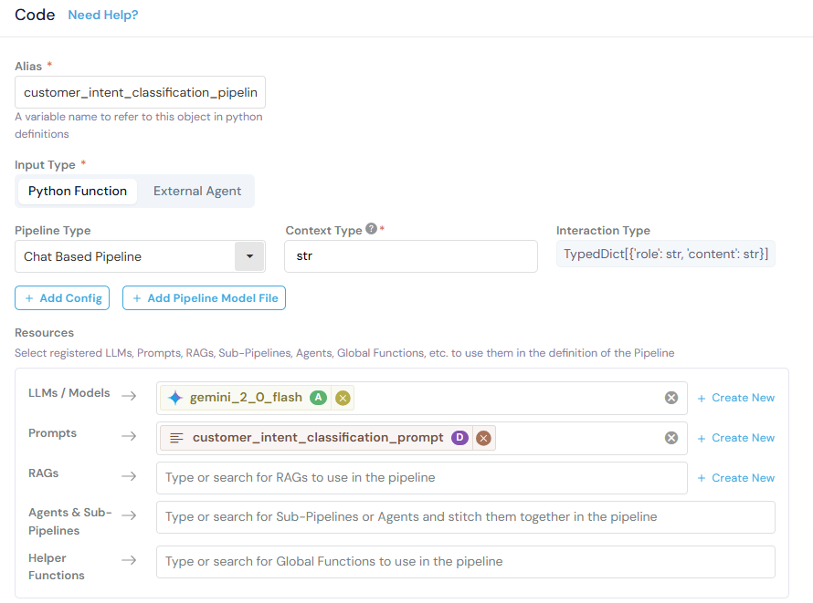
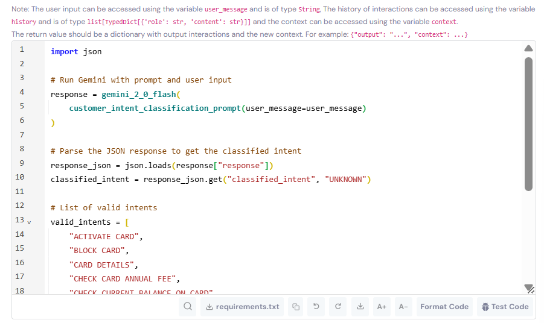
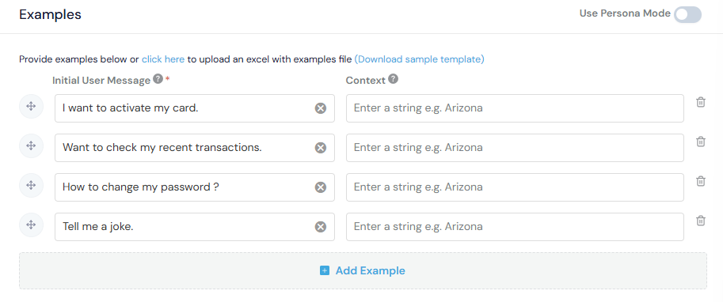

An agent combines multiple resources (models, prompts, RAGs, helper functions) to create an end-to-end use-case specific workflow. Read more about [Agents](../../../inventory-management/pipelines/) to understand more about what they are and how they work. This guide covers how to register agents on the GGX, using an **Intent Classification Agent** as a working example.

## Prerequisites

Before registering an agent, ensure you have:

- ✅ **Registered a Model** - Follow the [Model Registration Guide](../../model/) to register Gemini 2.0 Flash

- ✅ **Registered a Prompt** - Follow the [Prompt Registration Guide](../prompt/) to register the intent classification prompt

**Quick Check:** Navigate to **Data & AI Assets → Models** and **Skills / Prompts** to verify your resources are available.

If you haven't completed these steps, please do so before proceeding.

---

## Registration Steps

### Step 1. Navigate to Agents

Go to **Data & AI Assets → Agents** and click the **Create** button.

### Step 2. Fill in Basic Information



**Basic Information** fields help organize and identify your agent:

- **Description:** Clear explanation of what the agent does and its workflow
- **Usecase Type:** The primary use case category (e.g., "Question Answering")
- **Task Type:** Specific task the agent performs (e.g., "Classification")
- **Impact of Generated Output:** Scope of the agent's usage (e.g., "Internal Only")
- **Data Usage:** Whether the agent uses additional data sources beyond user input
- **Group:** Category for organizing similar agents (e.g., "Conversational AI ChatBot Agent")
- **Permissible Purpose:** Approved use cases and business scenarios for this agent

**Example for Intent Classification Agent:**

```
This is a chat-based pipeline designed for intent recognition & classifies incoming user
messages by assigning them to one of the following predefined intents:

1. ACTIVATE CARD
2. APPLY FOR LOAN
3. APPLY FOR MORTGAGE
4. BLOCK CARD
5. CANCEL LOAN

This pipeline operates on a single input and produces a single output for each message,
without maintaining conversational context across interactions.
```

### Step 3. Configure Code Settings



**Code Settings** define how your agent operates and which resources it uses.

Fill in the **Basic Information** fields as shown in the image above. These includes Alias, Input Type, Agent Type, and Context Type.

NOTE: For this case we have chosen to create a chat-based agent as in future we can expand the agent to recognize the user's intent over multiple turns, though for now we are keeping it simple and using a single input/output.

### Step 4. Add Resources

**Resources** are the pre-registered components your agent will use.

Click **+ Create New** or search for existing resources to add:

**LLMs / Models:**

- `gemini_2_0_flash` - The foundation model for generating responses

**Prompts:**

- `customer_intent_classification_prompt` - The structured instructions for intent classification

**Other Resources** (Not required for this example):

- **RAGs:** For retrieving relevant documents
- **Agents & Sub-Agents:** For complex multi-step workflows
- **Helper Functions:** For data processing utilities, or any other function according to your requirement

### Step 5. Write Agent Scoring Logic



**Agent Scoring Logic** orchestrates how resources work together:

- Combines models, prompts, and other resources
- Processes user inputs and conversation history
- Generates outputs and maintains context across turns

**Example - Intent Classification Agent:**

```python
import json

# Run Gemini with prompt and user input
response = gemini_2_0_flash(
    customer_intent_classification_prompt(user_message=user_message)
)

# Parse the JSON response to get the classified intent
response_json = json.loads(response["response"])
classified_intent = response_json.get("classified_intent", "UNKNOWN")

# List of valid intents
valid_intents = [
    "ACTIVATE CARD",
    "BLOCK CARD",
    "CARD DETAILS",
    "CHECK CARD ANNUAL FEE",
    "CHECK CURRENT BALANCE ON CARD",
]

# Validate the classified intent
if classified_intent not in valid_intents:
    classified_intent = "UNKNOWN"

# Return output and context
return {
    "output":  classified_intent,
    "context": "Any information that needs to be stored across turns"
}
```

**What This Does:**

1. Calls the Gemini model with the classification prompt and user message.
2. Parses the JSON response to extract the classified intent.
3. Validates the intent against the list of valid intents.
4. Returns the classification result as the output and any information that needs to be stored across turns as the context.

**Variables Available:**

- `user_message` - The current user input (type: String)
- `history` - Previous conversation messages (type: list[TypedDict[{'role': str, 'content': str}]])
- `context` - Any information that needs to be stored across turns (type: String)

### Step 6. Add Examples (Optional)



Add test examples to validate agent behavior.

**Note:** Examples help with testing and documenting expected behavior.

### Step 7. Save the Agent

Click **Create** to register the agent.

The agent is now:

- Available under **Data & AI Assets → Agents**
- Ready for simulation and testing
- Ready for use in downstream applications

---

## Testing Your Agent

After creating the agent, test it to verify behavior:

### Quick Test (During Creation/Editing)

1. While creating or editing the agent, scroll to the **Code** section
2. Click **Test Code** in the bottom right corner
3. Enter test inputs to verify logic without saving

### Interactive Test (After Saving)

1. Navigate to your saved agent
2. Click **Run** → **Chat Session** (top right corner)
    
    NOTE: Chat sessions is only available for chat-based agents. For free-flow agents, you can test the agent by calling the agent function with sample inputs using the test code button.

3. Enter sample messages to test the full conversation flow
4. Verify outputs match expected behavior

---

## Using Agents

### In Applications

Reference the agent in your application code:

```python
# Call the pipeline
result = customer_intent_classification_pipeline(
    user_message="I want to block my card",
    history=[],
    context=""
)

# Access the output
classified_intent = result["output"]  # "BLOCK CARD"
context = result["context"]  # "Any information that needs to be stored across turns"
```

---

## Related Documentation

- [Model Registration Guide](../../model/) - Register foundation models
- [Prompt Registration Guide](../prompt/) - Create reusable prompts

---

By following this guide, you can create reliable, production-ready agents that combine multiple AI resources into cohesive workflows.
