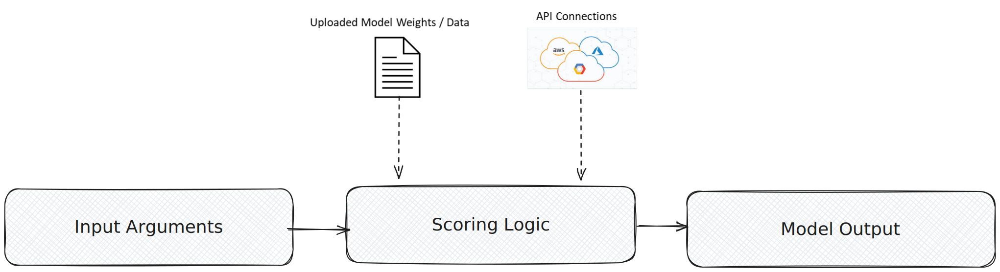

import { Badge, LinkCard, Steps, Tabs, TabItem } from '@astrojs/starlight/components';

<helper-panel object='FoundationModel' location='list'>

## What is a model?

A **model** is a software program that uses algorithms or rules to make informed decisions, predictions, or generations from a set of inputs without being given explicit instructions for every scenario — ML models, lookup tables, if-else rules, and LLMs all qualify.

A registered model in GGX typically includes:

- **Model file** — stored weights, parameters, lookup tables, tensors, or other data needed to initialise the model.
- **Scoring Logic** — the code that takes inputs and produces a prediction or generation.

## The three model types

Every model registered in GGX is one of three types. Choosing the right one is the first real decision you make on the registration form — it determines where the model runs and how it is configured.

<Tabs>
<TabItem label="API-Based">

<Badge text="External provider" variant="tip" /> **Best for** hosted foundation models — OpenAI, Anthropic, Google Vertex AI, Azure OpenAI, AWS Bedrock, Hugging Face Inference.

- GGX calls the provider over HTTPS using your configured credentials.
- You pick the **Model Provider** and the specific **Model** from the dropdown.
- You do not upload any weights.

</TabItem>
<TabItem label="Python-Based">

<Badge text="In-platform code" variant="note" /> **Best for** lightweight Python logic, rule-based models, or anything that runs inside GGX without an external file.

- Write the model's logic directly in the Scoring Logic editor.
- Use any libraries packaged with the platform.
- No upload, no external provider.

</TabItem>
<TabItem label="Custom">

<Badge text="Uploaded file" variant="success" /> **Best for** trained or fine-tuned models you want to host inside GGX — scikit-learn, BERT and other NLP models, custom fine-tunes.

- Upload the weights or model file.
- Write Scoring Logic that loads the file and produces a prediction.
- Runs entirely inside GGX with no external API call.

</TabItem>
</Tabs>

## Adding a model to the catalog

The **Model Catalog** is the central place where every registered model lives, organised into customisable groups. From here you can track, monitor, test, and create new models.

Click **Create** on the Model Catalog page, then work through the form:

<Steps>

1. **Name and description.** Give the model a clear name and a description of what it does and when to use it.

2. **Properties.** Set the **Group**, **Permissible Purpose**, **Approval Workflow**, **Ownership Type** (Proprietary, Open Source, Internal), and **Model Type** (for example, *LLM*).

3. **Alias.** <Badge text="required" variant="caution" /> A code-safe variable name pipelines use to refer to this model — lowercase with underscores, no spaces.

4. **Input Type.** Pick **API-Based**, **Python-Based**, or **Custom**. If API-Based, also pick the **Model Provider** and the specific **Model**.

5. **Output Type.** The data type the model returns, e.g. `dict[str, str]`.

6. **Input Arguments.** For each argument (typically `text`, `temperature`, `system_instruction`, etc.), set its **Alias**, **Type**, whether it is optional, and a default value.

7. **Resources and weights.** Attach any registered Global Functions or Prompts the scoring logic needs. Upload the model file under **Pipeline Model File** if the type is Custom.

8. **Scoring Logic.** Write the Python that initialises the model and produces a result. Use **Test Code** to validate it against sample input.

9. **Save.** Add notes or attach documentation under **Additional Information**, then click **Create**. The model is saved as a **Draft** until it goes through approval.

</Steps>

:::note[Credentials live in Integrations, not in code]
For API-Based models, authenticate using environment variables exposed through **Platform Integrations** (e.g. `GOOGLE_API_TOKEN`, `OPENAI_API_KEY`). Do not paste keys into Scoring Logic.
:::

</helper-panel>

## Supported providers

API-Based models can connect to any of the following providers. Each integration page covers the credentials and configuration the provider expects.

| Provider | Use it for |
|----------|------------|
| [OpenAI](../../../integrations/llm-providers/openai/) | GPT family and OpenAI-hosted models. |
| [Anthropic](../../../integrations/llm-providers/anthropic/) | Claude family. |
| [AWS Bedrock](../../../integrations/llm-providers/aws-bedrock/) | Bedrock-hosted foundation models from multiple vendors. |
| [Google Vertex AI](../../../integrations/llm-providers/gcp-vertexai/) | Gemini and Vertex-hosted models. |
| [Azure AI](../../../integrations/llm-providers/azureai/) | Azure-hosted OpenAI and other Azure foundation models. |
| [Hugging Face](../../../integrations/llm-providers/huggingface/) | Inference endpoints for open-source models. |

<LinkCard title="All LLM provider integrations" description="Browse every supported provider and how to wire up its credentials." href={`${import.meta.env.BASE_URL}integrations/llm-providers/`} />

## Versioning and approval

Every model in GGX follows the same lifecycle as any other registered asset:

| Stage | What it means |
|-------|---------------|
| **Draft** | Created automatically when the model is registered. Edits — including changes to scoring logic, arguments, and uploaded weights — are snapshotted in **Change History**. |
| **Under Approval** | Submitted to the configured **Approval Workflow** for review by the assigned responsibilities and reviewers. |
| **Approved (locked)** | Once approved the version is immutable. Downstream pipelines keep using the version they were built against — they are not silently upgraded. |
| **Cloned → new Draft** | To change an approved model, clone it; that creates a new draft version that goes through the cycle again. Only the latest approved version can be cloned. |

<LinkCard title="Version Management" description="How drafts, change history, snapshots, and cloning work across every registered asset." href={`${import.meta.env.BASE_URL}register-and-refine/version-management/`} />
<LinkCard title="Approval Workflows" description="Configure who reviews and approves a model before it can be used in production." href={`${import.meta.env.BASE_URL}evaluate-and-approve/approval-workflows/`} />

## Testing and evaluation

A registered model can be evaluated directly in the Model Catalog or as part of a downstream pipeline:

<LinkCard title="Simulation" description="Run a model over a dataset and inspect the outputs at scale before promoting." href={`${import.meta.env.BASE_URL}evaluate-and-approve/simulation/`} />
<LinkCard title="Comparison" description="Compare two models (or two versions of one) side-by-side on the same inputs." href={`${import.meta.env.BASE_URL}evaluate-and-approve/comparison/`} />

## A worked example

For an end-to-end walkthrough — registering Gemini 2.0 Flash, including credentials, arguments, and scoring logic — see the registration guide:

<LinkCard title="Model Registration: Gemini 2.0 Flash" description="Step-by-step example of registering an API-Based model on Google Vertex AI." href={`${import.meta.env.BASE_URL}register-and-refine/examples/model/`} />

## Capabilities unlocked by registration

Registering a model — rather than calling it from a one-off script — is what turns it into a governed, reusable asset:

| Capability | What you get |
|------------|--------------|
| **Change tracking** | Every modification to a draft is snapshotted in Change History; approved versions are locked. |
| **Purpose enforcement** | Automatic detection of Permissible Purpose violations when the model is used downstream. |
| **Testing & comparison** | Evaluate against other models using custom and standardised validation kits. |
| **Reusability** | Reuse across pipelines, with visibility through [Lineage Tracking](../../lineage-tracking/). |
| **API fingerprinting** | External API connectivity is fingerprinted so changes upstream are detectable. |
| **Auditable path to production** | A transparent, fully auditable journey from Draft through Approval to use in pipelines. |
| **Executable artifacts** | Extract ready-to-productionise artifacts straight from the Catalog. |
