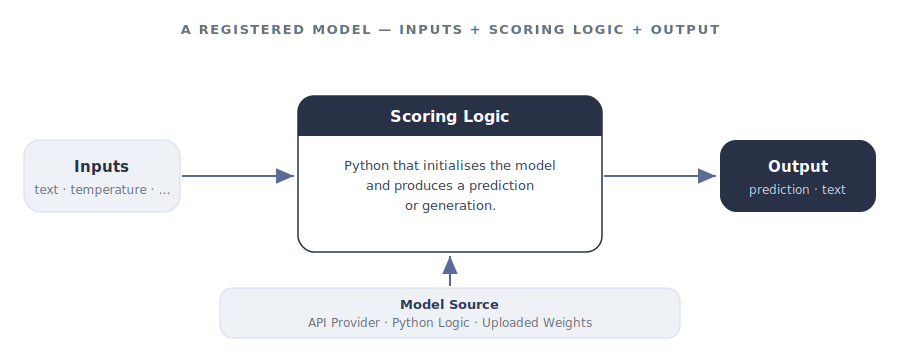

import { Badge, LinkCard, Steps, Tabs, TabItem } from '@astrojs/starlight/components';

<helper-panel object='FoundationModel' location='list'>

## What is a model?

A **model** is a software program that uses algorithms or rules to make informed decisions, predictions, or generations from a set of inputs without being given explicit instructions for every scenario — ML models, lookup tables, if-else rules, and LLMs all qualify.

A registered model in GGX typically includes:

- **Model file** — stored weights, parameters, lookup tables, tensors, or other data needed to initialise the model.
- **Scoring Logic** — the code that takes inputs and produces a prediction or generation.

<figure class="ggx-figure">



<figcaption>Inputs flow into scoring logic, which calls a model source and returns the model's output.</figcaption>
</figure>

## The three model types

Every model registered in GGX is one of three types. Choosing the right one is the first real decision you make on the registration form — it determines where the model runs and how it is configured.

<Tabs>
<TabItem label="API-Based">

<Badge text="External provider" variant="tip" /> **Best for** hosted foundation models — OpenAI, Anthropic, Google Vertex AI, Azure OpenAI, AWS Bedrock, Hugging Face Inference.

- GGX calls the provider over HTTPS using your configured credentials.
- You pick the **Model Provider** and the specific **Model** from the dropdown.
- You do not upload any weights.

</TabItem>
<TabItem label="Python-Based">

<Badge text="In-platform code" variant="note" /> **Best for** lightweight Python logic, rule-based models, or anything that runs inside GGX without an external file.

- Write the model's logic directly in the Scoring Logic editor.
- Use any libraries packaged with the platform.
- No upload, no external provider.

</TabItem>
<TabItem label="Custom">

<Badge text="Uploaded file" variant="success" /> **Best for** trained or fine-tuned models you want to host inside GGX — scikit-learn, BERT and other NLP models, custom fine-tunes.

- Upload the weights or model file.
- Write Scoring Logic that loads the file and produces a prediction.
- Runs entirely inside GGX with no external API call.

</TabItem>
</Tabs>

## Adding a model to the catalog

The **Model Catalog** is the central place where every registered model lives, organised into customisable groups. From here you can track, monitor, test, and create new models.

Click **Create** on the Model Catalog page, then work through the form:

<Steps>

1. **Name and description.** Give the model a clear name and a description of what it does and when to use it.

2. **Properties.** Set the **Group**, **Permissible Purpose**, **Approval Workflow**, **Ownership Type** (Proprietary, Open Source, Internal), and **Model Type** (for example, *LLM*).

3. **Alias.** <Badge text="required" variant="caution" /> A code-safe variable name pipelines use to refer to this model — lowercase with underscores, no spaces.

4. **Input Type.** Pick **API-Based**, **Python-Based**, or **Custom**. If API-Based, also pick the **Model Provider** and the specific **Model**.

5. **Output Type.** The data type the model returns, e.g. `dict[str, str]`.

6. **Input Arguments.** For each argument (typically `text`, `temperature`, `system_instruction`, etc.), set its **Alias**, **Type**, whether it is optional, and a default value.

7. **Resources and weights.** Attach any registered Global Functions or Prompts the scoring logic needs. Upload the model file under **Pipeline Model File** if the type is Custom.

8. **Scoring Logic.** Write the Python that initialises the model and produces a result. Use **Test Code** to validate it against sample input.

9. **Save.** Add notes or attach documentation under **Additional Information**, then click **Create**. The model is saved as a **Draft** until it goes through approval.

</Steps>

:::note[Credentials live in Integrations, not in code]
For API-Based models, authenticate using environment variables exposed through **Platform Integrations** (e.g. `GOOGLE_API_TOKEN`, `OPENAI_API_KEY`). Do not paste keys into Scoring Logic.
:::

</helper-panel>

## Supported providers

API-Based models can connect to any of the following providers. Each integration page covers the credentials and configuration the provider expects.

| Provider | Use it for |
|----------|------------|
| [OpenAI](../../../integrations/llm-providers/openai/) | GPT family and OpenAI-hosted models. |
| [Anthropic](../../../integrations/llm-providers/anthropic/) | Claude family. |
| [AWS Bedrock](../../../integrations/llm-providers/aws-bedrock/) | Bedrock-hosted foundation models from multiple vendors. |
| [Google Vertex AI](../../../integrations/llm-providers/gcp-vertexai/) | Gemini and Vertex-hosted models. |
| [Azure AI](../../../integrations/llm-providers/azureai/) | Azure-hosted OpenAI and other Azure foundation models. |
| [Hugging Face](../../../integrations/llm-providers/huggingface/) | Inference endpoints for open-source models. |

<LinkCard title="All LLM provider integrations" description="Browse every supported provider and how to wire up its credentials." href={`${import.meta.env.BASE_URL}integrations/llm-providers/`} />

## Testing a model

Testing a model means confirming three things: the scoring logic runs without error, it can reach its source (provider API, uploaded file, or in-platform code), and the output matches the **Output Type** you declared. GGX gives you two levels for this.

### Quick check — Test Code in the editor

Inside the Model Catalog page, the **Test Code** button at the bottom-right of the Scoring Logic editor runs the model against sample inputs without saving. Use it during development to:

- Confirm the API credentials configured in Integrations actually reach the provider.
- Verify the return value matches the declared **Output Type** (e.g. `dict[str, str]`).
- Sanity-check temperature, max-token, and system-instruction handling.
- Catch import errors or missing dependencies before saving.

### Bulk simulation across a dataset

A single Test Code call tells you the model *works*; a **Bulk Simulation** tells you how it behaves across many real cases. It runs every row of a dataset through the model and produces one output per record — useful for:

- Spotting edge cases (empty input, very long input, non-English) a single test would miss.
- Measuring quality across a representative sample before promoting to production.
- Attaching the run as evidence in the model's risk-assessment evidence tab.

## A worked example: Gemini 2.0 Flash

Registering Google's **Gemini 2.0 Flash** as an API-Based model. The form fields:

| Field | Value |
|-------|-------|
| Name | Gemini 2.0 Flash |
| Alias | `gemini_2_0_flash` |
| Input Type | API-Based |
| Model Provider | Google Vertex AI |
| Output Type | `dict[str, str]` |
| Input Arguments | `text` (String, required) · `temperature` (Numerical, optional, default `0`) · `system_instruction` (String, optional, default `None`) |

The scoring logic authenticates with an environment-variable token and calls Vertex AI:

```python title="gemini_2_0_flash — scoring logic"
import os
from google import genai
from google.genai import types

client = genai.Client(api_key=os.getenv("GOOGLE_API_TOKEN"))

config = types.GenerateContentConfig(
    temperature=temperature,
    seed=2025,
    system_instruction=system_instruction,
)

response = client.models.generate_content(
    model="gemini-2.0-flash",
    contents=text,
    config=config,
)

return {"response": response.text}
```

:::tip[Where the API token comes from]
You never hard-code the key. The `os.getenv("GOOGLE_API_TOKEN")` value is supplied by connecting the provider on the **Settings → Platform Integrations** page — pick the provider card (here **Google Vertex AI**), add its credentials, and GGX exposes them to scoring logic as environment variables.

If your provider is **not** one of the listed cards, open the **Advanced** tab to register a custom provider and define the environment variable yourself, then reference it the same way with `os.getenv(...)`.
:::

Once saved, it can be called from any downstream pipeline:

```python
reply = gemini_2_0_flash(
    text=user_prompt,
    temperature=0.7,
    system_instruction="You are a helpful assistant.",
)
output_text = reply["response"]
```

<LinkCard title="Full Gemini 2.0 Flash walkthrough" description="The complete registration guide with screenshots for every field." href={`${import.meta.env.BASE_URL}register-and-refine/examples/model/`} />

## Capabilities unlocked by registration

Registering a model — rather than calling it from a one-off script — is what turns it into a governed, reusable asset:

| Capability | What you get |
|------------|--------------|
| **Change tracking** | Every modification to a draft is snapshotted in Change History; approved versions are locked. |
| **Purpose enforcement** | Automatic detection of Permissible Purpose violations when the model is used downstream. |
| **Testing & evaluation** | Quick Test Code during development and Bulk Simulation across datasets before promoting. |
| **Reusability** | Reuse across pipelines, with visibility through [Lineage Tracking](../../lineage-tracking/). |
| **API fingerprinting** | External API connectivity is fingerprinted so changes upstream are detectable. |
| **Auditable path to production** | A transparent, fully auditable journey from Draft through Approval to use in pipelines. |
| **Executable artifacts** | Extract ready-to-productionise artifacts straight from the Catalog. |
