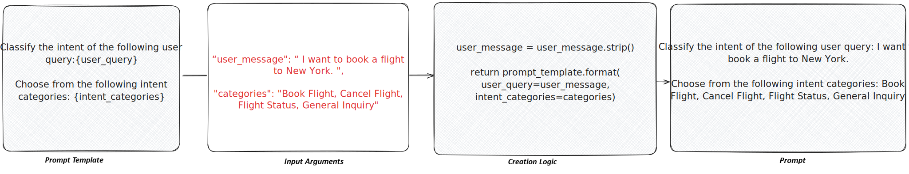

import { Badge, LinkCard, Steps, Tabs, TabItem } from '@astrojs/starlight/components';

<helper-panel object='Prompt' location='list'>

## What is a prompt?

A **prompt** is a natural-language instruction given to a generative model to direct its response or produce a desired outcome. It may include questions, commands, contextual details, few-shot examples, or partial inputs for the model to complete or extend.

In GGX, a prompt is more than the text you send — it is a **registered, versioned asset** made up of three parts that are stored and tracked together:

- **Prompt Template** — the instruction text, with placeholders for any dynamic values.
- **Input Arguments** — the typed inputs that fill those placeholders at runtime.
- **Creation Logic** — Python that prepares the arguments and fills the template before the prompt is sent to a model.

:::note[When creation logic is trivial]
If a prompt has no processing or formatting to do, the creation logic can simply return the template unchanged.
:::

## Anatomy of a prompt

| Part | What it holds | Required? |
|------|---------------|-----------|
| **Prompt Template** | The instruction text. Placeholders use Python-style braces, e.g. `{customer_utterance}`. | <Badge text="required" variant="caution" /> |
| **Input Arguments** | The typed values that replace placeholders. Each has an Alias, Type, optional flag, and default. | Optional for system-only prompts |
| **Creation Logic** | A Python function that formats arguments and returns the filled template. | <Badge text="required" variant="caution" /> |
| **Properties** | Description, Group, Permissible Purpose, Approval Workflow, Task Type, Prompt Type. | Mostly required — see below |
| **Attributes** | Alias (the Python variable name pipelines call this prompt by). | <Badge text="required" variant="caution" /> |

## Adding a prompt to the registry

The **Prompt Registry** is the central place where every registered prompt lives, organised into customisable groups. From here you can track, monitor, test, and create new prompts.

Click **Create** on the Prompt Registry page, then work through the form:

<Steps>

1. **Name and description.** Give the prompt a clear name and a plain-English description of what it does, when to use it, and when not to — it is what teammates read when deciding whether to reuse it.

2. **Properties.** Set the **Group**, **Permissible Purpose**, **Approval Workflow**, **Task Type**, and **Prompt Type** (for example, *System Instruction*).

3. **Alias.** <Badge text="required" variant="caution" /> A code-safe variable name pipelines use to refer to this prompt — lowercase with underscores, no spaces.

4. **Resources.** Add any registered Models, Global Functions, or other assets the creation logic should be able to call.

5. **Input Arguments.** For each argument, set its **Alias**, **Type**, whether it is optional, and a default value.

6. **Prompt Template and Creation Logic.** Write the template with `{placeholder}` markers, then write the Creation Logic that fills them. Use **Test Code** to run it against sample input before saving.

7. **Save.** Optionally attach documentation or notes under **Additional Information**, then click **Save**. The prompt is saved as a **Draft** until it goes through approval.

</Steps>

:::tip[Refining a prompt after saving]
After registration you can use **Analyze Prompt** to evaluate behaviour against sample inputs, and **Improve with AI** to get prompt-optimisation suggestions inline. See [Prompt Optimization](../../prompt-optimization/) for details.
:::

</helper-panel>

## Versioning and approval

Every prompt in GGX follows the same lifecycle as any other registered asset:

| Stage | What it means |
|-------|---------------|
| **Draft** | Created automatically when the prompt is registered. Edits are snapshotted in **Change History**, so every modification is traceable and revertible. |
| **Under Approval** | Submitted to the configured **Approval Workflow** for review by the assigned responsibilities and reviewers. |
| **Approved (locked)** | Once approved the version is immutable. Downstream pipelines continue using the version they were built against — they are not silently upgraded. |
| **Cloned → new Draft** | To change an approved prompt, clone it; that creates a new draft version that goes through the cycle again. Only the latest approved version can be cloned. |

<LinkCard title="Version Management" description="How drafts, change history, snapshots, and cloning work across every registered asset." href={`${import.meta.env.BASE_URL}register-and-refine/version-management/`} />
<LinkCard title="Approval Workflows" description="Configure who reviews and approves a prompt before it can be used in production." href={`${import.meta.env.BASE_URL}evaluate-and-approve/approval-workflows/`} />

## Testing and evaluation

A registered prompt can be evaluated directly in the Prompt Registry or as part of a downstream pipeline. Reach for the right level of test:

<LinkCard title="Simulation" description="Run a prompt over a dataset and inspect the outputs at scale before promoting." href={`${import.meta.env.BASE_URL}evaluate-and-approve/simulation/`} />
<LinkCard title="Comparison" description="Compare two prompts (or two versions of one) side-by-side on the same inputs." href={`${import.meta.env.BASE_URL}evaluate-and-approve/comparison/`} />
<LinkCard title="Prompt Optimization" description="Use Analyze Prompt and Improve with AI to refine a prompt's clarity, tone, and structure." href={`${import.meta.env.BASE_URL}register-and-refine/prompt-optimization/`} />

## A worked example

For an end-to-end walkthrough — a real banking-intent classification prompt with template, arguments, and creation logic — see the registration guide:

<LinkCard title="Prompt Registration Guide" description="Step-by-step example: registering an Intent Classification prompt with five card-related intents." href={`${import.meta.env.BASE_URL}register-and-refine/examples/intent-classification-pipeline-registration/prompt/`} />

## Capabilities unlocked by registration

Registering a prompt — rather than hard-coding it in a script — is what turns it into a governed, reusable asset:

| Capability | What you get |
|------------|--------------|
| **Change tracking** | Every modification to a draft is snapshotted in Change History; approved versions are locked. |
| **Purpose enforcement** | Automatic detection of Permissible Purpose violations when the prompt is used downstream. |
| **Testing & comparison** | Evaluate against other prompts using custom and standardised validation kits. |
| **Reusability** | Reuse across pipelines, with visibility through [Lineage Tracking](../../lineage-tracking/). |
| **Auditable path to production** | A transparent, fully auditable journey from Draft through Approval to use in pipelines. |
| **Executable artifacts** | Extract ready-to-productionise artifacts straight from the Registry. |
