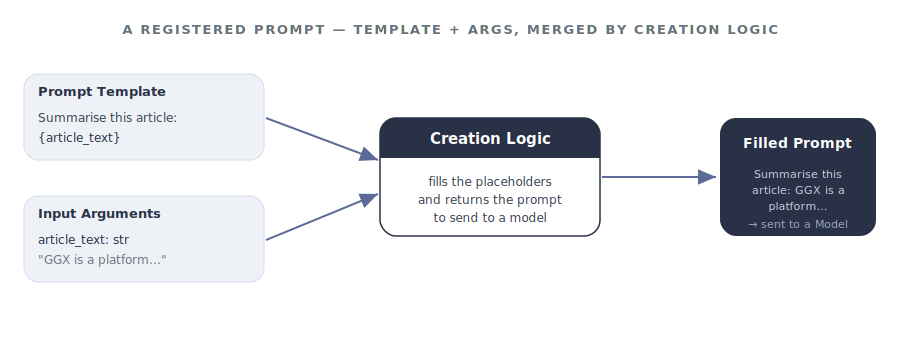

import { Badge, LinkCard, Steps, Tabs, TabItem } from '@astrojs/starlight/components';

<helper-panel object='Prompt' location='list'>

## What is a prompt?

A **prompt** is a natural-language instruction given to a generative model to direct its response or produce a desired outcome. It may include questions, commands, contextual details, few-shot examples, or partial inputs for the model to complete or extend.

In GGX, a prompt is more than the text you send — it is a **registered, versioned asset** made up of three parts that are stored and tracked together:

- **Prompt Template** — the instruction text, with placeholders for any dynamic values.
- **Input Arguments** — the typed inputs that fill those placeholders at runtime.
- **Creation Logic** — Python that prepares the arguments and fills the template before the prompt is sent to a model.

<figure class="ggx-figure">



<figcaption>The template and input arguments are merged by the creation logic into the prompt that is sent to a model.</figcaption>
</figure>

:::note[When creation logic is trivial]
If a prompt has no processing or formatting to do, the creation logic can simply return the template unchanged.
:::

## Anatomy of a prompt

| Part | What it holds | Required? |
|------|---------------|-----------|
| **Prompt Template** | The instruction text. Placeholders use Python-style braces, e.g. `{customer_utterance}`. | <Badge text="required" variant="caution" /> |
| **Input Arguments** | The typed values that replace placeholders. Each has an Alias, Type, optional flag, and default. | Optional for system-only prompts |
| **Creation Logic** | A Python function that formats arguments and returns the filled template. | <Badge text="required" variant="caution" /> |
| **Properties** | Description, Group, Permissible Purpose, Approval Workflow, Task Type, Prompt Type. | Mostly required — see below |
| **Attributes** | Alias (the Python variable name pipelines call this prompt by). | <Badge text="required" variant="caution" /> |

## Adding a prompt to the registry

The **Prompt Registry** is the central place where every registered prompt lives, organised into customisable groups. From here you can track, monitor, test, and create new prompts.

Click **Create** on the Prompt Registry page, then work through the form:

<Steps>

1. **Name and description.** Give the prompt a clear name and a plain-English description of what it does, when to use it, and when not to — it is what teammates read when deciding whether to reuse it.

2. **Properties.** Set the **Group**, **Permissible Purpose**, **Approval Workflow**, **Task Type**, and **Prompt Type** (for example, *System Instruction*).

3. **Alias.** <Badge text="required" variant="caution" /> A code-safe variable name pipelines use to refer to this prompt — lowercase with underscores, no spaces.

4. **Resources.** Add any registered Models, Global Functions, or other assets the creation logic should be able to call.

5. **Input Arguments.** For each argument, set its **Alias**, **Type**, whether it is optional, and a default value.

6. **Prompt Template and Creation Logic.** Write the template with `{placeholder}` markers, then write the Creation Logic that fills them. Use **Test Code** to run it against sample input before saving.

7. **Save.** Optionally attach documentation or notes under **Additional Information**, then click **Save**. The prompt is saved as a **Draft** until it goes through approval.

</Steps>

</helper-panel>

## Testing and improving a prompt

A prompt is only as good as the outputs it produces against the inputs you actually expect. GGX has dedicated features for prompt iteration *inside the Prompt Registry page itself*, plus the same Bulk Simulation that every other registered asset uses.

### Analyze Prompt

The **Analyze Prompt** button at the bottom of the Prompt Template editor scores your prompt against a set of quality dimensions and returns an **estimated prompt score** (e.g. 75%). Alongside the score, GGX lists **Findings** — specific gaps in the prompt that, if addressed, would raise the score. For each dimension, GGX either lists one or more Findings with a short explanation, or shows *"Nothing was found"* if the dimension passes.

The dimensions GGX currently evaluates include:

- **Bias** — e.g. *"Minimal / No Fair Lending Instructions in the prompt"* — flagging missing guidance for the model to remain unbiased, fair, or avoid perpetuating stereotypes.
- **Toxicity** — e.g. *"Minimal / No Code of Conduct instructions in the prompt"* — flagging missing guardrails against toxic, biased, or harmful output.
- **Logical Progression and Coherence** — whether the prompt's instructions follow a clear, step-by-step structure.
- **Examples Quality** — e.g. *"Limited Examples in the prompt"* or *"Limited Diversity in the prompt"* — flagging when there are too few examples, or when the examples don't reflect the range of real inputs the model will see.
- **Clarity** — whether the prompt's instructions are unambiguous.
- **Grammar** — e.g. *"Subject-Verb Disagreement"* — flagging grammatical issues in the prompt that could confuse the model.

Use Analyze Prompt as your iteration loop — change the template, click Analyze again, watch the score move.

### Improve with AI

The **Improve with AI** button uses the Findings surfaced by Analyze Prompt to generate suggested edits to the template — adding missing safety/bias guidance, sharpening unclear sections, restructuring for coherence. Review each suggestion, adapt it to your context, then re-run Analyze Prompt to confirm the score has improved before saving.

### Test the creation logic

If your Creation Logic does anything non-trivial (formats a list of intents, fetches dynamic context, applies conditional logic), use **Test Code** at the bottom of the Creation Logic editor to run it against sample arguments and inspect the filled template before saving.

### Bulk simulation through a pipeline

When the prompt is wired into a pipeline, **Bulk Simulation** runs that pipeline over an entire dataset of inputs and stores every filled prompt and model response — the right tool for measuring tone consistency, safety, output-format adherence, and edge-case behaviour at scale.

## A worked example: Customer Intent Classification

Registering an intent-classification prompt for a banking assistant. The form fields:

| Field | Value |
|-------|-------|
| Name | Customer Intent Classification |
| Alias | `customer_intent_classification_prompt` |
| Prompt Type | System Instruction |
| Task Type | Classification |
| Input Arguments | `user_message` (String, required) |

The template uses two placeholders — the customer's query, and a list of intents that the creation logic formats from a Python list:

```text title="prompt template (excerpt)"
You are a digital assistant for BankX. Classify the customer's
query into one of the predefined intents.

{list_of_intents}

OUTPUT FORMAT:
{"classified_intent": "str"}

Customer query:
{customer_utterance}
```

Creation Logic formats the intent definitions and fills both placeholders:

```python title="creation logic"
intent_definitions = [
    {"Intent": "ACTIVATE CARD",
     "Definition": "Request to activate a newly issued card",
     "Examples": ["How do I activate my new debit card?",
                  "Activate my credit card now."]},
    {"Intent": "BLOCK CARD",
     "Definition": "Request to block a lost, stolen, or compromised card",
     "Examples": ["Block my credit card immediately.",
                  "I lost my debit card, can you block it?"]},
    # ...
]

def get_intent_info(data_list):
    """Format intent definitions into readable text."""
    lines = []
    for i, item in enumerate(data_list, 1):
        lines.append(f"#### {i}. {item['Intent']}")
        lines.append(f"- Definition: {item['Definition']}")
        for ex in item["Examples"]:
            lines.append(f"  • {ex}")
        lines.append("")
    return "\n".join(lines)

return prompt.format(
    customer_utterance=user_message,
    list_of_intents=get_intent_info(intent_definitions),
)
```

Once saved, a pipeline calls the prompt by its alias:

```python
result = customer_intent_classification_prompt(user_message=user_input)
intent = result["classified_intent"]
```

<LinkCard title="Full Intent Classification walkthrough" description="The complete prompt with every intent, screenshots, and pipeline integration." href={`${import.meta.env.BASE_URL}register-and-refine/examples/intent-classification-pipeline-registration/prompt/`} />

## Capabilities unlocked by registration

Registering a prompt — rather than hard-coding it in a script — is what turns it into a governed, reusable asset:

| Capability | What you get |
|------------|--------------|
| **Change tracking** | Every modification to a draft is snapshotted in Change History; approved versions are locked. |
| **Purpose enforcement** | Automatic detection of Permissible Purpose violations when the prompt is used downstream. |
| **Testing & evaluation** | Analyze Prompt, Improve with AI, and Bulk Simulation through a pipeline. |
| **Reusability** | Reuse across pipelines, with visibility through [Lineage Tracking](../../lineage-tracking/). |
| **Auditable path to production** | A transparent, fully auditable journey from Draft through Approval to use in pipelines. |
| **Executable artifacts** | Extract ready-to-productionise artifacts straight from the Registry. |
