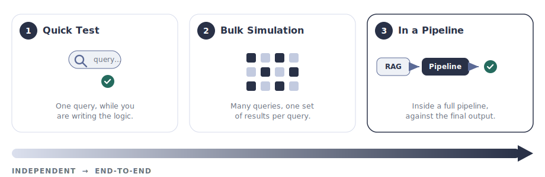

import { Badge, Steps, Tabs, TabItem } from '@astrojs/starlight/components';

<helper-panel object='Rag' location='list'>

## What is a RAG?

**Retrieval-Augmented Generation (RAG)** is an AI approach that helps language models by integrating a retrieval mechanism that fetches relevant external information in real time. This information allows the model to generate more accurate, up-to-date, and context-aware responses beyond its pre-trained knowledge.

A registered RAG in GGX has two main parts:

- **Knowledge Source** — a repository of external information: documents, vector databases, knowledge graphs like Neo4j, or other structured/unstructured data sources.
- **Retrieval Logic** — code that fetches the most relevant information from the knowledge source based on the provided inputs.

<figure class="ggx-figure">


<figcaption>A query flows into retrieval logic, which draws on a knowledge source and returns the retrieved information.</figcaption>
</figure>

## A worked example: a card-policy knowledge base

To make this concrete, picture `kb` — a RAG over a bank's **card-servicing policy** documents. It is the same `kb` that the [card-replacement assistant](../pipelines/#a-complete-example-a-card-replacement-assistant) calls whenever a customer asks to replace a lost card. On its own, `kb` does exactly one job: given a question, return the most relevant policy passages.

<Steps>

1. A query arrives — e.g. *"How long does a replacement card take?"*
2. The **retrieval logic** embeds the query and searches the **knowledge source** (a vector index built from the policy PDFs).
3. It returns the top-K passages — the grounding a downstream pipeline feeds to its model.

</Steps>

Because `kb` is registered on its own, any pipeline can reuse it — the same knowledge base could ground a card-servicing chatbot, an email-triage tool, or an internal policy-search widget.

## Anatomy of a RAG

| Part | What it holds | Required? |
|------|---------------|-----------|
| **Retrieval Logic** | Code that fetches relevant information from the knowledge source based on the inputs. | <Badge text="required" variant="caution" /> |
| **Knowledge Source** | A repository of external information — documents, vector databases, knowledge graphs. | Uploaded for Custom; configured via API for API-Based |
| **Input Arguments** | Typed inputs the retrieval logic operates on. Each has an Alias, Type, optional flag, and default value. | Optional |
| **Properties** | Description, Group, Permissible Purpose, Approval Workflow. | Mostly required |
| **Attributes** | Output Type and Alias (the Python variable name pipelines call this RAG by). | <Badge text="required" variant="caution" /> |

## The three retrieval types

Every RAG registered in GGX is one of three types. The choice determines where the knowledge source lives and how the retrieval logic reaches it.

<Tabs>
<TabItem label="API-Based">

<Badge text="External store" variant="tip" /> Communicates with external knowledge sources like **Neo4j** or **vector databases** using APIs to retrieve information from outside environments.

</TabItem>
<TabItem label="Python-Based">

<Badge text="In-platform" variant="note" /> Lightweight Python logic using various libraries or rule-based retrieval systems.

</TabItem>
<TabItem label="Custom">

<Badge text="Uploaded knowledge" variant="success" /> Leverages uploaded knowledge sources like **CSV** files or **vector indices** that GGX hosts as part of the RAG definition.

</TabItem>
</Tabs>

## Adding a RAG to the registry

The **RAG Registry** is the central place where every registered RAG lives, organised into customisable groups. From here you can track, monitor, test, and create new RAGs.

Click **Create** on the RAG Registry page, then work through the form:

<Steps>

1. **Name, Properties, and Attributes.** Give the RAG a clear name and description. Set the **Group**, **Permissible Purpose**, and **Approval Workflow** under Properties, and the **Output Type** and <Badge text="Alias" variant="caution" /> under Attributes.

2. **Input Arguments.** Define each argument with its **Alias**, **Type**, optional flag, and default value.

3. **Resources.** Select any registered Models, Global Functions, or Prompts the retrieval logic should be able to call.

4. **Input Type.** Pick **API-Based**, **Python-Based**, or **Custom**.

5. **Knowledge file and Retrieval Logic.** Upload the custom knowledge file if required, then write the retrieval code in the **Retrieval Logic** section.

6. **Additional Information.** Add notes or attach supporting documentation.

7. **Save.** Click **Save** to register. The RAG is saved as a **Draft** until it goes through approval.

</Steps>

## A complete example: the card-policy knowledge base

This fills in every field for `kb`, the **Custom** RAG introduced above. It uploads a vector index built from the card-servicing policy documents and returns the passages most relevant to a query.

<details class="ggx-details">
<summary>Page fields for <code>kb</code></summary>

| Field | Value |
|-------|-------|
| Description | *"Retrieves the most relevant passages from the bank's card-servicing policy documents. Use to ground card-servicing answers; not a source for fraud-dispute rules."* |
| Alias | `kb` |
| Input Type | Custom |
| Output Type | `list[str]` |
| Input Arguments | `query` (`str`, required), `top_k` (`int`, default `3`) |
| Resources | `embedder` (an embedding Model) |
| Knowledge file | `card_policy_index` — a vector index built from the policy PDFs |

</details>

<Tabs>
<TabItem label="Custom retrieval logic">

```python title="kb — retrieval logic"
# `query` and `top_k` are Input Arguments defined in Step 2.
# `embedder` is a Resource; `card_policy_index` is the uploaded knowledge file.
query_vector = embedder.embed(query)  # (1)!
hits = card_policy_index.search(query_vector, top_k=top_k)  # (2)!

# Return the passages most relevant to the query
return [hit.text for hit in hits]  # (3)!
```

1. `embedder` is a registered Model added under **Resources**; `query` is provided as an Input Argument.
2. `card_policy_index` is the uploaded knowledge file; `top_k` defaults to `3` but the caller can override it.
3. The return value matches the **Output Type** `list[str]` — exactly what a pipeline receives when it calls `kb.search(...)`.

</TabItem>
<TabItem label="API-Based variant">

An **API-Based** RAG reaches an external store — here a Neo4j knowledge graph — instead of an uploaded file:

```python title="graph_kb — retrieval logic"
# `query` is an Input Argument; `graph` is a Resource holding the connection.
cypher = build_cypher(query)
records = graph.run(cypher, limit=top_k)

return [r["passage"] for r in records]
```

</TabItem>
</Tabs>

</helper-panel>

## Testing a RAG

A RAG is testable **on its own** — you do not need to wire it into a pipeline first. Validate retrieval quality independently with a **Quick Test** and a **Bulk Simulation**, then exercise it **end-to-end** inside any pipeline that uses it.

<figure class="ggx-figure">



<figcaption>From a single-query sanity check, to a full run over a dataset, to an end-to-end test inside a real pipeline.</figcaption>
</figure>

### Quick Test — independent, while writing the logic

A fast check on a single query without saving; it runs the retrieval logic against sample input so you can confirm it returns sensible passages.

<Steps>

1. While creating or editing the RAG, scroll to the **Retrieval Logic** section.
2. Click **Test Code** in the bottom-right corner of the editor.
3. Enter a sample `query` (and any other Input Arguments, like `top_k`) and confirm the returned chunks are relevant.

</Steps>

### Bulk Simulation — independent, at scale

A single query tells you the RAG *runs*; a **bulk simulation** tells you how its retrieval behaves across many real questions. It runs an entire dataset of queries through the RAG and records one set of results per query — no pipeline required. Use it to:

- Spot queries that retrieve irrelevant or empty passages a single test would miss.
- Measure retrieval quality across a representative set of questions before approval.
- Attach the run as evidence in the RAG's approval and risk review.

<Badge text="shared mechanism" variant="note" /> Bulk Simulation is the same at-scale evaluation used across all registered assets, so the run, its dataset, and its results are logged and comparable just like a pipeline simulation.

### In a pipeline — end-to-end

Once the RAG behaves on its own, test it in context. Any [pipeline](../pipelines/) that lists the RAG as a **Resource** exercises it as part of a full request — so you can see how retrieval quality shapes the final generated output, not just the raw chunks. This is where you confirm `kb` actually grounds the assistant's reply, rather than only returning plausible passages.

:::tip[When to use which]
Reach for **Quick Test** while writing the retrieval logic, **Bulk Simulation** to validate retrieval quality across many queries before approval, and a **pipeline run** to confirm the RAG holds up end-to-end inside a real application — the most thorough check of the three.
:::

## Capabilities unlocked by registration

Registering a RAG — rather than calling a retriever from a loose script — is what turns it into a governed, reusable asset:

| Capability | What you get |
|------------|--------------|
| **Change tracking** | Automatic recording of modifications with efficient version upgrades. |
| **Purpose enforcement** | Automatic detection of Permissible Purpose violations. |
| **Testing & evaluation** | Evaluate against other RAGs using custom and standardised validation kits. |
| **Reusability** | Reuse across pipelines, with visibility through [Lineage Tracking](../../lineage-tracking/). |
| **API fingerprinting** | External retrieval connectivity is fingerprinted so changes upstream are detectable. |
| **Auditable path to production** | A transparent, fully auditable journey from Draft through Approval to use in pipelines. |
| **Executable artifacts** | Extract ready-to-productionise artifacts straight from the Registry. |
