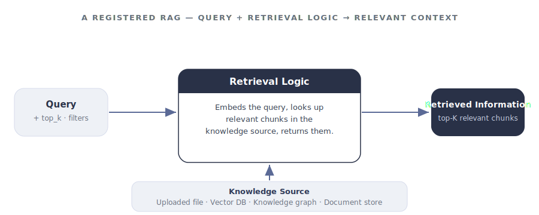

import { Badge, Steps, Tabs, TabItem } from '@astrojs/starlight/components';

<helper-panel object='Rag' location='list'>

## What is a RAG?

**Retrieval-Augmented Generation (RAG)** is an AI approach that helps language models by integrating a retrieval mechanism that fetches relevant external information in real time. This information allows the model to generate more accurate, up-to-date, and context-aware responses beyond its pre-trained knowledge.

A registered RAG in GGX has two main parts:

- **Knowledge Source** — a repository of external information: documents, vector databases, knowledge graphs like Neo4j, or other structured/unstructured data sources.
- **Retrieval Logic** — code that fetches the most relevant information from the knowledge source based on the provided inputs.

<figure class="ggx-figure">

<figcaption>A query flows into retrieval logic, which draws on a knowledge source and returns the retrieved information.</figcaption>
</figure>

## Anatomy of a RAG

| Part | What it holds | Required? |
|------|---------------|-----------|
| **Retrieval Logic** | Code that fetches relevant information from the knowledge source based on the inputs. | <Badge text="required" variant="caution" /> |
| **Knowledge Source** | A repository of external information — documents, vector databases, knowledge graphs. | Uploaded for Custom; configured via API for API-Based |
| **Input Arguments** | Typed inputs the retrieval logic operates on. Each has an Alias, Type, optional flag, and default value. | Optional |
| **Properties** | Description, Group, Permissible Purpose, Approval Workflow. | Mostly required |
| **Attributes** | Output Type and Alias (the Python variable name pipelines call this RAG by). | <Badge text="required" variant="caution" /> |

## The three retrieval types

Every RAG registered in GGX is one of three types. The choice determines where the knowledge source lives and how the retrieval logic reaches it.

<Tabs>
<TabItem label="API-Based">

<Badge text="External store" variant="tip" /> Communicates with external knowledge sources like **Neo4j** or **vector databases** using APIs to retrieve information from outside environments.

</TabItem>
<TabItem label="Python-Based">

<Badge text="In-platform" variant="note" /> Lightweight Python logic using various libraries or rule-based retrieval systems.

</TabItem>
<TabItem label="Custom">

<Badge text="Uploaded knowledge" variant="success" /> Leverages uploaded knowledge sources like **CSV** files or **vector indices** that GGX hosts as part of the RAG definition.

</TabItem>
</Tabs>

## Adding a RAG to the registry

The **RAG Registry** is the central place where every registered RAG lives, organised into customisable groups. From here you can track, monitor, test, and create new RAGs.

Click **Create** on the RAG Registry page, then work through the form:

<Steps>

1. **Name, Properties, and Attributes.** Give the RAG a clear name and description. Set the **Group**, **Permissible Purpose**, and **Approval Workflow** under Properties, and the **Output Type** and <Badge text="Alias" variant="caution" /> under Attributes.

2. **Input Arguments.** Define each argument with its **Alias**, **Type**, optional flag, and default value.

3. **Resources.** Select any registered Models, Global Functions, or Prompts the retrieval logic should be able to call.

4. **Input Type.** Pick **API-Based**, **Python-Based**, or **Custom**.

5. **Knowledge file and Retrieval Logic.** Upload the custom knowledge file if required, then write the retrieval code in the **Retrieval Logic** section.

6. **Additional Information.** Add notes or attach supporting documentation.

7. **Save.** Click **Save** to register. The RAG is saved as a **Draft** until it goes through approval.

</Steps>

</helper-panel>

## Testing a RAG

Registered RAGs can be evaluated within the RAG Registry using custom and standardised validation kits, or as part of a downstream pipeline. **Bulk Simulation** — the at-scale evaluation mechanism shared across all registered assets — runs a pipeline (or the RAG it uses) over an entire dataset of inputs and records the results.

## Capabilities unlocked by registration

Registering a RAG — rather than calling a retriever from a loose script — is what turns it into a governed, reusable asset:

| Capability | What you get |
|------------|--------------|
| **Change tracking** | Automatic recording of modifications with efficient version upgrades. |
| **Purpose enforcement** | Automatic detection of Permissible Purpose violations. |
| **Testing & evaluation** | Evaluate against other RAGs using custom and standardised validation kits. |
| **Reusability** | Reuse across pipelines, with visibility through [Lineage Tracking](../../lineage-tracking/). |
| **API fingerprinting** | External retrieval connectivity is fingerprinted so changes upstream are detectable. |
| **Auditable path to production** | A transparent, fully auditable journey from Draft through Approval to use in pipelines. |
| **Executable artifacts** | Extract ready-to-productionise artifacts straight from the Registry. |
