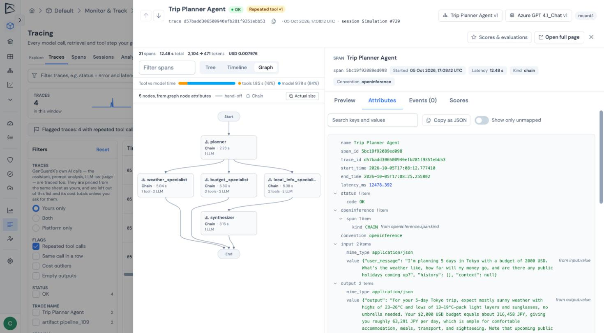
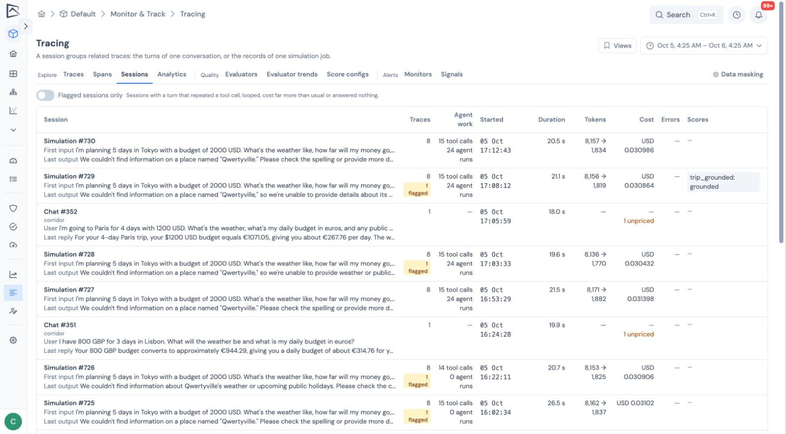

Agents fail in ways a single step never shows: calling the same tool again and again, looping, or quietly returning nothing. GGX looks at the whole run and flags these patterns on the trace.

## The agent graph

The **Graph** view on a trace draws the run from **Start** at the top to **End** at the bottom: which agents, tools and steps ran, and how work passed between them.

- Each node is colored and labeled by its kind: agent, model call, tool, retrieval, guardrail or step.
- Failures are outlined in red with a count.
- **Fit** scales a wide graph to the panel.
- Solid arrows are hand-offs, dashed arrows are delegation, and a count shows when the same path was taken more than once.
- Each node shows how many times the agent ran, its tool and model calls, its time and any failures.
- Selecting a node opens that agent's span in the [inspector](../exploring-traces/#the-span-inspector).

### Where the graph comes from

The graph is drawn from agent spans, or from `graph.node.id` and `graph.node.parent_id` when your instrumentation sends them (the heading then says _nodes_ rather than _agents_). A trace with neither says so.

A LangGraph run is drawn from the node each step ran in, which LangGraph records itself. Since it does not record which node came before, control is shown passing in the order the nodes ran.

In a LangGraph pipeline running in GGX, the model calls and tool calls a node makes sit under that node in the trace tree, so each agent shows what it spent. Each node counts as one agent run on the trace and its session. This applies to graphs run synchronously; an async graph keeps its model calls beside the graph.

### Agents written without a framework

An agent you wrote without a framework has no span of its own until you mark it. Put `@tracing.agent` on the function, or wrap the work in `tracing.trace_agent(name, input)`, and its model calls and tools appear under it, the same way [`@tracing.tool`](../sending-traces/#your-own-tools) marks a tool.

## Trajectory flags

| Badge | Means |
| --- | --- |
| **Repeated tool ×N** | N tool calls in the trace repeated an earlier call by the same agent to the same tool with the same arguments. Two agents in one graph that each make the same call are not a repeat. A tool that wraps another span of the same tool counts once, and calls with no recorded input never count. |
| **Same call ×N in a row** | The same tool was called with the same arguments at least 3 times in a row under one step. Searching for different things in turn does not count. |
| **Cost outlier** | The trace cost more than 10 times the median of recent traces with the same name, project and currency over the last 7 days, once there are at least 20 of them. Checked hourly. |
| **Empty output** | The trace or one of its model calls received an input, did not fail, and returned a blank answer. A step that simply did not record its output is not flagged. |

Flags appear as badges in the trace list, on the trace page and on each turn of a session. The **Flags** filter narrows the list to traces carrying any of them, and a line above the list counts flagged traces in your range.

The trace page also shows how the run's time split between tools and the model. Each is the time during which at least one such step was running, so agents working in parallel are not counted twice.

Your administrator can tune the thresholds with `TRACE_LOOP_MIN_REPEAT`, `TRACE_COST_OUTLIER_FACTOR`, `TRACE_COST_OUTLIER_MIN_TRACES` and `TRACE_COST_OUTLIER_BASELINE_DAYS`. Traces recorded before flags existed are not flagged.

## Sessions

The **Sessions** tab rolls traces up by session id. Each row shows the conversation's first and last message, how many turns it had, how long it ran, its tool calls and agent runs, tokens, cost, errors, users, scores, and how many of its turns were flagged. **Flagged sessions only** narrows the list to conversations with at least one flagged turn.

Opening a session shows the conversation as a transcript, one turn per trace with its flags, each linking to its full trace, plus the session's evaluations.

:::tip
Send the same `session_id` for every turn of a conversation, through `tracing.context(...)` in the SDK or the `session.id` span attribute, so the whole chat appears as one session.
:::

## Simulation jobs

Every trace a [simulation](../../evaluate-and-approve/simulation/) job produces shares one session, named _Simulation #_ and the job's number. Its page lists the job's records in the order of the input data, each with its input, output, cost and a link to its trace. In a multi-turn simulation the traces of one conversation stay together under a conversation label.

A job shows what it spent on model calls in its header, on every tab, and in a **Model usage** card on **Job Results**; both link to the session. Opening a row of the results shows that record's cost and tokens and a link to its trace, for a job with a single evaluation. The total covers the pipeline's own calls and any model calls its reports make. Traces of a simulation are named after the pipeline.

## What to read next

- [Evaluators](../evaluators/): the Agent trajectory, Tool-call correctness and Session coherence templates judge what this page shows.
- [Monitors](../monitors/#what-you-can-monitor): alert on agent flags.
- [Governance signals](../governance-signals/): retry loops and cost outliers are filed as findings.
