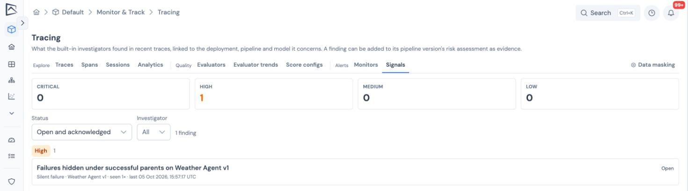

GGX investigates your traces every 15 minutes and files a **finding** when it sees a risk. Each finding is tied to the deployment, pipeline version and model it concerns, so it can follow the model into its risk assessment rather than stop at an engineer's inbox.

## What GGX looks for

| Investigator | Files a finding when |
| --- | --- |
| PII leak | Stored content still contains personal data, or a project stores content unmasked. Critical when capture is **Full**. |
| Error spike | The error rate rises well above its level over the previous day. |
| Silent failure | A step fails under a step that reports success, or fails with no error detail. |
| Instrumentation gap | A model's calls report no token usage, or calls do not name their model. |
| Retry loop | Agents repeat the same tool call. |
| Cost outlier | Runs cost far more than usual for their kind. |
| Evaluator regression | An evaluator's results over the last day are worse than over the week before. |
| Monitor alert | A [monitor](../monitors/) set to open findings starts alerting. |

Findings never quote trace content. They carry counts, the time window, links to example traces, and the names of the assets involved.

## Working a finding

Open **Tracing → Signals**. Tiles count open findings by severity, and the list can be filtered by status and investigator. Opening a finding shows its narrative, evidence, linked assets and history.

- **Status**: open, acknowledged, resolved or dismissed. Resolving or dismissing needs a reason, and every change records who, when and why. A finding can be reopened and assigned to someone.
- **Repeats**: if the same problem recurs while a finding is open, GGX updates it (occurrence count, evidence, and severity only ever rises) rather than filing another.
- **Resolved means fixed**: if the problem comes back, it is a new finding.
- **Dismissed means accepted**: recurrences are added to the dismissed finding quietly, and it reopens only if the problem becomes more severe.
- **Notifications**: new critical and high findings notify the project's members in GGX, and assigning a finding notifies the assignee.

## Findings in governance

- A **Trace signals** panel on pipeline and deployment pages lists the open findings that concern them, so approvers see them.
- **Add to risk assessment** records a finding in the pipeline version's risk assessment under a suggested category and risk (a PII leak goes under data leakage, for example), keeping the assessor's own text.
- Deleting a deployment, pipeline version or model keeps its findings and unlinks them.

## What to read next

- [Monitors](../monitors/): thresholds you set yourself, which can also open findings.
- [Data masking](../data-masking/): the policy the PII leak investigator checks against.
- [Approval workflows](../../evaluate-and-approve/approval-workflows/): where approvers review a pipeline before it ships.
